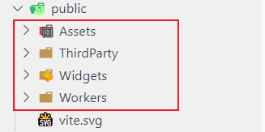
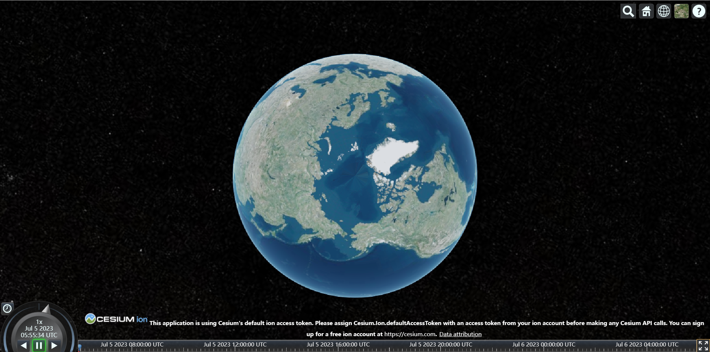
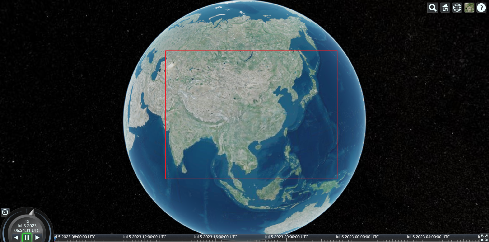
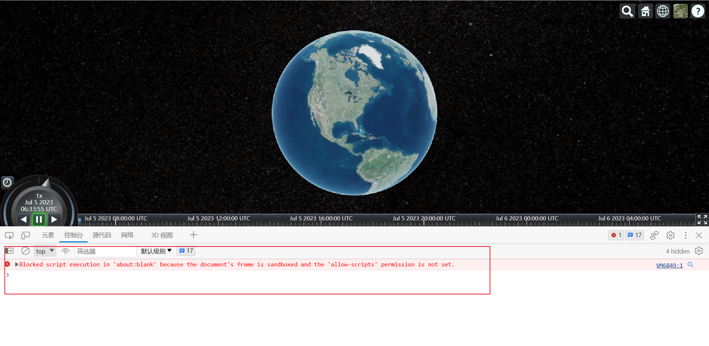

---
category:
  - Cesium
---
# 01、cesium加载地球与环境搭建

### 1、搭建vue3项目

使用vite进行搭建。

```js
npm init vite@latest
```

根据操作提示选择：vue 3 + Typescript

### 2、下载cesium库

终端输入：

```js
npm install cesium
```

### 3、创建cesium地图容器

```vue
<template>
  <div id="view_container"></div>
</template>
```

### 4、导入cesium

#### 4.1、复制cesium资源至public文件夹



#### 4.2、在组件中导入cesium模块与样式

```typescript
import * as Cesium from "cesium";
import "../public/Widgets/widgets.css";
```

> 注意
>
> 1. 如果报错：`无法找到'cesium'模块声明`。可以在**.d.ts声明文件**中创建声明：
>
>    ```typescript
>    declare module 'cesium'
>    ```
>
> 2. 引入样式文件时，编辑器是没有提示的，具体原因可能和public文件夹有关。

### 5、导入生命周期钩子

```typescript
import { onMounted } from "vue";
```

### 6、创建cesium地图容器

```typescript
onMounted(() => {
  const viewer = new Cesium.Viewer("view_container");
});
```

> 注意
>
> 如果报错：`变量声明未使用`。可以在tsconfig.json文件中修改：
>
> ```typescript
> "noUnusedLocals": false,//开启时声明的变量未使用会报警告
> ```

### 7、添加CESIUM_BASE_URL

添加cesium静态资源

```typescript
(window as any).CESIUM_BASE_URL= "/";
```

> 注意
>
> 不考虑**Typescript**的情况下，应该为：
>
> ```typescript
> window.CESIUM_BASE_URL = "/";
> ```
>
> 但是在**Typescript**中会报错：`“Window & typeof globalThis”上不存在属性“CESIUM_BASE_URL”`
>
> 有两种解决方案：
>
> 1. 在**.d.ts声明文件**中对**window**对象进行声明：
>
>    ```typescript
>    declare interface Window {
>      CESIUM_BASE_URL: any
>    }
>    ```
>
> 2. 对**window**进行类型断言为**any**类型：
>
>    ```typescript
>    (window as any).CESIUM_BASE_URL= "/";
>    ```

### 8、设置地图容器宽高

```css
<style>
html , body { 
  width: 100%; 
  height: 100%; 
  margin: 0; 
  padding: 0; 
  overflow: hidden; 
}
*,
#app{
  margin: 0;
  padding: 0;
}
#view_container{
  width: 100vw;
  height: 100vh;
}
</style>
```

### 9、启动项目、预览

```js
npm run dev
```

效果：



### 10、cesium基础设置

#### 10.1、cesium token

访问网址：[Stories | Cesium ion](https://ion.cesium.com/)获取令牌。

在代码中添加令牌：

```typescript
Cesium.Ion.defaultAccessToken='your token';
```

#### 10.2、隐藏logo

通过后台查看元素和API可以发现，将**viewer**上的小部件设置为隐藏即可。

```typescript
(viewer.cesiumWidget.creditContainer as HTMLElement).style.display = "none";
```

需要进行类型断言。

#### 10.3、设置默认视角

通过设置 `Cesium.Camera.DEFAULT_VIEW_RECTANGLE : Rectangle`来进行默认视角调整。

```typescript
//其中Rectangle是矩形范围，指定为经度和纬度坐标的二维区域
Cesium.Camera.DEFAULT_VIEW_RECTANGLE=Cesium.Rectangle.fromDegrees(
	73.5,//西经
	4,//南纬
	135.4,//东经
	53.5//北纬
)
```

其中:

`Cesium.Rectangle.fromDegrees(west, south, east, north, result) → Rectangle`

在给定边界经度和纬度（以度为单位）的情况下创建一个矩形。



#### 10.4、infobox报错



解决方法：

```typescript
 const viewer = new Cesium.Viewer("view_container",{
   infoBox:false,
 });
```
