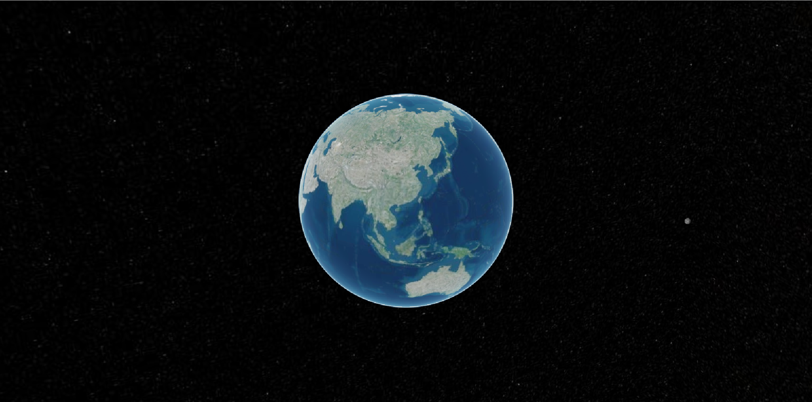

# 02、cesium中viewer详解

以下为cesium中viewer的一些常用的配置。

```typescript
 const viewer = new Cesium.Viewer("view_container",{
    infoBox:false,//小弹窗
    animation:false,//左下角动画仪表盘
    baseLayerPicker:false,//右上角图层选择按钮
    geocoder:false,//搜索框
    homeButton:false,//home按钮
    sceneModePicker:false,//模式切换按钮
    timeline:false,//底部时间轴
    navigationHelpButton:false,//右上角帮助按钮
    fullscreenButton:false,//右下角全屏按钮
    selectionIndicator:false,//选择指示器
     //配置天空盒子
    skyBox:new Cesium.skyBox({
          sources : {
            positiveX : 'skybox_px.png',
            negativeX : 'skybox_nx.png',
            positiveY : 'skybox_py.png',
            negativeY : 'skybox_ny.png',
            positiveZ : 'skybox_pz.png',
            negativeZ : 'skybox_nz.png'
          }
     })
 });
```

全部关闭后初始页面为：



## 