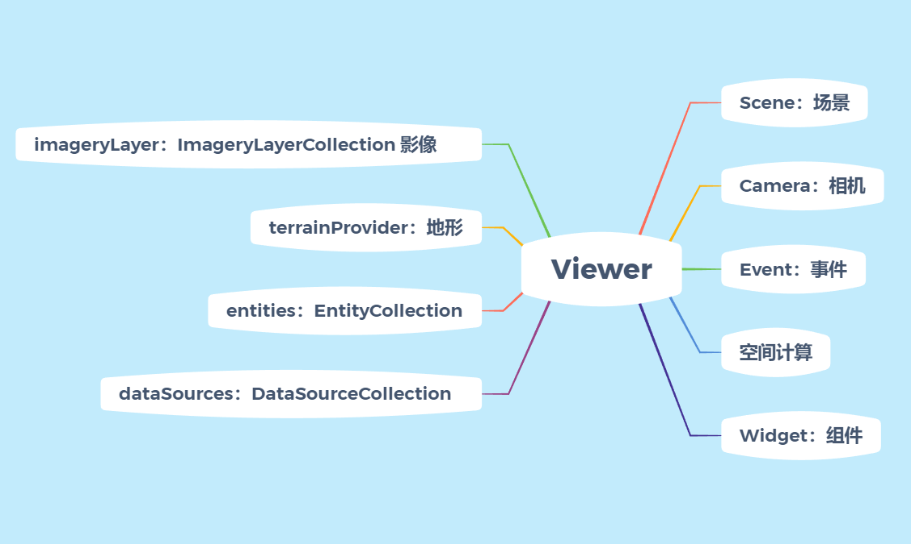

# 04、cesium中的API 关系

**此篇章暂时没有捋清楚，暂时停笔，详情参考：**

[Cesium API使用指南1 - 知乎 (zhihu.com)](https://zhuanlan.zhihu.com/p/80904975)

[Cesium API 模块结构图_cesium架构图](https://blog.csdn.net/Tmraz/article/details/113625213)

[cesium 的 API 结构及Viewer的介绍](https://blog.csdn.net/weixin_44857463/article/details/129273593)

实际开发过程中，cesium的API之间的关系如图所示：


### 1、viewer

创建任何一个三维窗口基本都需要使用Viewer类，Viewer代表了一个cesium的三维窗口的所有。

```typescript
const viewer = new Cesium.Viewer('地图容器ID');
```

关于Viewer的内部层级关系，如下：



## 