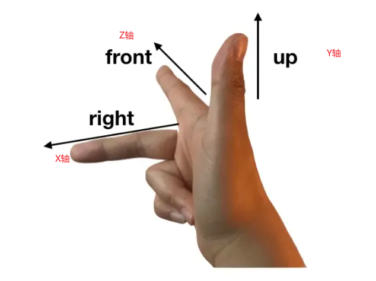

# 05、camera

相机由位置、方向和视锥体定义。

### 1、相机位置

**Cesium**中的相机位置通过**destination**来确定，**position**指的是相机位置的三维坐标（可以用经纬度和大地高表达，也可以用笛卡尔坐标来表达），让相机飞到对应的位置：

```js
//天安门经纬度转笛卡尔坐标
const position = Cesium.Cartesian3.fromDegrees(116.390512,39.913574,1000);
viewer.camera.setView({
	destination: position,
});
```

### 2、相机方向

通过**orientation**来确定相机的方向，其设定原理和**右手笛卡尔坐标系**原理相同，有两种表达方法。



#### 2.1、heading、pitch、roll三参数

- **heading**: 偏航角，xy平面绕z轴旋转，默认方向为正北（0°），正角度为向东旋转。
- **pitch**: 俯仰角，yz平面绕x轴旋转，默认角度为-90°，即朝向地面，0°为平视，正角度为仰视，负角度为俯视，即抬头低头。
- **roll**: 翻转角，xz平面绕y轴旋转，默认角度为0°，正角度向右旋转，负角度向左旋转，即左右歪头。

```js
//确定相机位置
var position = Cesium.Cartesian3.fromDegrees(86.889, 27.991, 4000);
//飞到相机位置并确定相机姿态
viewer.camera.flyTo({
    destination: position,
    orientation:{
        heading:Cesium.Math.toRadians(0.0), //正北
        pitch:Cesium.Math.toDegrees(0.0), //平视
        roll: 0.0
    }
});
```

#### 2.2、direction、up两个参数

- **direction**：表示相机视线方向相对于世界坐标的单位向量。
- **up**：表示相机的up方向的单位向量。

这两个参数就确定了相机的局部坐标系方向

```js
//确定相机位置
var position = Cesium.Cartesian3.fromDegrees(86.889, 27.991, 4000);
//飞到相机位置并确定相机姿态
viewer.camera.flyTo({
    destination: position,
    orientation:{
        direction : new Cesium.Cartesian3(-0.042312, -0.201232, -0.978629), //相机视线方向单位向量
        up : new Cesium.Cartesian3(-0.479345, -0.855321, 0.1966022)         //相机的up方向单位向量
    }
});
```

### 3、相机控制方法

#### 3.1、setView()

setView通过定义相机飞行目的点的三维坐标（经纬度和大地高）和视线方向，将视角直接切换到所设定的视域范围内，**没有空中飞行的过程，适合快速切换视角**

```typescript
//设定相机
var position = Cesium.Cartesian3.fromDegrees(86.889, 27.991, 4000);
//相机聚焦位置并确定相机姿态
viewer.camera.setView({
    destination: position,
    orientation:{
        heading:Cesium.Math.toRadians(0.0), //正北
        pitch:Cesium.Math.toDegrees(0.0), //平视
        roll: 0.0
    }
});
```

#### 3.2、flyTo()

**flyTo则是有相机空中飞行的过程，**可以设置飞行时间。

- **基础用法**

  ```typescript
  // 1. 确定相机位置，角度默认
  viewer.camera.flyTo({
      destination : Cesium.Cartesian3.fromDegrees(-117.16, 32.71, 15000.0)
  });
  // 2.确定相机角度和位置
  viewer.camera.flyTo({
      destination : Cesium.Cartesian3.fromDegrees(-122.19, 46.25, 5000.0),
      orientation : {
          heading : Cesium.Math.toRadians(175.0),
          pitch : Cesium.Math.toRadians(-35.0),
          roll : 0.0
      }
  });
  // 3.类似于fitbounds函数
  viewer.camera.flyTo({
      destination : Cesium.Rectangle.fromDegrees(west, south, east, north)
  });
  
  // 4.用单位向量表示的相机角度
  viewer.camera.flyTo({
      destination : Cesium.Cartesian3.fromDegrees(-122.19, 46.25, 5000.0),
      orientation : {
          direction : new Cesium.Cartesian3(-0.04231243104240401, -0.20123236049443421, -0.97862924300734),
          up : new Cesium.Cartesian3(-0.47934589305293746, -0.8553216253114552, 0.1966022179118339)
      }
  });
  ```

- **运动效果**

  **easingFunction**设置运动效果，类别见https://cesium.com/learn/cesiumjs/ref-doc/EasingFunction.html?classFilter=easingFunction

  **duration**设置运动时间

  ```typescript
  // flyTo using QUADRATIC_IN_OUT easing function
  viewer.camera.flyTo({
    destination : new Cesium.Cartesian3(-3961951.575572026, 3346492.0945766014, 3702340.5336036095),
    orientation : {
        direction : new Cesium.Cartesian3(0.8982074415844437, -0.4393530288745287, 0.013867512433959908),
        up : new Cesium.Cartesian3(0.12793638617798253, 0.29147314437764565, 0.9479850669701113),
    },
    
    complete: function () {
      setTimeout(function () {
        viewer.camera.flyTo({
          destination : new Cesium.Cartesian3(-2304817.2435183465, -3639113.128132953, 4688495.013644141),
          orientation : {
              direction : new Cesium.Cartesian3(0.3760550186878076, 0.9007147395506565, 0.21747547189489164),
              up : new Cesium.Cartesian3(-0.20364591529594356, -0.14862471084230877, 0.9676978022659334),
          },
          easingFunction: Cesium.EasingFunction.QUADRATIC_IN_OUT,
          duration: 5
        });
      }, 1000);
    },
    
  });
  ```

