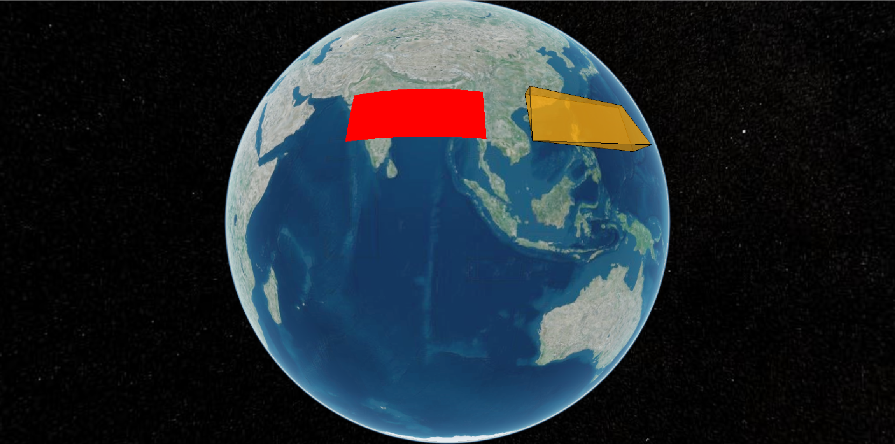
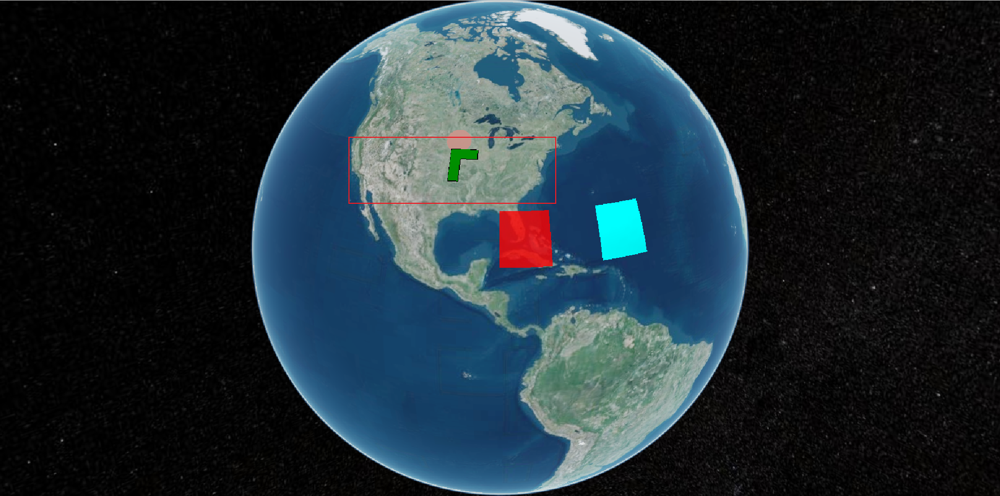

# 06、实体Entity

**Entity API** 公开一组设计一致的高级对象，这些对象将相关的可视化效果和信息聚合到统一的数据结构中，称之为**实体**。

- 专注于数据的呈现，而不是担心可视化的潜在机制。
- 提供了结构，以便以自然适合静态数据的方式轻松构建复杂的时间动态可视化。

虽然实体 API 实际上在后台使用原始 API，但这是（几乎）永远不必关注的实现细节。通过将各种启发式方法应用于我们提供的数据，实体 API 能够提供灵活、高性能的可视化效果，同时公开一致、易于学习且易于使用的界面。

1. 添加矩形并赋予颜色

   ```typescript
     //添加矩形Entity并赋予颜色
     const rectangle_red = viewer.entities.add({
       polygon: {
         //层次结构：获取或设置指定多边形层次结构的属性。
         hierarchy: Cesium.Cartesian3.fromDegreesArray([
           70, 25, 70, 14, 100, 14, 100, 25,
         ]),
         material: Cesium.Color.RED,
       },
     });
   ```

2. 添加矩形实体并每个顶点赋予高程

   ```typescript
   //添加矩形实体并每个点赋予高程
     const rectangle_red_height = viewer.entities.add({
       polygon: {
         //层次结构：获取或设置指定多边形层次结构的属性。
         hierarchy: Cesium.Cartesian3.fromDegreesArrayHeights([
           110, 25, 300000, 110, 14, 200, 140, 14, 500000, 140, 25, 100000,
         ]),
         extrudedHeight: 0, //拉伸高度
         perPositionHeight: true, //获取或设置指定是否使用每个位置的高度的布尔值。 如果为 true，则形状将具有由每个hierarchy位置的高度定义的非均匀高度。如果为 false，则形状将具有由height 指定的恒定高度。
         material: Cesium.Color.ORANGE.withAlpha(0.5), //指定用于填充多边形的材料的属性,材质
         outline: true, //一个布尔属性，指定是否勾勒出多边形的轮廓。
         outlineColor: Cesium.Color.BLACK, //多边形轮廓颜色
       },
     });
   ```

   

3. 添加走廊

   ```typescript
     //添加走廊
     const greenCorridor = viewer.entities.add({
       name: "绿色浮空走廊",
       corridor: {
         positions: Cesium.Cartesian3.fromDegreesArray([
           -90.0, 40.0, -95.0, 40.0, -95.0, 35.0,
         ]),
         height: 100000.0, //指定道路相对于椭球体表面的高度。
         width: 200000.0, //指定道路边缘之间的距离。
         cornerType: Cesium.CornerType.MITERED, //指定拐角样式的角类型属性。
         material: Cesium.Color.GREEN,
         outline: true, // 指定是否勾勒出走廊的轮廓。
       },
     });
   ```

   
