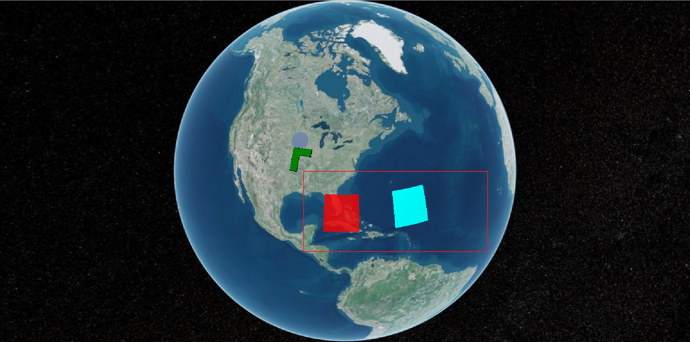
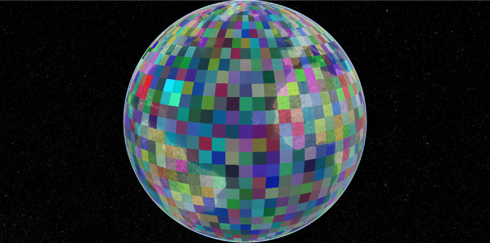

# 07、图元Primitive

**Primitive API** 公开了执行手头任务所需的最小抽象量。它的结构是为图形开发人员提供灵活的实现，而不是为了 API 一致性。加载模型与创建广告牌不同，两者都与创建多边形完全不同。每种类型的可视化都有其独特的功能。此外，每个都有不同的性能特征，需要不同的最佳实践。虽然这种方法功能强大且灵活，但大多数应用程序最好使用更高级别的抽象。

### 1、创建贴地几何

1. 获取viewer的scene属性对象

   ```typescript
   const scene = viewer.scene;
   ```

2. 创建几何要素实例

   ```typescript
     const instance = new Cesium.GeometryInstance({
       geometry: new Cesium.RectangleGeometry({
         rectangle: Cesium.Rectangle.fromDegrees(-100, 20, -90, 30),
         vertexFormat: Cesium.EllipsoidSurfaceAppearance.VERTEX_FORMAT,
       }),
     });
   ```

3. 在scene属性上的primitives属性上添加单个图元实例

   ```typescript
   scene.primitives.add(
       new Cesium.Primitive({
         geometryInstances: instance,
         appearance: new Cesium.EllipsoidSurfaceAppearance({
           material: Cesium.Material.fromType("Stripe"),
         }),
       })
     );
   ```

   > 注意
   >
   > 关于**appearance**有：
   >
   > - [MaterialAppearance](https://cesium.com/learn/cesiumjs/ref-doc/MaterialAppearance.html)
   > - [EllipsoidSurfaceAppearance](https://cesium.com/learn/cesiumjs/ref-doc/EllipsoidSurfaceAppearance.html)
   > - [PerInstanceColorAppearance](https://cesium.com/learn/cesiumjs/ref-doc/PerInstanceColorAppearance.html)
   > - [DebugAppearance](https://cesium.com/learn/cesiumjs/ref-doc/DebugAppearance.html)
   > - [PolylineColorAppearance](https://cesium.com/learn/cesiumjs/ref-doc/PolylineColorAppearance.html)
   > - [PolylineMaterialAppearance](https://cesium.com/learn/cesiumjs/ref-doc/PolylineMaterialAppearance.html)
   >
   > 其中`EllipsoidSurfaceAppearance`适用于贴地的外观，`PerInstanceColorAppearance`适用于自定义的颜色属性。

### 2、创建自定义颜色属性几何

1. 获取viewer的scene属性对象

   ```typescript
   const scene = viewer.scene;
   ```

2. 创建自定义颜色属性的几何实例

   ```typescript
     //自定义属性颜色
     const instance_red = new Cesium.GeometryInstance({
       geometry: new Cesium.RectangleGeometry({
         rectangle: Cesium.Rectangle.fromDegrees(-85, 20, -75, 30),
         vertexFormat: Cesium.PerInstanceColorAppearance.VERTEX_FORMAT,
       }),
       id: "red",
       attributes: {
         color: new Cesium.ColorGeometryInstanceAttribute(1, 0, 0, 0.8),
       },
     });
     const instance_yellow = new Cesium.GeometryInstance({
       geometry: new Cesium.RectangleGeometry({
         rectangle: Cesium.Rectangle.fromDegrees(-65, 20, -55, 30),
         vertexFormat: Cesium.PerInstanceColorAppearance.VERTEX_FORMAT,
       }),
       id: "yellow",
       attributes: {
         color: Cesium.ColorGeometryInstanceAttribute.fromColor(Cesium.Color.AQUA),
       },
     });
   ```

3. 添加多个几何实例

   ```typescript
     scene.primitives.add(
       new Cesium.Primitive({
         geometryInstances: [instance_red, instance_yellow],
         appearance: new Cesium.PerInstanceColorAppearance(),
       })
     );
   ```

   

4. 生成覆盖全球的随机颜色几何实例

   ```typescript
    const instances = [];
   	//循环生成随机颜色的几何实例并添加进几何实例数组
     for (let lon = -180.0; lon < 180.0; lon += 5.0) {
       for (let lat = -85.0; lat < 85.0; lat += 5.0) {
         instances.push(
           new Cesium.GeometryInstance({
             geometry: new Cesium.RectangleGeometry({
               rectangle: Cesium.Rectangle.fromDegrees(
                 lon,
                 lat,
                 lon + 5.0,
                 lat + 5.0
               ),
               vertexFormat: Cesium.PerInstanceColorAppearance.VERTEX_FORMAT,
             }),
             attributes: {
               color: Cesium.ColorGeometryInstanceAttribute.fromColor(
                 Cesium.Color.fromRandom({ alpha: 0.5 })
               ),
             },
           })
         );
       }
     }
     scene.primitives.add(
       new Cesium.Primitive({
         geometryInstances: instances,
         appearance: new Cesium.PerInstanceColorAppearance(),
       })
     );
   ```

   

