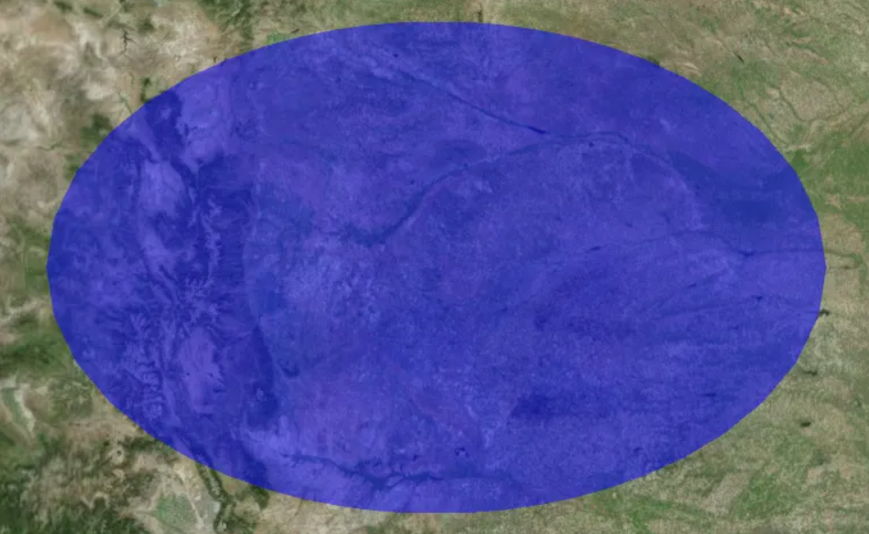
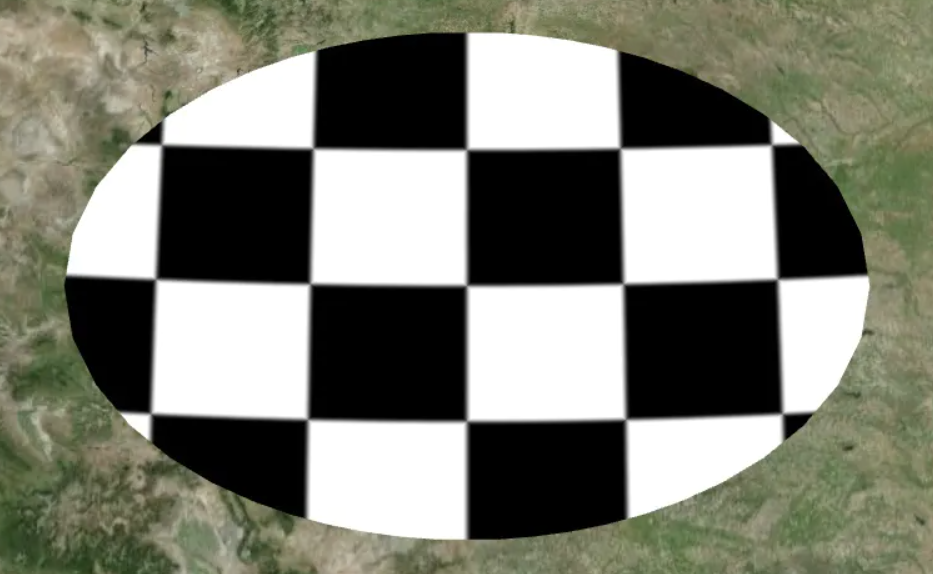
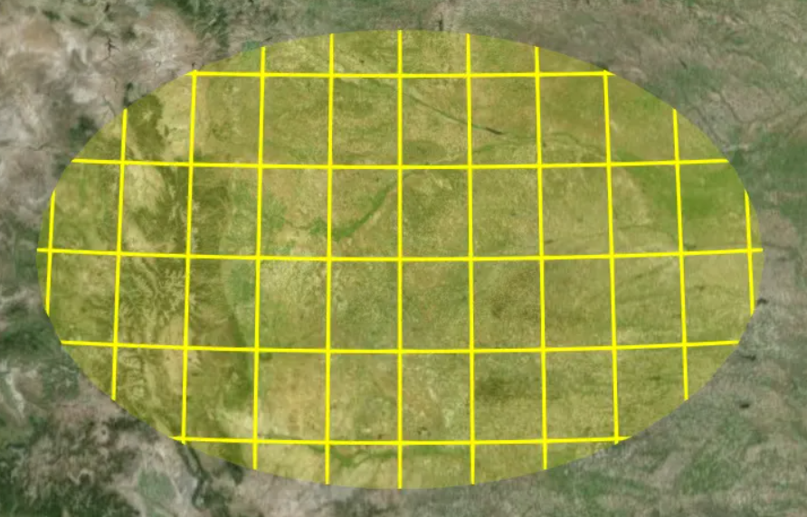
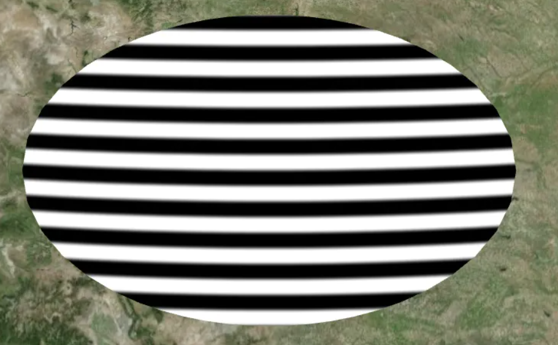
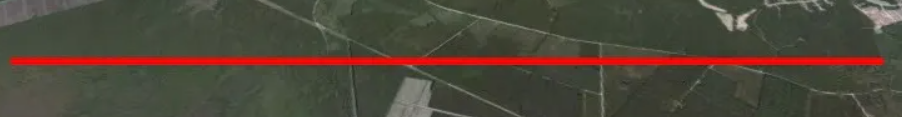
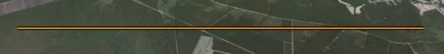
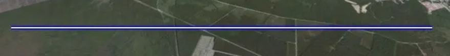

# 09、材质

所有形状和体积都有一组控制其外观的通用属性。该属性指定是否填充几何图形，该属性指定是否轮廓几何图形。材料属性决定了填充的外观。下面创建一个半透明的蓝色椭圆:

### 1、多边形

```typescript
const entity = viewer.entities.add({
  position: Cesium.Cartesian3.fromDegrees(-103.0, 40.0),
  ellipse: {
    semiMinorAxis: 250000.0,
    semiMajorAxis: 400000.0,
    material: Cesium.Color.BLUE.withAlpha(0.5),
  },
});
viewer.zoomTo(viewer.entities);

const ellipse = entity.ellipse; // For upcoming examples
```



#### 1.1、图像

```typescript
ellipse.material = "/docs/tutorials/creating-entities/images/cats.jpg";
```


#### 1.2、棋盘

```typescript
ellipse.material = new Cesium.CheckerboardMaterialProperty({
  evenColor: Cesium.Color.WHITE,
  oddColor: Cesium.Color.BLACK,
  repeat: new Cesium.Cartesian2(4, 4),
});
```



#### 1.3、网格

```typescript
ellipse.material = new Cesium.GridMaterialProperty({
  color: Cesium.Color.YELLOW,
  cellAlpha: 0.2,
  lineCount: new Cesium.Cartesian2(8, 8),
  lineThickness: new Cesium.Cartesian2(2.0, 2.0),
});
```



#### 1.4、条纹

```typescript
ellipse.material = new Cesium.StripeMaterialProperty({
  evenColor: Cesium.Color.WHITE,
  oddColor: Cesium.Color.BLACK,
  repeat: 32,
});
```



### 2、线

**Polylines**是一种特殊情况，因为它们没有填充或轮廓属性。他们依靠除颜色以外的任何特殊材料。由于这些特殊材料，不同宽度和轮廓宽度适用于所有系统。

```typescript
const entity = viewer.entities.add({
  polyline: {
    positions: Cesium.Cartesian3.fromDegreesArray([-77, 35, -77.1, 35]),
    width: 5,
    material: Cesium.Color.RED,
  },
});
viewer.zoomTo(viewer.entities);

const polyline = entity.polyline; // For upcoming examples
```



#### 2.1、折线轮廓

```typescript
polyline.material = new Cesium.PolylineOutlineMaterialProperty({
  color: Cesium.Color.ORANGE,
  outlineWidth: 3,//轮廓宽度
  outlineColor: Cesium.Color.BLACK,//轮廓颜色
});
```



#### 2.2、折线发光

```typescript
polyline.material = new Cesium.PolylineGlowMaterialProperty({
  glowPower: 0.2,//发光强度
  color: Cesium.Color.BLUE,
});
```



#### 2.3、其他类型折线材质

```typescript
//箭头
new Cesium.PolylineArrowMaterialProperty(Cesium.Color.red)

//飞线
 new Cesium.PolylineGlowMaterialProperty({
  glowPower: 0.2,//发光强度
  taperPower:0.7,//指定锥形效果的强度，以占总线长的百分比表示。如果为 1.0 或更高版本，则不使用锥度效果
  color: Cesium.Color.BLUE,
});
```


**更多材质详情请看**：[Material - Cesium Documentation](https://cesium.com/learn/cesiumjs/ref-doc/Material.html?classFilter=material)

## 