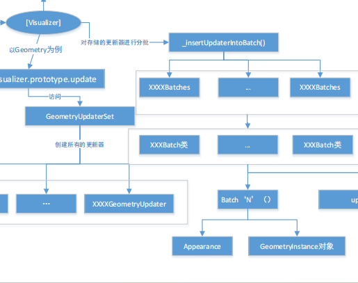

# 11、Cesium源码

### 1、Viewer模块实例化过程

#### 1.1、获取源码

- github下载

[Releases · CesiumGS/cesium (github.com)](https://github.com/CesiumGS/cesium/releases)


- 编辑器打开


#### 1.2、Viewer的构造函数


```js
    if (!defined_default(container)) {//245548行；查看是否存在DOM
      throw new DeveloperError_default("container is required.");
    }
    container = getElement_default(container);
```

这一步，查看DOM元素是否存在，使用getElement_default模块判断domID或DOM元素变量并返回。

##### 1.2.1、工具模块：defaultValue_default

```js
//245552行
options = defaultValue_default(options, defaultValue_default.EMPTY_OBJECT);
```

这一步是判断传进来的options对象是否为空，如果为空，那就使用空对象预设值`defaultValue_default.EMPTY_OBJECT`。其中，`defaultValue_default`是一个重要的模块，它判断第一个参数如果是**undefined**，就把第二个参数作为它的值返回，如果不是**undefined**，那就返回它本身。

##### 1.2.2、工具模块：defined_default

```js
//245553行
const createBaseLayerPicker = (!defined_default(options.globe) || options.globe !== false) && (!defined_default(options.baseLayerPicker) || options.baseLayerPicker !== false);
```

这一步通过`defined_default`模块判断构造参数**options**是否有**globe**属性、**baseLayerPicker**属性来决定是否创建底图选择器控件。`defined_default`模块的作用就是，判断传入值是否定义，定义了就返回**true**。

##### 1.2.3、创建DOM和判断传入参数option

```js
//245564行
const that = this;
const viewerContainer = document.createElement("div");
viewerContainer.className = "cesium-viewer";
container.appendChild(viewerContainer);
const cesiumWidgetContainer = document.createElement("div");
cesiumWidgetContainer.className = "cesium-viewer-cesiumWidgetContainer";
viewerContainer.appendChild(cesiumWidgetContainer);
const bottomContainer = document.createElement("div");
bottomContainer.className = "cesium-viewer-bottom";
viewerContainer.appendChild(bottomContainer);
const scene3DOnly = defaultValue_default(options.scene3DOnly, false);
let clock;
let clockViewModel;
let destroyClockViewModel = false;
if (defined_default(options.clockViewModel)) {
	clockViewModel = options.clockViewModel;
	clock = clockViewModel.clock;
} else {
	clock = new Clock_default();
	clockViewModel = new ClockViewModel_default(clock);
	destroyClockViewModel = true;
}
if (defined_default(options.shouldAnimate)) {
	clock.shouldAnimate = options.shouldAnimate;
}
```

将**Viewer**实例的**this**指向变量赋予给**that**变量，并为控件的**div**创建**DOM**元素。

利用`defaultValue_default`模块和`defined_default`模块，实现：

- 判断传入参数**options**中**scene3DOnly**参数是否赋值，如果没有则默认为**false**，即是否仅使用3d场景的意思；
- 判断传入参数**options**中的时钟模型属性**clockViewModel**是否存在，来决定是用传入的时钟模型，亦或者是用系统的时钟模型；
- 判断传入参数**options**中是否定义了**shouldAnimate**属性，如果定义了，则将时钟的同名属性设为同样的值。

##### 1.2.4、创建CesiumWidget

```js
//225489行
const cesiumWidget = new CesiumWidget_default(cesiumWidgetContainer, {
      baseLayer: createBaseLayerPicker || defined_default(options.baseLayer) || defined_default(options.imageryProvider) ? false : void 0,
      clock,
      skyBox: options.skyBox,
      skyAtmosphere: options.skyAtmosphere,
      sceneMode: options.sceneMode,
      mapProjection: options.mapProjection,
      globe: options.globe,
      orderIndependentTranslucency: options.orderIndependentTranslucency,
      contextOptions: options.contextOptions,
      useDefaultRenderLoop: options.useDefaultRenderLoop,
      targetFrameRate: options.targetFrameRate,
      showRenderLoopErrors: options.showRenderLoopErrors,
      useBrowserRecommendedResolution: options.useBrowserRecommendedResolution,
      creditContainer: defined_default(options.creditContainer) ? options.creditContainer : bottomContainer,
      creditViewport: options.creditViewport,
      scene3DOnly,
      shadows: options.shadows,
      terrainShadows: options.terrainShadows,
      mapMode2D: options.mapMode2D,
      blurActiveElementOnCanvasFocus: options.blurActiveElementOnCanvasFocus,
      requestRenderMode: options.requestRenderMode,
      maximumRenderTimeChange: options.maximumRenderTimeChange,
      depthPlaneEllipsoidOffset: options.depthPlaneEllipsoidOffset,
      msaaSamples: options.msaaSamples
    });
```

高频API、**Scene**、**imageryProvider**、**Globe**等均在**CesiumWidget**实例化这一步创建。

##### 1.2.5、其他的初始化

紧随其后的就是队**Viewer**的其他的一些属性的初始化，分别是界面上的按钮、时间轴等控件的初始化、事件总管理者`EventHelper`模块的初始化、重要的`DataSourceCollection/DataSourceDisplay`的初始化。

最后，以上初始化的对象，全部注册为当前**Viewer**实例上的属性，并将其中一些对象例如：**DataSourceCollection**的一些事件一并注册到**Viewer**的原型上。

除了以上初始化之外，**Cesium**还默认为**cesiumWidget**注册了屏幕操作事件的点击、双击事件，方便初始化完成后能通过点击来拾取场景中的**Entity**（场景**Scene**、实体**Entity**是数据范围，不作详细介绍了），这两个事件使用`cesiumWidget.screenSpaceEventHandler.setInputAction`方法来注册。

##### 1.2.6、原型定义方法： Object.defineProperties


在**Viewer**的原型上定义的许多属性，包括上文提及的初始化的多个对象、事件等。还包括上文创建的各个初始化的对象的一些**属性快捷连接**，以便**Viewer**实例上直接访问**其他模块的属性**。

例如你既能在**Viewer**上获取**camera**，也能在**Scene**模块获取**camera**，只不过**Viewer**上返回的**camera**也要先访问**scene**罢了。

还在Viewer的原型上定义了许多公共方法和私有方法。


### 2、CesiumWidget模块实例化过程

实例化**Viewer**必定会实例化一个**CesiumWidget**。**CesiumWidget**实际上代表的是**三维数据可视区域**，而**Viewer**除了包括可视区域，还包括各种控件（时间轴、右上角各种按钮、搜索框、时间拨盘等），更像是一个**总体承载容器**。**Viewer**能通过`extend`()方法扩充自定义的控件。

[CesiumWidget模块的实例化过程 ver1.67 - 知乎 (zhihu.com)](https://zhuanlan.zhihu.com/p/121935766)

在**cesium**中，虽然**CesiumWidget**是三维数据可视区域，但是真正调用**WebGL**进行绘图的是**CesiumWidget**中实例化的**Scene**，**CesiumWidget**会将构造时传递的**DOM**元素中内部**嵌入**一个**canvas**，再将这个**canvas元素**传递给**Scene实例**，让**Scene**进行绘制。


#### 2.1、场景及有关对象构造

**CesiumWidget**模块的构造函数通过一个`try/catch`块，完成**Scene**、**Globe**、**SkyBox**、**SkyAtmosphere**模块的实例化。而最终暴露到**CesiumWidget**的**API**中的，有**camera、terrainProvider、imageryLayers、scene、screenSpaceEventHandler、clock**这几个主要的对象


但在**Cesium**中，某个模块的属性并不一定是其原型上的，而是**这个模块别的属性的原型上的**。例如：**CesiumWidget**的属性**Camera**是**Scene**上的。

所以想要知道**API**之间的**包含关系**，只能通过源码了解。


```js
// CesiumWidget.js模块
Object.defineProperties(CesiumWidget.prototype, {
    // ...
    camera : {
        get : function() {
            return this._scene.camera;
        }
    },
    // ...
}
```


#### 2.2、Scene实例化

实例化**Scene**对象，传递主要的构造参数大部分来自于**CesiumWidget**的构造参数**options**中。

```js
//实例化Scene对象
var scene = new Scene({
    canvas : canvas,
    contextOptions : options.contextOptions,
    creditContainer : innerCreditContainer,
    creditViewport: creditViewport,
    mapProjection : options.mapProjection,
    // 太长了不贴了
    // ...
});
this._scene = scene;
```

指定摄像机的约束轴为Z轴，触发私有函数调整像素比例和摄像机视锥体。

```js
scene.camera.constrainedAxis = Cartesian3_default.UNIT_Z;
configurePixelRatio(this);
configureCameraFrustum(this);
```

创建**ellipsoid**和**globe**，并传递给**scene**.

```js
      const ellipsoid = defaultValue_default(
        scene.mapProjection.ellipsoid,
        Ellipsoid_default.WGS84
      );
      let globe = options.globe;
      if (!defined_default(globe)) {
        globe = new Globe_default(ellipsoid);
      }
      if (globe !== false) {
        scene.globe = globe;
        scene.globe.shadows = defaultValue_default(
          options.terrainShadows,
          ShadowMode_default.RECEIVE_ONLY
        );
      }
```

后续主要创建：

- 环境因素：主要是天空盒和太阳、月亮、大气环境。
- 影像数据源：（若无，则调用**createWorldImagery**模块创建世界影像，和**CesiumION**的**token**有关）和地形数据源，并传递给**scene**。影像数据源和地形数据源均可以从**options**中获取，若**options**没有，则使用**Cesium**官方给的，需要注意**token**问题。
- 视图模式：确定**scene**对象的视图模式是二维的、三维的还是哥伦布的（2.5D）。
- 给**scene**绑定了渲染错误事件处理函数。
- 确认是否使用默认的循环渲染机制（**useDefaultRenderLoop**属性），这个属性若为**false**，则需要手动调用`CesiumWidget.render()`渲染。还确定了在默认循环渲染机制时，目标帧速率（**targetFrameRate**属性）。

#### 2.3、原型上的方法定义


### 3、requestAnimationFrame循环触发帧动画

#### 3.1、CesiumWidget类是控制场景对象触发渲染的调度器

**Scene** 类是一个三维空间对象的容器，它在原型链上有一个 **render** 方法，寥寥百行，控制了三维场景中若干物体的更新、渲染。

`Scene.prototype.render` 方法调用一次，只更新并渲染**一帧**。

**WebGL** 一般会和 **requestAnimationFrame, (rAF)** 这个 API 循环调用渲染函数。而让 **canvas** 中场景能连续多帧循环往复运行的调度者，是 **CesiumWidget** 类。

在**CesiumWidget**类中有一个使用`Object.defineProperties()`方法定义的`setter`:

```js
//使用默认循环调度    
useDefaultRenderLoop: {
      get: function() {
        return this._useDefaultRenderLoop;
      },
      set: function(value) {
        if (this._useDefaultRenderLoop !== value) {
          this._useDefaultRenderLoop = value;
          if (value && !this._renderLoopRunning) {
            startRenderLoop(this);
          }
        }
      }
    },
```

在**实例化CesiumWidget**时，会使用传入的值，若没有，则是**true**。

```js
this._useDefaultRenderLoop = void 0;
this.useDefaultRenderLoop = defaultValue_default(
	options.useDefaultRenderLoop,
	true
);
```

一旦赋值，就开始**CesiumJS**的**渲染循环**，由一个在模块内的函数**startRenderLoop**负责控制。

```js
function startRenderLoop(widget) {
    widget._renderLoopRunning = true;
    let lastFrameTime = 0;
    function render2(frameTime) {//frameTime表示帧时间（即上一帧和当前帧之间的时间差）
      if (widget.isDestroyed()) {//这里首先检查场景所属的 widget（可能是一个Cesium Viewer或其他渲染容器）是否已被销毁。如果已被销毁，则直接退出函数，不再执行渲染操作。
        return;
      }
      if (widget._useDefaultRenderLoop) {//检查 widget 是否使用默认的渲染循环。这意味着它是否会自动进行渲染，还是需要手动调用该函数来渲染场景。
        try {
          const targetFrameRate = widget._targetFrameRate;//获取目标帧率，这是一个用户定义的期望帧率值。
         //用于检查变量是否已定义且不为null的函数。如果目标帧率未定义，表示用户没有设置特定的目标帧率，那么就会执行以下操作。
          if (!defined_default(targetFrameRate)) {
            widget.resize();//调整 widget 的大小，确保它适应容器的尺寸。
            widget.render();//调用 widget 的渲染方法，开始进行场景的渲染。
            requestAnimationFrame(render2);//使用浏览器的rAF方法来请求下一帧的渲染，以形成连续的渲染循环。
          } else {
            const interval = 1e3 / targetFrameRate;//计算每帧之间的时间间隔，以便在达到目标帧率时控制渲染频率。
            const delta = frameTime - lastFrameTime;//计算当前帧与上一帧之间的时间差
            if (delta > interval) {//如果时间差超过了目标间隔，说明可以进行下一帧渲染。
              widget.resize();
              widget.render();
              //更新 lastFrameTime，使其为上一帧的时间，以便在下一次渲染时计算时间差。
              lastFrameTime = frameTime - delta % interval;//
            }
            requestAnimationFrame(render2);
          }
        } catch (error) {//如果在渲染过程中发生错误，将捕获异常并执行以下操作
          widget._useDefaultRenderLoop = false;//将 _useDefaultRenderLoop 标志设置为false，表示不再使用默认的渲染循环
          widget._renderLoopRunning = false;//将 _renderLoopRunning 标志设置为false，表示渲染循环已停止
          if (widget._showRenderLoopErrors) {//如果允许显示渲染循环错误，将执行以下操作
            const title = "An error occurred while rendering.  Rendering has stopped.";//显示错误面板，向用户展示发生的错误
            widget.showErrorPanel(title, void 0, error);
          }
        }
      } else {
        widget._renderLoopRunning = false;//将 _renderLoopRunning 标志设置为false，表示渲染循环已停止
      }
    }
    requestAnimationFrame(render2);
  }
```

传入的**widget**是**CesiumWidget**的实例，实现了一个灵活的渲染循环，允许根据目标帧率控制渲染频率，同时处理可能发生的渲染错误。在渲染前会检查**widget**是否已被销毁，以避免渲染被执行到已不再需要的场景。最后，通过**递归**调用`requestAnimationFrame`实现连续的渲染循环，直到渲染停止或**widget**被销毁。

#### 3.2、Scene对象

对于**全局**而言，**CesiumWidget**负责控制**DOM**的变化情况，例如窗口尺寸变化导致**DIV**的变化等，并负责起**渲染循环的调度**。

对于**单帧**而言，**Scene**类需要使用自己原型链上的**render**方法完成自我状态、数据对象的更新;

以及`Scene.js`模块内的**render**函数**触发WebGL绘制**。

```js
//Scene类原型链上的render
Scene.prototype.render = function(time) {
    this._preUpdate.raiseEvent(this, time);//事件触发，会在渲染前被调用，可以让用户在渲染之前执行一些操作。
    const frameState = this._frameState;//获取当前场景的帧状态对象
    frameState.newFrame = false;//将newFrame标志设置为false，表示当前帧不是一个新帧
    if (!defined_default(time)) {//检查时间参数是否已定义，如果未定义，则使用当前的JulianDate（儒略日期）作为时间
      time = JulianDate_default.now();
    }
      //检查相机是否有更新。如果有相机更新，会返回true，否则返回false
    const cameraChanged = this._view.checkForCameraUpdates(this);
   /**判断是否需要渲染场景
   !this.requestRenderMode: 如果没有设置requestRenderMode属性，表示始终要进行渲染。
	this._renderRequested: 如果_renderRequested属性为true，表示已经请求过渲染。
	cameraChanged: 如果相机有更新，表示需要进行渲染。
	this._logDepthBufferDirty: 如果深度缓冲区有更新，表示需要进行渲染。
	this._hdrDirty: 如果高动态范围(HDR)设置有更新，表示需要进行渲染。
	this.mode === SceneMode_default.MORPHING: 如果场景模式为“MORPHING”，表示需要进行渲染。*/
    let shouldRender = !this.requestRenderMode || this._renderRequested || cameraChanged || this._logDepthBufferDirty || this._hdrDirty || this.mode === SceneMode_default.MORPHING;
      // 如果shouldRender为false，并且定义了maximumRenderTimeChange属性和_lastRenderTime属性，则判断是否超过了最大渲染时间间隔，如果超过则需要进行渲染
    if (!shouldRender && defined_default(this.maximumRenderTimeChange) && defined_default(this._lastRenderTime)) {
      const difference = Math.abs(
        JulianDate_default.secondsDifference(this._lastRenderTime, time)
      );
      shouldRender = shouldRender || difference > this.maximumRenderTimeChange;
    }
    if (shouldRender) {//如果需要进行渲染，执行以下操作
      this._lastRenderTime = JulianDate_default.clone(time, 		this._lastRenderTime);// 将当前时间克隆到_lastRenderTime，用于计算下一次渲染的时间间隔
      this._renderRequested = false;//将_renderRequested属性设置为false，表示渲染已经被处理
      this._logDepthBufferDirty = false;//将_logDepthBufferDirty属性设置为false，表示深度缓冲区已更新。
      this._hdrDirty = false;// 将_hdrDirty属性设置为false，表示HDR设置已更新
      const frameNumber = Math_default.incrementWrap(
        frameState.frameNumber,
        15e6,
        1
      );//更新帧号，将frameState.frameNumber递增，并在达到最大值时循环回来（15e6表示最大值）
      updateFrameNumber(this, frameNumber, time);// 更新场景的帧数相关参数
      frameState.newFrame = true;
    }
    tryAndCatchError(this, prePassesUpdate);//在渲染前尝试执行prePassesUpdate函数，并捕获可能发生的错误
    if (this.primitives.show) {//如果场景中的图元（primitives）显示（即可见），则执行以下操作
      tryAndCatchError(this, updateMostDetailedRayPicks);//在渲染前尝试执行updateMostDetailedRayPicks函数，并捕获可能发生的错误
      tryAndCatchError(this, updatePreloadPass);//在渲染前尝试执行updatePreloadPass函数，并捕获可能发生的错误
      tryAndCatchError(this, updatePreloadFlightPass);//在渲染前尝试执行updatePreloadFlightPass函数，并捕获可能发生的错误
      if (!shouldRender) {// 如果不需要渲染（即shouldRender为false），尝试执行updateRequestRenderModeDeferCheckPass函数，并捕获可能发生的错误
        tryAndCatchError(this, updateRequestRenderModeDeferCheckPass);
      }
    }
    this._postUpdate.raiseEvent(this, time);//事件触发，会在渲染后被调用，可以让用户在渲染之后执行一些操作
    if (shouldRender) {
      this._preRender.raiseEvent(this, time);//事件触发，在渲染前被调用，可以让用户在渲染之前执行一些操作
      frameState.creditDisplay.beginFrame();// 开始帧处理，用于显示相应的信用信息（例如Cesium logo）
      tryAndCatchError(this, render);//尝试执行渲染操作，交给Scene.js模块的render函数触发WebGL绘制，并捕获可能发生的错误
    }
    updateDebugShowFramesPerSecond(this, shouldRender);//更新是否显示帧率的调试信息，根据是否进行了渲染来确定
    tryAndCatchError(this, postPassesUpdate);//在渲染后尝试执行postPassesUpdate函数，并捕获可能发生的错误
    callAfterRenderFunctions(this);//调用在渲染后执行的函数
    if (shouldRender) {
      this._postRender.raiseEvent(this, time);//事件触发，在渲染后被调用，可以让用户在渲染之后执行一些操作
      frameState.creditDisplay.endFrame();// 结束帧处理，清除之前显示的信用信息
    }
  };
```

实现了一个灵活的场景渲染流程，根据**场景中的变化情况和用户设置的参数**来确定是否进行渲染。在渲染前和渲染后触发了多个事件，用户可以通过**监听**这些事件来扩展场景渲染的功能。同时，代码中对错误的捕获和处理也有一定的保障

**Scene** 类是一个场景对象容器，其`Scene.prototype.render()` 方法负责：

- 生命周期事件（**preUpdate、preRender、postUpdate、postRender**）回调触发；
- 更新帧状态和帧号
- 更新 **Scene** 中的 **Primitive**
- 移交渲染权给模块内的 **render** 函数触发 **WebGL** 绘制

`Scene.prototype.render()`并没有更新椭球体，没有请求地形四叉树瓦片，而是等待更重要的 **Primitive** 等三维物体的更新后，才判断 **globe** 是否存在，从而决定要不要画地球（的皮肤），最终才更新并执行 **Command**，也就是 `scene.updateAndExecuteCommands(passState, backgroundColor)`;

```js
//Scene.js模块内的render函数，触发WebGL绘制 
var scratchBackgroundColor = new Color_default();
function render(scene) {
    const frameState = scene._frameState;
    const context = scene.context;
    const us = context.uniformState;
    const view = scene._defaultView;
    scene._view = view;
    scene.updateFrameState();
    frameState.passes.render = true;
    frameState.passes.postProcess = scene.postProcessStages.hasSelected;
    frameState.tilesetPassState = renderTilesetPassState;
    let backgroundColor = defaultValue_default(scene.backgroundColor, Color_default.BLACK);
    if (scene._hdr) {
      backgroundColor = Color_default.clone(backgroundColor, scratchBackgroundColor);
      backgroundColor.red = Math.pow(backgroundColor.red, scene.gamma);
      backgroundColor.green = Math.pow(backgroundColor.green, scene.gamma);
      backgroundColor.blue = Math.pow(backgroundColor.blue, scene.gamma);
    }
    frameState.backgroundColor = backgroundColor;
    scene.fog.update(frameState);
    us.update(frameState);
    const shadowMap = scene.shadowMap;
    if (defined_default(shadowMap) && shadowMap.enabled) {
      if (!defined_default(scene.light) || scene.light instanceof SunLight_default) {
        Cartesian3_default.negate(us.sunDirectionWC, scene._shadowMapCamera.direction);
      } else {
        Cartesian3_default.clone(scene.light.direction, scene._shadowMapCamera.direction);
      }
      frameState.shadowMaps.push(shadowMap);
    }
    scene._computeCommandList.length = 0;
    scene._overlayCommandList.length = 0;
    const viewport = view.viewport;
    viewport.x = 0;
    viewport.y = 0;
    viewport.width = context.drawingBufferWidth;
    viewport.height = context.drawingBufferHeight;
    const passState = view.passState;
    passState.framebuffer = void 0;
    passState.blendingEnabled = void 0;
    passState.scissorTest = void 0;
    passState.viewport = BoundingRectangle_default.clone(viewport, passState.viewport);
    if (defined_default(scene.globe)) {
      scene.globe.beginFrame(frameState);
    }
    scene.updateEnvironment();
    scene.updateAndExecuteCommands(passState, backgroundColor);//更新并执行 Command
    scene.resolveFramebuffers(passState);
    passState.framebuffer = void 0;
    executeOverlayCommands(scene, passState);
    if (defined_default(scene.globe)) {
      scene.globe.endFrame(frameState);
      if (!scene.globe.tilesLoaded) {
        scene._renderRequested = true;
      }
    }
    context.endFrame();
  }
```


#### 3.3、三维地球构成

CesiumJS 的三维地球，实际上分两大部分：

- 地球椭球体与表面的 GIS 影像服务
- 场景中的三维物体

CesiumJS 内置了大量的默认值，包括地球椭球体以及影像服务（默认用的必应瓦片服务，要 token）。但是，实际上可以不需要地球椭球体和底图的：

```js
   if (defined(scene.globe)) {
     scene.globe.beginFrame(frameState);
   }
```

上述代码片段是 `Scene.js` 模块内的 **render** 函数的一小段，也就是说，若没有定义 **globe**，那就不绘制椭球上的帧。

.jpg)

### 4、渲染原理之渲染Primitive

**Scene.js** 模块内的 **render** 函数会将控制权交给 **WebGL**，执行 CesiumJS 自己封装的**指令对象**，画出**每一帧**来。

模块内的 **render** 函数首先会更新一批状态信息，譬如帧状态、雾效、Uniform 值、通道状态、三维场景中的环境信息等，然后就开始更新并执行指令，调用的是 **Scene** 原型链上的 `updateAndExecuteCommands` 方法。

整个过程大致调用为：


#### 4.1、指令


CesiumJS 有三类指令：

- **DrawCommand** 绘图指令
- **ClearCommand** 清屏指令
- **ComputeCommand** 计算指令

绘图指令最终会把控制权交给 `Context` 对象，根据自身的着色器对象，绘制自己身上的数据资源;

清屏指令比较简单，目的就是调用 WebGL 的清屏函数，清空各类缓冲区并填充清空后的颜色值，依旧会把控制权传递给 `Context` 对象;

计算指令则借助 WebGL 并行计算的特点，将指令对象上的数据在着色器中编码、计算、解码，最后写入到输出缓冲（通常是帧缓冲的纹理上），同样控制权会给到 `Context` 对象。

#### 4.2、通道

一帧是由多个通道顺序绘制构成的，在 CesiumJS 中，通道英文单词是 **Pass**

既然通道的绘制是有顺序的，其顺序保存在 `Renderer/Pass.js` 模块导出的冻结对象中，目前（1.107版本）有 10 个优先顺序等级（最后 `NUMBER_OF_PASSES` 是通道的数量）

```js
  var Pass = {
    ENVIRONMENT: 0,
    COMPUTE: 1,
    GLOBE: 2,
    TERRAIN_CLASSIFICATION: 3,
    CESIUM_3D_TILE: 4,
    CESIUM_3D_TILE_CLASSIFICATION: 5,
    CESIUM_3D_TILE_CLASSIFICATION_IGNORE_SHOW: 6,
    OPAQUE: 7,
    TRANSLUCENT: 8,
    VOXELS: 9,
    OVERLAY: 10,
    NUMBER_OF_PASSES: 11
  };
```

以上为例，第一优先被绘制的指令，是环境（`ENVIRONMENT: 0`）方面的对象、物体。而不透明（`OPAQUE: 7`）的三维对象的绘制指令，则要先于透明（`TRANSLUCENT: 8`）物体被执行。

**CesiumJS** 会在**每一帧即将开始绘制前，对所有已经收集好的指令根据通道进行排序，实现顺序绘制**。

#### 4.3、生成并执行指令

原型链上的 `updateAndExecuteCommands` 方法会做模式判断，我们一般使用的是三维模式（`SceneMode.SCENE3D`），所以只需要看 `else if` 分支即可，也就是

```js
executeCommandsInViewport(true, this, passState, backgroundColor);
```

此处，**this** 就是 **Scene** 自己。

`executeCommandsInViewport()` 是一个 `Scene.js` 模块内的函数，这个函数比较短，对于当前我们关心的东西，只需要看它调用的 `updateAndRenderPrimitives()` 和最后的 `executeCommands2()` 函数调用即可。

##### 4.3.1、Primitive 生成指令

```js
 [Module Scene.js]
 - fn updateAndRenderPrimitives()
   [Module Primitive.js]
   - fn createCommands()
   - fn updateAndQueueCommands()
```

`Scene.js` 模块内的函数 `updateAndRenderPrimitives()` 负责更新 **Scene** 上所有的 **Primitive**。

期间，控制权会通过 **PrimitiveCollection** 转移到 **Primitive** 类（或者有类似结构的类，譬如 **Cesium3DTileset** 等）上，令其更新本身的数据资源，根据情况创建新的着色器，并随之创建 **绘图指令**，最终在 `Primitive.js` 模块内的 `updateAndQueueCommands()` 函数排序、并推入帧状态对象的指令列表上。

##### 4.3.2、Context对象执行WebGL底层代码

```js
 [Module Scene.js]
 - fn executeCommands2()
 - fn executeCommand() // 收到 Command 和 Context
   [Module Context.js]
   - Context.prototype.draw()
```

另一个模块内的函数 `executeCommands2()` 则负责执行这些指令（中间还有一些小插曲，下文再提）。

此时，上文的“通道”再次起作用，此函数内会根据 **Pass** 的优先顺序依次更新唯一值状态（**UniformState**），然后下发给 `executeCommand()` 函数（注意少了个`s`）以具体的某个指令对象以及 `Context` 对象。

> 除了 `executeCommand()` 函数外，`Scene.js` 模块内仍还有其它类似的函数，例如 `executeIdCommand()` 负责执行绘制 ID 信息纹理的指令，
>
> `executeTranslucentCommandsBackToFront()` / `executeTranslucentCommandsFrontToBack()` 函数负责透明物体的指令等。
>
> 甚至在 Scene 对象自己的属性中，就有清屏指令字段，会在 `executeCommands()` 函数中直接执行，不经过上述几个执行具体指令的函数。

**Context** 对象是对 `WebGL(2)RenderingContext` 等 **WebGL** 原生接口、参数的封装，所有指令对象最终都会由其进行拆包装、组装 WebGL 函数调用并执行绘图、计算、清屏。

#### 4.4、指令对象转移

指令对象在 Primitive（或类似的类）生成后，由 模块内的 `updateAndQueueCommands()` 函数排序并推入帧状态对象的指令列表上：

```js
 // updateAndQueueCommands 函数中，函数接收来自 Scene 逐级传入的帧状态对象 -- frameState
 const commandList = frameState.commandList;
 const passes = frameState.passes;
 if (passes.render || passes.pick) {
   // ... 省略部分代码
   commandList.push(colorCommand);
 }
```

`frameState.commandList` 就是个普通的数组。

而在执行时，却是从 **View** 对象上的 **frustumCommandsList** 上取的指令：

```js
 // Scene.js 模块的 executeCommands2() 函数中
 const frustumCommandsList = view.frustumCommandsList;
 const numFrustums = frustumCommandsList.length;
 //...
 let j;
 for (let i = 0; i < numFrustums; ++i) {
   const index = numFrustums - i - 1;
   const frustumCommands = frustumCommandsList[index];
   
   // ...
   
   // 截取不透明物体的通道指令执行代码片段
   us.updatePass(Pass.OPAQUE);
   commands = frustumCommands.commands[Pass.OPAQUE];
   length = frustumCommands.indices[Pass.OPAQUE];
   for (j = 0; j < length; ++j) {
     executeCommand(commands[j], scene, context, passState);
   }
   
   // ...
 }
```

其中，下发给 `executeCommand()` 函数的 `commands[j]` 参数，就是具体的某个指令对象。

而在这个传递下发的过程中，是通过 `View.prototype.createPotentiallyVisibleSet`实现的。

##### 4.4.1、筛选可见集

**View** 对象是 **Scene**、**Camera** 之间的纽带，负责“眼睛”与“世界”之间信息的处理，即视图。

`View.prototype.createPotentiallyVisibleSet`的作用，就是把 **Scene** 上的计算指令、覆盖物指令，帧状态上的指令列表，根据 **View** 的可见范围做一次筛选，减少要执行指令个数提升性能。

具体来说，就是把分散在各处的指令，筛选后绑至 **View** 对象的 **frustumCommandsList** 列表中，借助 `View.js` 模块内的 `insertIntoBin()` 函数完成：

```js
 // View.js 模块内
 
 function insertIntoBin(view, scene, command, commandNear, commandFar) {
   // ...
   
   const frustumCommandsList = view.frustumCommandsList;
   const length = frustumCommandsList.length;

   for (let i = 0; i < length; ++i) {
     // ...
     
     frustumCommands.commands[pass][index] = command;
    
     // ...
   }
   
   // ...
 }  
```

这个函数内做了对**指令的筛选判断**。

### 5、渲染原理之渲染Entity

>Entity参数对象最终会被解析变成Primitive，几何类型的Entity转变为几何类型的Primitive，但是其他类型的呢？例如：Label、Model、Wall、tileset这些又该如何转化为Primitive？？
>
>解答：
>
>1. 不同的Entity会触发生成不同的Visualizer（可视化器）
>2. 其中GeometryVisualizer会通过GeometryUpdaterSet创建Updater（更新器），然后进行分批、更新。
>3. 其中Cesium3Dtiles会在 `Cesium3DTilesetVisualizer.prototype.update`调用 `createTileset(resource, tilesetHash, entity, primitives)`方法
>4. Model会在 `ModelVisualizer.prototype.update`调用 `createModelPrimitive(this, entity, resource, incrementallyLoadTextures)`方法
>5. 其余的可以详看源码中对应的`xxxx.prototype.update`方法。

在创建三维几何体或三维模型的时候，只需要传入参数对象，就可以实现Entity的创建。

```js
const modelEntity = viewer.entites.add({
   id: 'some-entitiy',
   name: 'some-name',
   position: Cartesian3.fromDegrees(112.5, 22.3, 0),
   model: {
     uri: 'path/to/model.glb'
   }
})
```

关于Entity与Primitive之间的对比：

- 前者使用 Property API 使得动态效果简单化，后者需要自己编写着色器；
- 个体数量较多时，前者的性能不如后者；
- 后者支持较底层的用法，可以自己控制材质着色器、几何数据并批优化；
- ...

> **但是Entity最终会变成Primitive，其中Entity API是如何从参数化对象到WebGL渲染？**

上述代码可以得出，**Entity API**的入口是**Viewer**，而不是像**Primitive API**是从**Scene**访问的，即：

**Entity API必须依赖Viewer容器。**

#### 5.1、Entity API必须依赖Viewer容器

**Viewer** 其实是 **CesiumJS** 长期维护的一个成果，它在大多数时候扮演的是 **Web3D GIS** 地球的总入口对象。

**Scene** 暴露出来的 Primitive API 是一种比较接近 WebGL 数据接口的 API，面对接近业务层的数据格式，譬如 GeoJSON、KML、GPX 等，Primitive API 就比较麻烦。

虽然可以做一些转换接口，不过 **Cesium** 团队结合自己研发的数据标记语言 -- **CZML**，配上**内置的时钟**，封装出了更高级别的架构。

**CesiumJS** 使用 **DataSource API** 和 **Entity API** 这套组合实现了复杂、动态空间地理数据格式的接入。

##### 5.1.1、高层数据模型的封装 - DataSource API

Entity API的基础设施。

首先，分别看定义在 `Viewer` 原型链上的两个属性 `entities`、`dataSourceDisplay`：

```js
 Object.defineProperties(Viewer.prototype, {
   // ...
   dataSourceDisplay: {
     get: function () {
       return this._dataSourceDisplay;
     },
   },
   entities: {
     get: function () {
       return this._dataSourceDisplay.defaultDataSource.entities;
     },
   },
   // ...
 }
```

从上面两个 getter 看，**EntityCollection** 似乎是被 **DataSourceDisplay** 对象的 **defaultDataSource** 管辖的；**defaultDataSource** 是 **CustomDataSource** 类型的。

**Viewer** 拥有一个 **DataSourceDisplay** 成员，**它负责所有 DataSource 的更新**。

##### 5.1.2、显示管理器 DataSourceDisplay 与默认数据源 CustomDataSource

它随 **Viewer** 创建而创建，而且优先级相当高，仅次于 **CesiumWidget**；它自己则创建默认的 **DataSource**，也就是 **CustomDataSource**：

```js
 // DataSourceDisplay.js
 function DataSourceDisplay(options) {
   // ...
    const defaultDataSource = new CustomDataSource_default();
    this._onDataSourceAdded(void 0, defaultDataSource);
    this._defaultDataSource = defaultDataSource;
   // ...
 }
```

在这个 **CustomDataSource** 的构造函数里，就能找到 **Viewer** 暴露出去的 **EntityCollection**：

```js
 // CustomDataSource.js
 function CustomDataSource(name) {
   // ...
   this._entityCollection = new EntityCollection(this);
   // ...
 }
 
 Object.defineProperties(CustomDataSource.prototype, {
   // ...
   entities: {
     get: function () {
       return this._entityCollection;
     },
   },
   // ...
 }
```

所以，包含关系就说清楚了：

```text
 Viewer
 ┖ DataSourceDisplay
   ┖ CustomDataSource
     ┖ EntityCollection
```

> **DataSourceDisplay** 除了管着 **CustomDataSource** 这个服务于 **Entity API** 的默认数据源外，还管着其它的 **DataSource**，其它的都会装入 **DataSourceDisplay** 的 **DataSourceCollection** 容器下，譬如 **GeoJsonDataSource**、**CzmlDataSource** 等，在文档中搜 DataSource 关键字基本能找齐。

##### 5.1.3、默认数据源：CustomDataSource

默认的数据源的作用，就是给 **Entity API** 提供土壤。

但是 **CustomDataSource** 并不是只能给 **Entity API** 使用，在官方沙盒中可以找到直接使用 **CustomDataSource** 的例子。

##### 5.1.4、DataSource API与Scene之间的联系

目前了解的，在**Cesium**中，只有**Scene**上的**PrimitiveCollection**才有权力更新**Primitive**，进而创建**DrawCommand**。

而**DataSource API**被包含于**DataSourceDisplay**对象，**DataSourceDisplay**对象拥有一个**私有的primitiveCollection**成员对象。

```js
 function DataSourceDisplay(options) {
   // ...
   const scene = options.scene;
   const dataSourceCollection = options.dataSourceCollection;
   // ...
   
    let primitivesAdded = false;
    const primitives = new PrimitiveCollection_default();
    const groundPrimitives = new PrimitiveCollection_default();
     //这个私有的 PrimitiveCollection 创建完成后，就把它添加到 Scene 的 PrimitiveCollection 中了，伴随着 CesiumWidget 调度的渲染循环进行帧渲染。
    if (dataSourceCollection.length > 0) {
      scene.primitives.add(primitives);
      scene.groundPrimitives.add(groundPrimitives);
      primitivesAdded = true;
    }
     
    this._primitives = primitives;
    this._groundPrimitives = groundPrimitives;
   
   // ...
   
   if (!primitivesAdded) {
     // 对于 dataSourceCollection.length 是 0 的情况
     // 使用事件机制把私有的 PrimitiveCollection 添加到 scene.primitives 中
   }
 }
```

>**PrimitiveCollection** 支持嵌套添加，也就是 **Collection** 可以添加到 **Collection** 中，**update** 时也会树状逐级向下更新。

#### 5.2、可视化器——Visualizer

> 问题：可视化器是什么？

在**Cesium**中，**Visualizer**是用于将实体(**Entity**)与场景(**Scene**)进行关联的组件。**Visualizer负责处理实体的渲染、更新和交互等任务**。**Cesium**中的实体是地理空间中的对象，可以是点、线、多边形、模型等。

**Visualizer**的作用是根据实体的属性和状态来生成对应的可视化效果，并将其添加到场景中。当实体的属性发生变化或需要更新时，**Visualizer**会负责更新渲染效果，从而保持场景的实时同步。

**Cesium**中内置了多个**Visualizer**，用于处理不同类型的实体，例如：

1. PointVisualizer：处理点实体的渲染。
2. PolylineVisualizer：处理线实体的渲染。
3. PolygonVisualizer：处理多边形实体的渲染。
4. ModelVisualizer：处理模型实体的渲染。

通过将实体与**Visualizer**关联，**Cesium**可以高效地管理大量的地理空间数据，并在三维场景中进行动态展示。**Visualizer**的灵活性也使得开发者可以根据需要**自定义**新的**Visualizer**来处理特定类型的实体或实现特定的渲染效果。

##### 5.2.1、为CustomDataSource创建Visualizer

在**DataSourceDisplay**创建**defaultDataSource**时，会主动调用`_onDataSourceAdded`方法：

```js
// packages/engine/Source/DataSources/DataSourceDisplay.js
const defaultDataSource = new CustomDataSource_default();
//将CustomDataSource类型的实例defaultDataSource作为参数传入_onDataSourceAdded方法
this._onDataSourceAdded(void 0, defaultDataSource);
this._defaultDataSource = defaultDataSource;
```

```js
Viewer
┖CesiumWidget
┖DataSourceDisplay
	┖DataSourceCollection
	┖CustomDataSource
		┖EntityCollection
			┖Entity

```

`_onDataSourceAdded`方法会给**defaultDataSource**再创建一个私有的**PrimitiveCollection**添加到**DataSourceDisplay**的**PrimitiveCollection**中。紧接着会调用`_visualizersCallback`方法创建**可视化器。**

```js
 // DataSourceDisplay.prototype._onDataSourceAdded 中
 dataSource._visualizers = this._visualizersCallback(
   scene,
   entityCluster,
   dataSource
 );
```

```js
function DataSourceDisplay(options) {
  // ...
  this._visualizersCallback = defaultValue(
    options.visualizersCallback,
    DataSourceDisplay.defaultVisualizersCallback
  );
  // ...
}
//_visualizersCallback方法会返回一个Visualizer对象数组
DataSourceDisplay.defaultVisualizersCallback = function(
scene,
entityCluster,
dataSource
) {
    const entities = dataSource.entities;
    return [
      new BillboardVisualizer_default(entityCluster, entities),
      new GeometryVisualizer_default(
        scene,
        entities,
        dataSource._primitives,
        dataSource._groundPrimitives
      ),
      new LabelVisualizer_default(entityCluster, entities),
      new ModelVisualizer_default(scene, entities),
      new Cesium3DTilesetVisualizer_default(scene, entities),
      new PointVisualizer_default(entityCluster, entities),
      new PathVisualizer_default(scene, entities),
      new PolylineVisualizer_default(
        scene,
        entities,
        dataSource._primitives,
        dataSource._groundPrimitives
      )
    ];
  };
```

##### 5.2.2、EntityCollection 与 Visualizer 之间的通信 - 事件机制

> 问题：可视化器如何将Entity转换为Primitive？

实际上，每一个**CustomDataSource**都包含一个与之关联的**EntityCollection**，它让其包含的**EntityCollection**在**DataSourceDisplay**中作为一个合理的数据源存在。但是并不直接监听Entity的变化。

真正**直接监听Entity变化**的是通过**EntityCollection**的**事件机制**完成的，而**EntityCollection**无论发生什么变化都会传递给**Visualizer**。

```js
DataSourceDisplay
┖ CustomDataSource
  ┠ EntityCollection
  ┃      ↑
  ┃  事件机制监听变化
  ┃      ┃
  ┖ [Visualizers]
```

**EntityCollection** 原型链上的 **add/removeById/removeAll** 方法会执行一个模块内的函数 `fireChangedEvent()`，它最核心的作用，就是把增加、删除、修改的 **Entity** 通过事件触发通知给 **Visualizer**：

```js
// function fireChangedEvent() 中
const addedArray = added.values.slice(0);
const removedArray = removed.values.slice(0);
const changedArray = changed.values.slice(0);

added.removeAll();
removed.removeAll();
changed.removeAll();
collection._collectionChanged.raiseEvent(
  collection,
  addedArray,
  removedArray,
  changedArray
);
```

其中，**added/removed/changed** 是 **Entity** 增删改时的临时保存容器，每次执行 `fireChangedEvent()` 函数时都会把这三个容器清除。

在上述代码中，触发事件的还是**EntityCollection**本身，`fireChangedEvent()`只是把变动的、最新的Entity取出并通知注册的回调函数。

在**VIsualizer**创建的时候，就给**EntityCollection**注册了回调函数：

```js
// 在 GeometryVisualizer 的构造函数中
entityCollection.collectionChanged.addEventListener(
  GeometryVisualizer.prototype._onCollectionChanged,
  this
);
```

也就是说，每当 **EntityCollection** 有增删改变化时，**GeometryVisualizer** 的 `_onCollectionChanged` 就会收到变化的 **Entity**，并继续执行后续动作。

关于**Entity**的属性的修改是借助**Property API**完成的，**Property API**是用于**管理实体（Entity）属性的一组接口和方法**。实体的属性可以是固定值、时间相关值或动态计算的值，Property API使得实体属性的处理更加灵活和强大。在**add/removeAll/removeById**到**EntityCollection**时，**EntityCollection**会为该**Entity**注册属性变动事件的回调：

```js
//add
EntityCollection.prototype.add = function(entity) {
//...
    entity.definitionChanged.addEventListener(
      EntityCollection.prototype._onEntityDefinitionChanged,
      this
    );
    fireChangedEvent(this);//
    return entity;
  };
//removeById
EntityCollection.prototype.removeById = function(id) {
   //...
    entity.definitionChanged.removeEventListener(
      EntityCollection.prototype._onEntityDefinitionChanged,
      this
    );
    fireChangedEvent(this);
    return true;
  };
//removeAll
EntityCollection.prototype.removeAll = function() {
	//...
    for (let i = 0; i < entitiesLength; i++) {
	  //...
      if (!defined_default(addedItem)) {
        existingItem.definitionChanged.removeEventListener(
          EntityCollection.prototype._onEntityDefinitionChanged,
          this
        );
        removed.set(existingItemId, existingItem);
      }
    }
	//...
    fireChangedEvent(this);
  };
```

```js
 EntityCollection.prototype._onEntityDefinitionChanged = function(entity) {
    const id = entity.id;
    if (!this._addedEntities.contains(id)) {
      this._changedEntities.set(id, entity);
    }
    fireChangedEvent(this);
  };
```

`_onEntityDefinitionChanged` 在 **Entity** 的 `definitionChanged` 事件触发后执行，也还是执行 `fireChangedEvent` 函数

#### 5.3、时钟Clock

> 问题：怎么触发DataSourceDisplay的更新？

**CesiumWidget**中拥有一个时钟成员对象。

```js
// CesiumWidget 构造函数中
this._clock = defined(options.clock) ? options.clock : new Clock();
```

默认的时钟会在**每一帧**渲染调度函数中**跳动**：

```js
CesiumWidget.prototype.render = function () {
  if (this._canRender) {
    this._scene.initializeFrame();
    const currentTime = this._clock.tick();
    this._scene.render(currentTime);
  } else {
    this._clock.tick();
  }
};
```

但无论是否渲染，都会调用`Clock.prototype.tick()`方法跳动一次时钟，这个方法会触发**onTick**事件：

```js
Clock.prototype.tick = function () {
  // ...
  this.onTick.raiseEvent(this);
  // ...
}
```

而在**Viewer**的构造函数中，先创建了**CesiumWidget**，随后就为时钟注册了**onTick**的回调函数：

```js
function Viewer(container, options) {
  // ...
  // eventHelper 是一个事件助手对象，此处为 clock 注册事件用
  eventHelper.add(clock.onTick, Viewer.prototype._onTick, this);
  // ...
}

Viewer.prototype._onTick = function (clock) {
  const time = clock.currentTime;

  const isUpdated = this._dataSourceDisplay.update(time);
  // ...
}
```

在 **_onTick** 方法中，第一件做的事情就是执行 **DataSourceDisplay** 的更新：

```js
DataSourceDisplay.prototype.update = function (time) {
  // ...
  let result = true;
  
  let visualizers;
  let vLength;
  
  visualizers = this._defaultDataSource._visualizers;
  vLength = visualizers.length;
  for (x = 0; x < vLength; x++) {
    result = visualizers[x].update(time) && result;
  }
  
  // ...
}
```

这个更新方法其实就是 **进一步更新** **DataSourceDisplay** 中所有的数据源（无论是数据源容器中的还是默认的 **CustomDataSource** 的）的 **可视化器（Visualizer）**。

**CesiumWidget** 负责调度 **Scene** 的帧渲染，同时会跳动时钟对象，时钟对象的跳动又进而通知 **Viewer** 更新 **DataSourceDisplay** 下辖的所有 **DataSource**。

#### 5.4、 Visualizer 的更新

##### 5.4.1、更新方法中的三个循环

> 三个循环把`_addedObjects/_removedObjects/_changedObjects`这三类逆序遍历通过EntityCollection的事件机制传递给Visualizer

```js
GeometryVisualizer.prototype.update = function (time) {
  // ...
  const addedObjects = this._addedObjects;
  const added = addedObjects.values;
  const removedObjects = this._removedObjects;
  const removed = removedObjects.values;
  const changedObjects = this._changedObjects;
  const changed = changedObjects.values;
  
  let i;
  let entity;
  let id;
  let updaterSet;
  const that = this;
  
  for (i = changed.length - 1; i > -1; i--) { /* ... */ }
  for (i = removed.length - 1; i > -1; i--) { /* ... */ }
  for (i = added.length - 1; i > -1; i--) { /* ... */ }
  
  addedObjects.removeAll();
  removedObjects.removeAll();
  changedObjects.removeAll();
  
  // ...
} 
```

更新方法会取三类**Entity**（`_addedObjects/_removedObjects/_changedObjects`）进行逆序遍历。这三个容器会通过EntityCollection的事件机制传递给Visualizer。

##### 5.4.2、Visualizer 的数据转换工具 - Updater

> Updater是什么?

在使用Property API去修改实体Entity的属性（外观、形状...）时，这些动态值每一帧需要变成静态值传递给WebGL，Entity中的几何类型比较多，Cesium分别为这些几何类型的动态转静态的过程进行了封装——Updater：用于辅助几何类型的Entity的几何数据更新。

例如，在GeometryVisualizer.js模块中，有如下数组：

```js
const geometryUpdaters = [
  BoxGeometryUpdater,
  CylinderGeometryUpdater,
  CorridorGeometryUpdater,
  EllipseGeometryUpdater,
  EllipsoidGeometryUpdater,
  PlaneGeometryUpdater,
  PolygonGeometryUpdater,
  PolylineVolumeGeometryUpdater,
  RectangleGeometryUpdater,
  WallGeometryUpdater,
];
```

这些就是对应的几何更新器。这些几何更新器类中可以找到createXXXGeometryInstance原型链上的方法。例如：`EllipsoidGeometryUpdater.prototype.createFillGeometryInstance` 方法。


这些方法就是最后创建 `Primitive` 时所需的 `GeometryInstance` 的创建者，它们依赖于时间，返回该时间的静态几何值。

##### 5.4.3、Updater 的集合 - GeometryUpdaterSet

> GeometryUpdater是什么？

在GeometryVisualizer.prototype.update方法中，三个逆序循环在访问一个GeometryUpdaterSet类型的容器。这个容器是`GeometryVisualizer.js` 模块内的私有类。

只有在遍历 `_addedObjects` 时才会创建 `GeometryUpdaterSet`，此时新来的 `Entity` 会传给这个集合。这个集合的作用也比较简单

- 为新来 **Entity** 创建**所有的**几何更新器（这就是性能可能会出现问题的原因之一了）
- 为所有的几何更新器注册 `geometryChanged` 事件的响应函数

这个几何更新器集合创建完后，会存储到 **GeometryVisualizer** 中，并与 **Entity** 的 **id** 作绑定（方便其它两个逆序循环查找）


##### 5.4.4、性能的提升 - Updater 的分批

> 分批的作用？分批的后续操作？

WebGL 的特点就是，单帧内绘制的次数越少，就越流畅。**GeometryVisualizer** 如果不为这些接受来的 **Entity** 分类归并批次，而是粗暴地把每个 **Entity** 直接生成静态几何、外观数据就创建 **Primitive** 的话，有多少 **Entity** 就会有多少 **Primitive**，也就有多少 **DrawCommand**，性能会非常糟糕。

所以，Cesium在**GeometryVisualizer** 中设计了一个分批的过程，也就是原型链上的 `_insertUpdaterIntoBatch` 方法。

在 **GeometryVisualizer** 更新时，三个列表循环中的两个（添加列表和更改列表）都会调用 `_insertUpdaterIntoBatch` 方法，把由于新增或修改 **Entity** 而创建出来的新的 Updater 做分批。

```js
GeometryVisualizer.prototype.update = function (time) {
  // ...
  for (i = changed.length - 1; i > -1; i--) {
    // ...
    that._insertUpdaterIntoBatch(time, updater);
  }
  
  // ...
  
  for (i = added.length - 1; i > -1; i--) {
    // ...
    that._insertUpdaterIntoBatch(time, updater);
    // ...
  }
  
  // ...
}
```

而在 `_insertUpdaterIntoBatch` 方法中，能看到非常多的分支判断以及 **add** 操作，这就是将 **Updater** 根据**不同的条件**分配到 **Visualizer** 上不同的**批次容器**中的过程了。


##### 5.4.5、Visualizer 更新的最后一步 - 批次容器更新

> 批次容器是什么？


#### 5.5、批次容器完成数据合并 - Primitive 创建

##### 5.5.1、批次容器的类型与创建

CesiumJS 目前版本提供了若干种批次容器：

- `DynamicGeometryBatch`：_dynamicBatch
- `StaticOutlineGeometryBatch`：_outlineBatches
- `StaticGroundGeometryColorBatch`：_groundColorBatches
- `StaticGroundGeometryPerMaterialBatch`：_groundMaterialBatches
- `StaticGeometryColorBatch`：_closedColorBatches、_openColorBatches
- `StaticGeometryPerMaterialBatch`：_closedMaterialBatches、_openMaterialBatches

上面列出的，前者是类型，冒号后面的是 Visualizer 的成员字段（也就是具体批次容器对象），从名称不难看出它们的不同之处，大部分是用材质或颜色来作为分类依据。

在 **GeometryVisualizer** 的构造函数中找到创建这些成员字段的代码（其实构造函数里大部分代码也是在创建批次容器）。它们最终会合并到 **_batches** 数组中方便遍历：

```js
this._batches = this._outlineBatches.concat(
  this._closedColorBatches,
  this._closedMaterialBatches,
  this._openColorBatches,
  this._openMaterialBatches,
  this._groundColorBatches,
  this._groundMaterialBatches,
  this._dynamicBatch
);
```

##### 5.5.2、 内部批次容器

> 内部批次容器是什么？

在上述列举的批次容器，只是一个代理容器，真正起到存储作用的是这些批次容器模块文件内部的Batch类。

以最简单的静态批次容器 **StaticGeometryColorBatch** 为例，它在 **Updater** 通过 **add** 方法添加进来时，就会创建内部 **Batch**，同时创建这个时刻的 **GeometryInstance**：

```js
function Batch(
  primitives,
  translucent,
  appearanceType,
  depthFailAppearanceType,
  depthFailMaterialProperty,
  closed,
  shadows
) {
  // ...
}

StaticGeometryColorBatch.prototype.add = function (time, updater) {
  // ...
  const instance = updater.createFillGeometryInstance(time);
  // ...
  
  const batch = new Batch(/* ... */);
  batch.add(updater, instance);
  items.push(batch);
}
```

这个内部 **Batch** 存放着外观信息和 **GeometryInstance** 对象。



##### 5.5.3、创建 Primitive

在 Visualizer 的更新方法中，最后就是对所有批次容器进行更新。仍以 **StaticGeometryColorBatch** 为例，它的更新方法会调用一个模块内的 `updateItems` 函数，这个函数对传入的某部分内部 **Batch** 执行更新：

```js
// StaticGeometryColorBatch.js 中

function updateItems(batch, items, time, isUpdated) {
  // ...
  for (i = 0; i < length; ++i) {
    isUpdated = items[i].update(time) && isUpdated;
  }
  // ...
}

StaticGeometryColorBatch.prototype.update = function (time) {
  // ...
  if (solidsMoved || translucentsMoved) {
    isUpdated =
      updateItems(this, this._solidItems, time, isUpdated) && isUpdated;
    isUpdated =
      updateItems(this, this._translucentItems, time, isUpdated) && isUpdated;
  }
  // ...
}
```

**StaticGeometryColorBatch** 上的 `_solidItems` 和 `_translucentItems` 都是普通的数组，保存的是模块内部定义 **Batch** 类型的对象。

而这些内部 **Batch** 的更新函数，最终就会根据存储的信息，完成 **Primitive** 的创建：

```js
// StaticGeometryColorBatch.js 中

// ... 这个方法很长，节约篇幅
Batch.prototype.update = function (time) {
  let isUpdated = true;
  let removedCount = 0;
  let primitive = this.primitive;
  const primitives = this.primitives;
  let i;
  
  if (this.createPrimitive) {
    const geometries = this.geometry.values;
    const geometriesLength = geometries.length;
    if (geometriesLength > 0) {
      // ...
      primitive = new Primitive({ /* ... */ })
      primitives.add(primitive);
    } // else ...
  } // else ...
}
```

至此，**Entity** 终于完成了静态 **Primitive** 的创建，接着等待 **Scene** 在帧渲染流程中更新 **PrimitiveCollection** 进而创建出 **DrawCommand**，等待 **WebGL** 绘制。

#### 5.6、总结

> 关于CesiumWidget调度渲染、primitive渲染、Entity渲染解析、API关系架构


