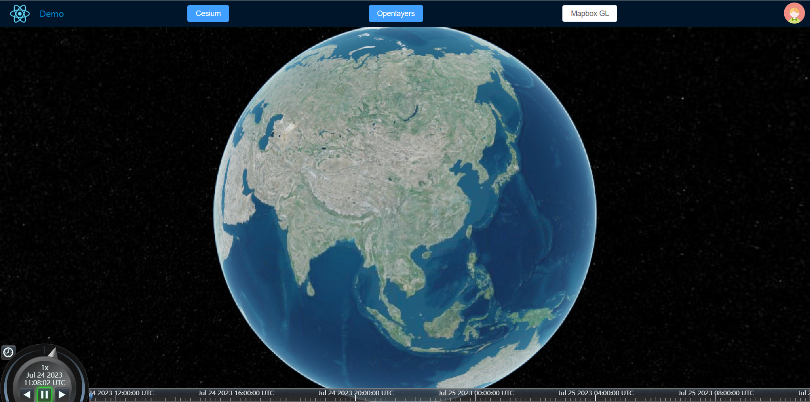

# 12、创建地球

承接第一节的Cesium加载地球与环境搭建，需要注意几个点：

### 1、Vue的响应式与地图、三维等复杂状态对象

#### 1.1、如何避免响应式

在**Vue 2**中，其响应式是通过Object.defineProperty递归实现的，在Vue 2的文档中也明确指出：

> **data**是**Vue**实例的数据对象，**Vue**会递归地吧**data**的**property**转换为**getter/setter**，从而让**data**的**property**能够响应数据变化。**对象必须是纯粹的对象（含有零个或多个Key/value对）**：浏览器**API**创建的原生对象，原型上的**property**会被忽略。**大概来说，data应该只能是数据，不推荐观察拥有状态行为的对象。**

问题：如何在Vue 2中避免响应式？？？？

在**Vue 3**中，有对应避免深层代理的API，如：**shallowRef、shallowReactive、markRaw**，这种就适用于

- **GIS**类对象：**openlayers**、**Cesium**、**mapbox GL**等等
- 三维类对象：**threejs**、babylonjs等等
- 图形接口对象：**WebGL**、**WebGPU**等等
- 任何具备自我行为与复杂内部状态的对象

#### 1.2、Cesium中共享Viewer

##### 1.2.1、pinia全局状态管理

Vue 中使用pinia ，可以把核心的 Viewer 对象送入全局状态中，但是要避免 Vue 的响应式劫持，响应式问题可以通过 Vue3 的 `shallowRef` 或 `shallowReactive` 来解决：

```html
<script lang="ts" setup>
import { onMounted, shallowRef, ref } from 'vue'
import { Viewer } from 'cesium'

const viewerDivRef = ref<HTMLDivElement>()
const viewerRef = shallowRef<Viewer>()
onMounted(() => {
  viewerRef.value = new Viewer(viewerDivRef.value as HTMLElement, /* ... */)
})
</script>
```

或者用 `shallowReactive`：

```html
<script lang="ts" setup>
import { onMounted, shallowReactive, ref } from 'vue'
import { Viewer } from 'cesium'

const viewerDivRef = ref<HTMLDivElement>()
const viewerRef = shallowReactive<{
  viewer: Viewer | null
}>({
  viewer: null
})
onMounted(() => {
  viewerRef.viewer = new Viewer(viewerDivRef.value as HTMLElement, /* ... */)
})
</script>
```

甚至可以更简单一些：

```html
<script lang="ts" setup>
import { onMounted, ref } from 'vue'
import { Viewer } from 'cesium'

const viewerDivRef = ref<HTMLDivElement>()
let viewer: Viewer | null = null
onMounted(() => {
  viewer = new Viewer(viewerDivRef.value as HTMLElement, /* ... */)
})
</script>
```

##### 1.2.2、`provide/inject` 

仅适用于地图组件在最顶层的情况：

```html
<!-- 顶层组件下发 Viewer -->
<script lang="ts" setup>
import { onMounted, ref, provide } from 'vue'
import { Viewer } from 'cesium'
import { CESIUM_VIEWER } from '@/symbol'

const viewerDivRef = ref<HTMLDivElement>()
let viewer: Viewer | null = null
onMounted(() => {
  viewer = new Viewer(viewerDivRef.value as HTMLElement, /* ... */)
  provide(CESIUM_VIEWER, viewer)
})
</script>

<!-- 下面是子组件调用 -->
<script lang="ts" setup>
import { inject } from 'vue'
import type { Viewer } from 'cesium'
import { CESIUM_VIEWER } from '@/symbol'

const viewer = inject<Viewer>(CESIUM_VIEWER)
</script>
```

##### 1.2.3、兄弟组件或父子组件传值

- **defineExpose**
- 层层事件冒泡至父级组件，或者使用全局事件库（如 **mitt**）
- 使用全局状态 **pinia** 或 **vuex**

> 关于全局事件库mitt：
>
> - 安装mitt：
>
>   ```typescript
>   npm install mitt -S
>   ```
>
> - 封装mitt：
>
>   ```typescript
>   //封装mitt
>   import mitt from 'mitt';
>   const bus = mitt();
>   export default bus;
>   ```
>
> - 按需引入mitt：
>
>   ```typescript
>   //将实例提交到事件总线
>   bus.emit('toOther',viewer)
>   ```
>
>   ```typescript
>   //监听数据转发
>   bus.on('toOther',(res:Viewer)=>{
>   	viewerCopy = res
>   });
>   ```
>
>   ```typescript
>   //移除指定事件
>   bus.off('toOther');
>   ```

### 2、效果图



