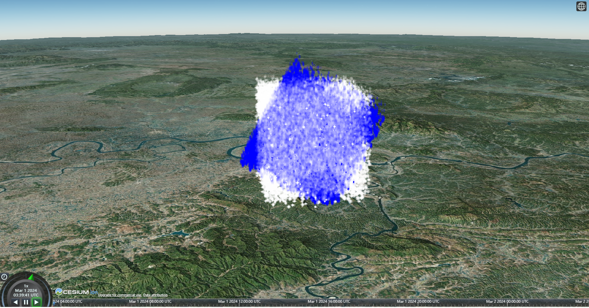

# 16、场景粒子渲染

### 一、ParticleSystem简介

在Cesium中，粒子系统ParticleSystem是一种用于模拟和呈现大量小粒子效果的功能。这些小粒子可以代表火花、烟雾、雨滴等效果，用于增强Cesium中的三维场景的视觉效果。Cesium的粒子系统允许用户创建、配置和控制这些粒子的外观和行为。

Cesium的粒子系统提供了许多配置选项，通过指定粒子的纹理、颜色、生命周期、速度等属性，结合粒子系统的粒子回调函数，以满足不同的粒子效果的需求。



### 二、雪花粒子渲染实现

#### 1、初始化地图

```vue
<template>
  <div id="viewContainer"></div>
</template>
<script setup lang="ts">
import * as Cesium from "cesium";
import { onMounted } from "vue";

Cesium.Ion.defaultAccessToken =  "your token";//替换token
    
// 初始化地图
const initMap = async () => {
  new Cesium.Viewer("viewContainer", {
    infoBox: false,
    baseLayerPicker: false, //右上角图层选择按钮
    geocoder: false, //搜索框
    homeButton: false, //home按钮
    sceneModePicker: true, //模式切换按钮
    navigationHelpButton: false, //右上角帮助按钮
    fullscreenButton: false, //右下角全屏按钮
    terrainProvider: await Cesium.createWorldTerrainAsync(),
  });
};
onMounted(() => {
  initMap();
});
</script>
<style scoped>
#viewContainer {
  height: calc(100vh - 100px);
  width: calc(100vw - 260px);
}
</style>
```

#### 2、重设相机视角

```typescript
//重设相机
const resetCameraFunction = () => {
  scene.camera.setView({
    destination: Cesium.Cartesian3.fromDegrees(113, 27, 5000),
    orientation: {
      heading: 4.731089976107251,
      pitch: -0.32003481981370063,
    },
  });
};
```

#### 3、创建雪花粒子系统

```typescript
let snowParticlePrimitives: Cesium.Primitive;
//创建雪花粒子系统
const startSnow = () => {
  scene.primitives.removeAll(); 
  snowParticlePrimitives = scene.primitives.add(
    new Cesium.ParticleSystem({
      //模型矩阵：从粒子生成的本地坐标系转换到地球所在的坐标系
      modelMatrix: Cesium.Matrix4.fromTranslation(
        Cesium.Cartesian3.fromDegrees(113, 27, 10000)
      ),
      //发射器模型矩阵：从粒子发射器坐标系转换到粒子生成的本地坐标系
      emitterModelMatrix: computeEmitterModelMatrixSnow,
      minimumSpeed: -1.0,
      maximumSpeed: 0.0,
      lifetime: 15.0,
      emitter: new Cesium.BoxEmitter(
        new Cesium.Cartesian3(10000, 10000, 10000)
      ), //粒子发射器。
      startScale: 0.5,
      endScale: 1.0,
      image: "/snowflake_particle.png",
      emissionRate: 7000, //每秒发射的粒子数
      startColor: Cesium.Color.WHITE.withAlpha(0.0),
      endColor: Cesium.Color.WHITE.withAlpha(1.0),
      minimumImageSize: minimumSnowImageSize,
      maximumImageSize: maximumSnowImageSize,
      updateCallback: snowUpdate,//雪花更新函数
    })
  );
};
```

#### 4、创建雪花更新函数

```typescript
let snowGravityScratch = new Cesium.Cartesian3();//雪花重力方向单位向量
const snowParticleSize = 12.0;//雪花粒子大小
//最小粒子尺寸
const minimumSnowImageSize = new Cesium.Cartesian2(
  snowParticleSize,
  snowParticleSize
);
//最大粒子尺寸
const maximumSnowImageSize = new Cesium.Cartesian2(
  snowParticleSize * 2.0,
  snowParticleSize * 2.0
);
//定义雪花更新函数
const snowUpdate = (particle: {
  position: Cesium.Cartesian3;
  velocity: Cesium.Cartesian3;
  endColor: { alpha: number };
}) => {
  //根据传入坐标创建归一化向量（方向单位向量）
  snowGravityScratch = Cesium.Cartesian3.normalize(
    particle.position,
    snowGravityScratch
  );
  //单位向量乘以随机标量
  Cesium.Cartesian3.multiplyByScalar(
    snowGravityScratch,
    -8,
    snowGravityScratch
  );
  //粒子的速度矢量
  particle.velocity = Cesium.Cartesian3.add(
    particle.velocity,
    snowGravityScratch,
    particle.velocity
  );
};
```

#### 5、转换矩阵

```typescript
//局部旋转矩阵
const ratationAngle = Cesium.Math.toRadians(30);//旋转角度
//X轴旋转左侧4*4矩阵
const ratationMatrixX = Cesium.Matrix4.fromRotationTranslation(
  Cesium.Matrix3.fromRotationX(ratationAngle)
);
//Z轴旋转右侧3*3矩阵
const ratationMatrixZ =   Cesium.Matrix3.fromRotationZ(Cesium.Math.toRadians(20)),
//计算雪花发射器模型矩阵
const computeEmitterModelMatrixSnow = Cesium.Matrix4.multiplyByMatrix3(
  ratationMatrixX,
  ratationMatrixZ,
  new Cesium.Matrix4()
);
```

### 三、雨滴相对雪花粒子系统创建

#### 1、创建雨水粒子系统

```typescript
const startRain = () => {
  scene.primitives.add(
    new Cesium.ParticleSystem({
      modelMatrix: computeModelMatrix(snowParticlePrimitives),
      emitterModelMatrix: computeEmitterModelMatrix(),
      minimumSpeed: -1.0, //设置最小限度（以米/秒为单位），超过该限值将随机选择粒子的实际速度。
      maximumSpeed: 0.0, //设置最大界限（以米/秒为单位），低于该界限将随机选择粒子的实际速度。
      lifetime: 1.0, //粒子系统发射粒子的时间，以秒为单位。
      emitter: new Cesium.BoxEmitter(
        new Cesium.Cartesian3(10000, 10000, 10000)
      ), //粒子发射器。
      startScale: 0.5,
      endScale: 1.0,
      image: "/circular_particle.png",
      emissionRate: 3000,
      startColor: Cesium.Color.BLUE.withAlpha(0.2),
      endColor: Cesium.Color.BLUE.withAlpha(1),
      imageSize: rainImageSize,
      updateCallback: rainUpdate,
    })
  );
};
```

#### 2、创建雨水更新函数

```typescript
let rainGravityScratch = new Cesium.Cartesian3();
//定义雨水更新函数
const rainUpdate = (particle: {
  velocity: Cesium.Cartesian3;
  position: Cesium.Cartesian3;
  endColor: { alpha: number };
}) => {
  rainGravityScratch = Cesium.Cartesian3.normalize(
    particle.position,
    rainGravityScratch
  );
  rainGravityScratch = Cesium.Cartesian3.multiplyByScalar(
    rainGravityScratch,
    -8,
    rainGravityScratch
  );
  particle.velocity = Cesium.Cartesian3.add(
    particle.velocity,
    rainGravityScratch,
    particle.velocity
  );
};
```

#### 3、转换矩阵

```typescript
//计算雨水模型矩阵
const computeModelMatrixRain = (primitive: Cesium.Primitive) => {
  return primitive.modelMatrix;
};

const emitterModelMatrix = new Cesium.Matrix4();
const translation = new Cesium.Cartesian3();
const rotation = new Cesium.Quaternion();
let hpr = new Cesium.HeadingPitchRoll();
const trs = new Cesium.TranslationRotationScale(); //由平移、旋转和缩放定义的仿射变换。

//计算雨水粒子发射器模型矩阵
const computeEmitterModelMatrixRain = () => {
  //设置头、俯仰角、旋转角度和旋转轴
  hpr = Cesium.HeadingPitchRoll.fromDegrees(0, 0, 60, hpr);
  //设置平移
  trs.translation = Cesium.Cartesian3.fromElements(0, 0, 0, translation);
  //设置旋转
  trs.rotation = Cesium.Quaternion.fromHeadingPitchRoll(hpr, rotation);
  //返回仿射变换矩阵
  return Cesium.Matrix4.fromTranslationRotationScale(trs, emitterModelMatrix);
};
```

### 四、完整代码

```vue
<template>
  <div id="viewContainer"></div>
</template>
<script setup lang="ts">
import * as Cesium from "cesium";
import { onMounted } from "vue";

Cesium.Ion.defaultAccessToken ="your token"

let viewer: Cesium.Viewer;
let scene: Cesium.Scene;

// 初始化地图
const initMap = () => {
  viewer = new Cesium.Viewer("viewContainer", {
    infoBox: false,
    baseLayerPicker: false, //右上角图层选择按钮
    geocoder: false, //搜索框
    homeButton: false, //home按钮
    sceneModePicker: true, //模式切换按钮
    navigationHelpButton: false, //右上角帮助按钮
    fullscreenButton: false, //右下角全屏按钮
    shouldAnimate: true,
    terrain: Cesium.Terrain.fromWorldTerrain(),
  });

  scene = viewer.scene;
  scene.globe.depthTestAgainstTerrain = true;
  resetCameraFunction();
  startSnow();
  startRain();
};
const resetCameraFunction = () => {
  scene.camera.setView({
    destination: Cesium.Cartesian3.fromDegrees(113, 27, 5000),
    orientation: {
      heading: 4.731089976107251,
      pitch: -0.32003481981370063,
    },
  });
};

let snowGravityScratch = new Cesium.Cartesian3();
const snowParticleSize = 12.0;
const minimumSnowImageSize = new Cesium.Cartesian2(
  snowParticleSize,
  snowParticleSize
);
const maximumSnowImageSize = new Cesium.Cartesian2(
  snowParticleSize * 2.0,
  snowParticleSize * 2.0
);
//定义雪花更新函数
const snowUpdate = (particle: {
  position: Cesium.Cartesian3;
  velocity: Cesium.Cartesian3;
  endColor: { alpha: number };
}) => {
  //根据传入坐标创建归一化向量（方向单位向量）
  snowGravityScratch = Cesium.Cartesian3.normalize(
    particle.position,
    snowGravityScratch
  );
  //单位向量乘以随机标量
  Cesium.Cartesian3.multiplyByScalar(
    snowGravityScratch,
    -8,
    snowGravityScratch
  );
  //粒子的速度矢量
  particle.velocity = Cesium.Cartesian3.add(
    particle.velocity,
    snowGravityScratch,
    particle.velocity
  );
};

//局部旋转矩阵
const ratationAngle = Cesium.Math.toRadians(30);
const ratationMatrix = Cesium.Matrix4.fromRotationTranslation(
  Cesium.Matrix3.fromRotationX(ratationAngle)
);
const computeEmitterModelMatrixSnow = Cesium.Matrix4.multiplyByMatrix3(
  ratationMatrix,
  Cesium.Matrix3.fromRotationZ(Cesium.Math.toRadians(20)),
  new Cesium.Matrix4()
);

const emitterModelMatrix = new Cesium.Matrix4();
const translation = new Cesium.Cartesian3();
const rotation = new Cesium.Quaternion();
let hpr = new Cesium.HeadingPitchRoll();
const trs = new Cesium.TranslationRotationScale(); //由平移、旋转和缩放定义的仿射变换。

//计算发射器模型矩阵
const computeEmitterModelMatrixRain = () => {
  //设置头、俯仰角、旋转角度和旋转轴
  hpr = Cesium.HeadingPitchRoll.fromDegrees(0, 0, 60, hpr);
  //设置平移
  trs.translation = Cesium.Cartesian3.fromElements(0, 0, 0, translation);
  //设置旋转
  trs.rotation = Cesium.Quaternion.fromHeadingPitchRoll(hpr, rotation);
  //返回仿射变换矩阵
  return Cesium.Matrix4.fromTranslationRotationScale(trs, emitterModelMatrix);
};

let snowParticlePrimitives: Cesium.Primitive;
const startSnow = () => {
  scene.primitives.removeAll(); //为什么要移除全部？？？会不会有不好的影响？因为entity也是转换为primitive

  snowParticlePrimitives = scene.primitives.add(
    new Cesium.ParticleSystem({
      modelMatrix: Cesium.Matrix4.fromTranslation(
        Cesium.Cartesian3.fromDegrees(113, 27, 10000)
      ),
      emitterModelMatrix: computeEmitterModelMatrixSnow,
      minimumSpeed: -1.0,
      maximumSpeed: 0.0,
      lifetime: 15.0,
      emitter: new Cesium.BoxEmitter(
        new Cesium.Cartesian3(10000, 10000, 10000)
      ), //粒子发射器。
      startScale: 0.5,
      endScale: 1.0,
      image: "/snowflake_particle.png",
      emissionRate: 7000, //每秒发射的粒子数
      startColor: Cesium.Color.WHITE.withAlpha(0.0),
      endColor: Cesium.Color.WHITE.withAlpha(1.0),
      minimumImageSize: minimumSnowImageSize,
      maximumImageSize: maximumSnowImageSize,
      updateCallback: snowUpdate,
    })
  );
};

// rain
const rainParticleSize = 15.0;
const rainImageSize = new Cesium.Cartesian2(
  rainParticleSize,
  rainParticleSize * 2.0
);
let rainGravityScratch = new Cesium.Cartesian3();
//定义雨水更新函数
const rainUpdate = (particle: {
  velocity: Cesium.Cartesian3;
  position: Cesium.Cartesian3;
  endColor: { alpha: number };
}) => {
  rainGravityScratch = Cesium.Cartesian3.normalize(
    particle.position,
    rainGravityScratch
  );
  rainGravityScratch = Cesium.Cartesian3.multiplyByScalar(
    rainGravityScratch,
    -8,
    rainGravityScratch
  );
  particle.velocity = Cesium.Cartesian3.add(
    particle.velocity,
    rainGravityScratch,
    particle.velocity
  );
};

//计算模型矩阵
const computeModelMatrixRain = (primitive: Cesium.Primitive) => {
  return primitive.modelMatrix;
};
const startRain = () => {
  scene.primitives.add(
    new Cesium.ParticleSystem({
      modelMatrix: computeModelMatrixRain(snowParticlePrimitives),
      emitterModelMatrix: computeEmitterModelMatrixRain(),
      minimumSpeed: -1.0, //设置最小限度（以米/秒为单位），超过该限值将随机选择粒子的实际速度。
      maximumSpeed: 0.0, //设置最大界限（以米/秒为单位），低于该界限将随机选择粒子的实际速度。
      lifetime: 1.0, //粒子系统发射粒子的时间，以秒为单位。
      emitter: new Cesium.BoxEmitter(
        new Cesium.Cartesian3(10000, 10000, 10000)
      ), //粒子发射器。
      startScale: 0.5,
      endScale: 1.0,
      image: "/circular_particle.png",
      emissionRate: 3000,
      startColor: Cesium.Color.BLUE.withAlpha(0.2),
      endColor: Cesium.Color.BLUE.withAlpha(1),
      imageSize: rainImageSize,
      updateCallback: rainUpdate,
    })
  );
};
onMounted(() => {
  initMap();
});
</script>
<style scoped>
#viewContainer {
  height: calc(100vh - 100px);
  width: calc(100vw - 260px);
}
</style>
```

