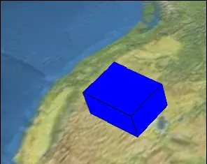

# 29、属性Property

## 一、Property是什么？

在Cesium中，为了让Entity实体对象能够携带时间的动态特性，引入了Property类型，让Entity实体对象可以随时间动态变化。

官方文档定义：


## 二、Property用法

### 1、Property分类


### 2、Property抽象基类

- `isConstant`：用于判断属性是否为不随着时间变化的常量。Cesium会通过判断这个属性来决定是否需要在场景更新的每一帧中都获取该属性的数值，从而来更新三维场景的物体。true则只获取一次。除非definitionChanged触发发生改变。
- `definitionChanged` ：通过该事件可以监听到Property自身发生的变化，例如：数值发生变化。
- `equals`：检测属性值是否相等。
- `getValue`： 获取传入的时间的特定属性值。`getValue(time, result)`返回修改后的result或者新的Property实例。

### 3、SampleProperty类型

采样属性类型，用于描述随时间变化的属性值的类型。允许在一系列离散的时间点上存储属性值，并在这些时间点之间进行插值，以获取中间时间点合适的值。

```typescript
//add a box
const addBlueBox = () => {
  blueBox = viewer.entities.add({
    name: "blue Box",
    position: Cesium.Cartesian3.fromDegrees(113, 23, 4000),
    box: {
      dimensions: new Cesium.Cartesian3(40000, 30000, 50000),
      material: Cesium.Color.BLUE,
      outline: true,
      outlineColor: Cesium.Color.RED,
    },
  });
};
```

```typescript
const changeBoxHight = () => {
  const propertyBox = new Cesium.SampledProperty(Cesium.Cartesian3); //实例化插值属性类型
  propertyBox.addSample(
    Cesium.JulianDate.fromIso8601("2024-01-29T09:30:00.00Z"),
    new Cesium.Cartesian3(40000.0, 30000.0, 20000.0)
  );
  propertyBox.addSample(
    Cesium.JulianDate.fromIso8601("2024-01-30T09:30:02.00Z"),
    new Cesium.Cartesian3(40000.0, 30000.0, 70000.0)
  );
  blueBox.box && (blueBox.box.dimensions = propertyBox);
};
```


### 4、TimeIntervalCollectionProperty类型

时间间隔集合属性类型，用于描述不同时间间隔内具有不同属性值的数据类型，不会进行插值。

```typescript
const property = new Cesium.TimeIntervalCollectionProperty(Cesium.Cartesian3);

    property.intervals.addInterval(Cesium.TimeInterval.fromIso8601({
        iso8601 : '2019-01-01T00:00:00.00Z/2019-01-01T12:00:00.00Z',
        isStartIncluded : true,
        isStopIncluded : false,
        data : new Cesium.Cartesian3(400000.0, 300000.0, 200000.0)
    }));
    property.intervals.addInterval(Cesium.TimeInterval.fromIso8601({
        iso8601 : '2019-01-01T12:00:01.00Z/2019-01-02T00:00:00.00Z',
        isStartIncluded : true,
        isStopIncluded : false,
        data : new Cesium.Cartesian3(400000.0, 300000.0, 400000.0)
    }));
    property.intervals.addInterval(Cesium.TimeInterval.fromIso8601({
        iso8601 : '2019-01-02T00:00:01.00Z/2019-01-02T12:00:00.00Z',
        isStartIncluded : true,
        isStopIncluded : false,
        data : new Cesium.Cartesian3(400000.0, 300000.0, 500000.0)
    }));
    property.intervals.addInterval(Cesium.TimeInterval.fromIso8601({
        iso8601 : '2019-01-02T12:00:01.00Z/2019-01-03T00:00:00.00Z',
        isStartIncluded : true,
        isStopIncluded : true,
        data : new Cesium.Cartesian3(400000.0, 300000.0, 700000.0)
    }));

blueBox.box.dimensions = property;
```



### 5、ConstantProperty类型

常量属性类型，用于描述整个时间范围内不随时间变化的属性值的类型。

Entity实体内部会将部分属性隐式转换为ConstantProperty类型。例如：

```typescript
blueBox.box.dimensions = new Cesium.Cartesian3(400000.0, 300000.0, 200000.0);
```

等价于：

```typescript
blueBox.box.dimensions = new ConstantProperty(new Cesium.Cartesian3(400000.0, 300000.0, 200000.0));
```

虽然不随时间发生变化，但是仍然可以通过setValue方法去改变其property的值。

```typescript
blueBox.box.dimensions.setValue(new Cesium.Cartesian3(400000.0, 300000.0, 700000.0));
```

### 6、CompositeProperty类型

组合属性类型，可以把多种不同类型的Property组合在一起操作。

```typescript
// 1 sampledProperty
    var sampledProperty = new Cesium.SampledProperty(Cesium.Cartesian3);
    sampledProperty.addSample(Cesium.JulianDate.fromIso8601('2019-01-01T00:00:00.00Z'), 
        new Cesium.Cartesian3(400000.0, 300000.0, 200000.0));

    sampledProperty.addSample(Cesium.JulianDate.fromIso8601('2019-01-02T00:00:00.00Z'), 
        new Cesium.Cartesian3(400000.0, 300000.0, 400000.0));

    // 2 ticProperty
    var ticProperty = new Cesium.TimeIntervalCollectionProperty();
    ticProperty.intervals.addInterval(Cesium.TimeInterval.fromIso8601({
        iso8601 : '2019-01-02T00:00:00.00Z/2019-01-02T06:00:00.00Z',
        isStartIncluded : true,
        isStopIncluded : false,
        data : new Cesium.Cartesian3(400000.0, 300000.0, 400000.0)
    }));
    ticProperty.intervals.addInterval(Cesium.TimeInterval.fromIso8601({
        iso8601 : '2019-01-02T06:00:00.00Z/2019-01-02T12:00:00.00Z',
        isStartIncluded : true,
        isStopIncluded : false,
        data : new Cesium.Cartesian3(400000.0, 300000.0, 500000.0)
    }));
    ticProperty.intervals.addInterval(Cesium.TimeInterval.fromIso8601({
        iso8601 : '2019-01-02T12:00:00.00Z/2019-01-02T18:00:00.00Z',
        isStartIncluded : true,
        isStopIncluded : false,
        data : new Cesium.Cartesian3(400000.0, 300000.0, 600000.0)
    }));
    ticProperty.intervals.addInterval(Cesium.TimeInterval.fromIso8601({
        iso8601 : '2019-01-02T18:00:00.00Z/2019-01-03T23:00:00.00Z',
        isStartIncluded : true,
        isStopIncluded : true,
        data : new Cesium.Cartesian3(400000.0, 300000.0, 700000.0)
    }));

    // 3 compositeProperty
    var compositeProperty = new Cesium.CompositeProperty();
    compositeProperty.intervals.addInterval(Cesium.TimeInterval.fromIso8601({
        iso8601 : '2019-01-01T00:00:00.00Z/2019-01-02T00:00:00.00Z',
        data : sampledProperty
    }));
    compositeProperty.intervals.addInterval(Cesium.TimeInterval.fromIso8601({
        iso8601 : '2019-01-02T00:00:00.00Z/2019-01-03T00:00:00.00Z',
        isStartIncluded : false,
        isStopIncluded : false,
        data : ticProperty
    }));

    // 4 设置position
    blueBox.box.dimensions = compositeProperty;
```


### 7、PositionProperty类型

位置属性抽象基类型，拓展了Property类型的接口，增加了`referenceFrame`，同时只能表示position。

`referenceFrame`用于指定位置或者坐标的参考系，确定实体和属性的位置是相对于哪个坐标系的。

1. `Cesium.ReferenceFrame.FIXED`

   这是默认值，表示位置是相对于固定的地球坐标系。如果你没有明确指定 `referenceFrame`，Cesium 通常会假定为 `FIXED`。

   ```typescript
   const entity = new Cesium.Entity({
       position: Cesium.Cartesian3.fromDegrees(-75.1641667, 39.9522222, 0),
       referenceFrame: Cesium.ReferenceFrame.FIXED
   });
   ```

2. `Cesium.ReferenceFrame.INERTIAL`

   表示位置是相对于一个惯性坐标系，这个坐标系与地球的自转一起旋转。

   ```typescript
   const entity = new Cesium.Entity({
       position: Cesium.Cartesian3.fromDegrees(-75.1641667, 39.9522222, 0),
       referenceFrame: Cesium.ReferenceFrame.INERTIAL
   });
   ```

### 8、SampledPositionProperty类型

采样位置属性类型，用于描述随时间变化的位置属性类型。专门用于处理实体的位置属性，允许在一系列离散的时间点上存储位置值，并支持在这些时间点之间进行插值，以获取中间时间点的合适位置值。

```typescript
const property = new Cesium.SampledPositionProperty();

property.addSample(
  Cesium.JulianDate.fromIso8601("2024-01-29T00:00:00.00Z"),
  Cesium.Cartesian3.fromDegrees(-114.0, 40.0, 300000.0)
);

property.addSample(
  Cesium.JulianDate.fromIso8601("2024-01-30T00:00:00.00Z"),
  Cesium.Cartesian3.fromDegrees(-114.0, 45.0, 300000.0)
);

blueBox.position = property;
```


> 注意：
>
> 对于SampleProperty与SamplePositionProperty可以通过`setInterpolationOptions(options)`方法设置插值使用的算法和度数。
>
> 1. 线性插值
> 2. Lagrange插值
> 3. Hermite插值

### 9、MaterialProperty类型

材质属性抽象基类型。它对Property进行了扩展，增加了`getType`方法，用来获取材质类型。


```typescript
const changeBoxColor = () => {
  const colorProperty = new Cesium.SampledProperty(Cesium.Color);

  colorProperty.addSample(
    Cesium.JulianDate.fromIso8601("2024-01-29T00:00:00.00Z"),
    new Cesium.Color(0, 1, 0)
  );

  colorProperty.addSample(
    Cesium.JulianDate.fromIso8601("2024-01-30T00:00:00.00Z"),
    new Cesium.Color(0, 0, 1)
  );

  const color = new Cesium.ColorMaterialProperty(colorProperty);
  blueBox.box && (blueBox.box.material = color);

  console.log(
    color.getType(Cesium.JulianDate.fromIso8601("2024-01-29T09:30:00.00Z"))
  );
  console.log(
    color.getType(Cesium.JulianDate.fromIso8601("2024-01-29T01:30:00.00Z"))
  );
};
```


### 10、CallbackProperty类型

回调属性类型，用于通过自定义回调函数，返回需要的property。

```typescript
const l = 200000.0;
const property = new Cesium.CallbackProperty(function (time, result) {
  result = result || new Cesium.Cartesian3(0, 0, 0);

  l += 10000.0;
  if (l > 700000.0) {
    l = 200000.0;
  }

  result.x = 400000.0;
  result.y = 300000.0;
  result.z = l;

  return result;
}, false);

blueBox.box.dimensions = property;
```


### 11、ReferenceProperty类型

映射属性类型，直接将property映射到其他对象的property上。

```typescript
const refenceBoxChange = () => {
  redBox = viewer.entities.add({
    name: "red BOX",
    position: Cesium.Cartesian3.fromDegrees(112, 23, 4000),
    box: {
      dimensions: new Cesium.Cartesian3(40000, 30000, 50000),
      material: Cesium.Color.RED,
      outline: true,
      outlineColor: Cesium.Color.BLUE,
    },
  });
  const collection = viewer.entities;
  redBox.box &&
    (redBox.box.dimensions = new Cesium.ReferenceProperty(
      collection,
      blueBox.id,
      ["box", "dimensions"]
    ));
};
```


### 12、VelocityOrientationProperty类型

速度方向属性类型，用于计算物体基于其速度方向来动态改变其朝向的属性类型。

```typescript
const position = new Cesium.SampledProperty();
position.addSamples(...);
const entity = viewer.entities.add({
  position : position,
  orientation : new Cesium.VelocityOrientationProperty(position)//四元数
}));
```

> 注意：
>
> 四元数通常表示为：
> $$
> q=[x,y,z,w]
> $$
> 其中x,y,z是虚部的三个分量，w是实部分量。Cesium中的四元数可以通过多种方式创建，如通过角轴表示、欧拉角转换、矩阵转换等。

### 13、VelocityVectorProperty类型

速度矢量属性类型，用于计算物体速度向量。

```typescript
blueBox.box.show = false;
blueBox.billboard = {
  scale: 0.05,
  image:
    "https://upload-images.jianshu.io/upload_images/80648-5dfe8a3ea2c250be.png?imageMogr2/auto-orient/strip%7CimageView2/2/w/540/format/webp",
  alignedAxis: new Cesium.VelocityVectorProperty(blueBox.position, true), 
};
```

