---
category:
  - Openlayers
---
# Openlayers笔记

## 一、基础配置

### 1、准备工作

#### 1.1、安装openlayers

```typescript
npm install ol
```

#### 1.2、导入ol

```typescript
import 'ol/ol.css'; // 在main.ts引入地图样式
import * as ol from 'ol'; // 在地图组件页面中一级属性可一次性全部导入
import { Map, View, Feature } from 'ol' // 在地图组件页面中一级属性也可按需导入
import { Tile } from 'ol/layer'; // 二级属性必须由ol/xxx(一级属性名)进行按需导入
```

### 2、初始化

#### 2.1、准备地图容器

```vue
<template>
  <div id="mapContent" class="mapContent"></div>
</template>

<style>
/*为地图容器指定大小*/
.mapContent {
  width: 100vw;
  height: calc(100vh - 50px);
}
</style>
```

#### 2.2、初始化地图

```typescript
let map:Map//定义一个Map类型的变量，接收地图实例
//定义初始化地图实例函数
const initMap=()=>{
    map = new Map({
        target:"mapContent",//地图容器
        view: new View({
            center: fromLonLat([108.84, 34.26], "EPSG:4548"), //将坐标从经度/纬度转换为其他投影。
      		zoom: 4.5, //缩放级别
      		projection: "EPSG:4548", //设置投影坐标为自定义坐标EPSG:4548
        }) ,
        controls: [],//地图控件
    })
}
//在onMounted钩子函数上挂载初始化函数
onMounted(()={
	initMap()
})
```

### 3、view视图中常用配置

```typescript
view: new ol.View({
    center: [104.06, 30.67], // 成都EPSG:4326坐标系中心点
    projection: 'EPSG:4326', // 坐标系 若不设置坐标系格式，则默认为EPSG:3857的坐标系
    zoom: 6, //默认缩放值
    maxZoom: 8, //最大缩放值
    minZoom: 4, //最小缩放值
    rotation: 1.57, //旋转 按照一圈（2π）3.1415926...*2来计算，比如90度大约就是3.14/2=1.57，旋转方向为顺时针，可设置负值
    extent: [101.87372, 26.68196289, 109.498232, 34.1087207], // 定义地图容器初始所显示的内容，鼠标对地图进行拖动时无法超过这个边界 [xMin, yMin, xMax, yMax]
}),
```

## 二、地图控件

**OpenLayers**封装了很多地图控件用于操作地图内容、显示地图信息等。具体来说，控件是一个地图上可见的一个小部件，其DOM元素位于屏幕的固定位置，使用CSS来决定控件位置。
在将设置的图层数据渲染呈现到Web客户端的时候，**OpenLayers**首先在我们自定义的div元素中创建一个**Viewport**容器，地图的所有内容都放置在**Viewport**中。主要分为三个关键层：

- 地图渲染层：canvas元素，地图基于canvas方式渲染。
- 内容叠加层：用于放置覆盖层内容，如弹窗、图片等等。
- 地图控件层：用于放置控件，默认情况会放置zoom、rotate1、attribution这三个控件。

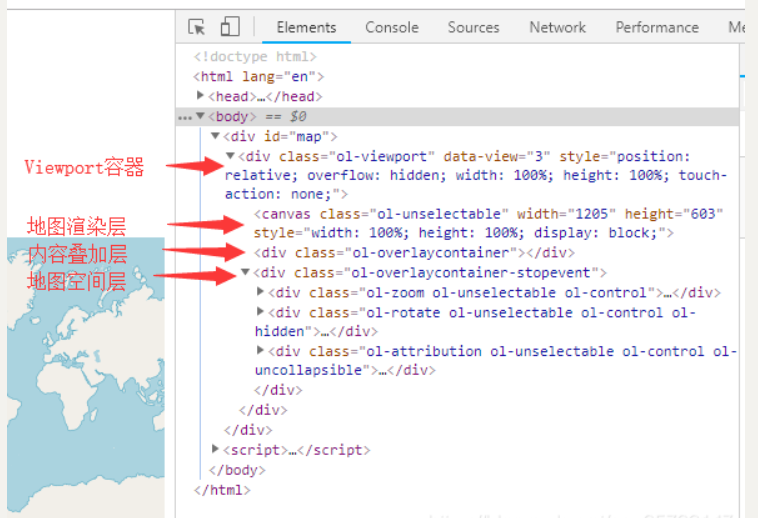

### 1、普通缩放控件

普通缩放控件具有两个按钮分别用于地图的缩小和放大。可以用鼠标分别点击这两个按钮用于地图缩小和放大。

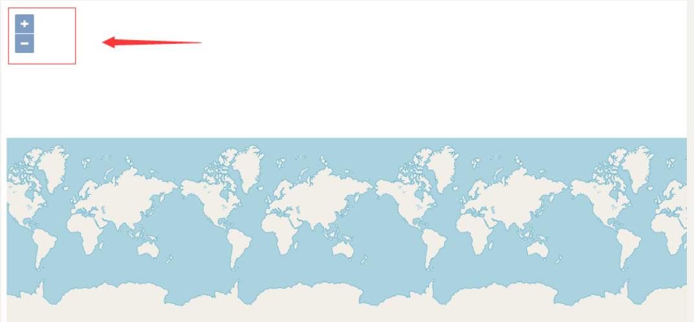

打开浏览器的开发者工具，可以发现普通缩放控件的DOM元素确实放在地图控件层中：

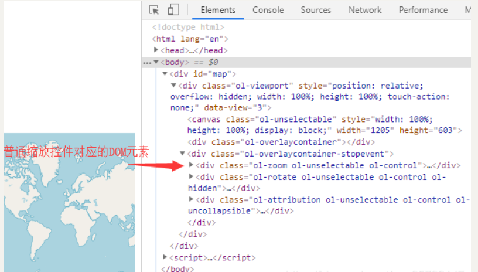

可以通过`map.getControls().getArray()`返回一个地图控件数组，里面包含了地图中默认的控件实例，而这个数组的第一个元素就是普通缩放控件的实例。

查看`ol.control.Zoom`类的API文档，可以发现**OpenLayers**设计了许多属性以方便开发人员对普通缩放控件进行调整：

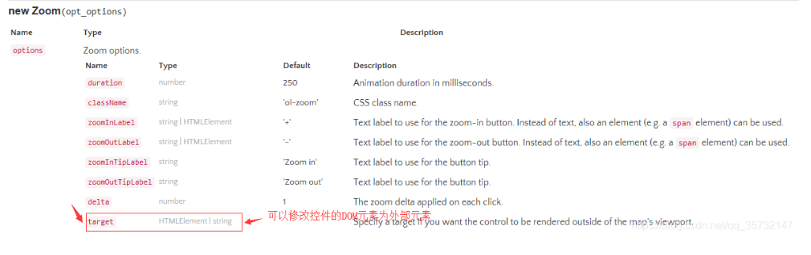

可以通过为`target`属性赋值为自定义的DOM元素来为普通缩放控件绑定指定的DOM元素。

### 2、滑块缩放控件

普通缩放控件`ol.control.Zoom`会被默认加到地图中的，而滑块缩放控件`ol.control.ZoomSlider`不会被默认加入到地图中:

```typescript
let map = new ol.Map({
  target: "map", // 关联到对应的div容器
  layers: [
    new ol.layer.Tile({
      // 瓦片图层
      source: new ol.source.OSM(), // OpenStreetMap数据源
    }),
  ],
  view: new ol.View({
    // 地图视图
    projection: "EPSG:3857",
    center: [0, 0],
    zoom: 0,
  }),
  controls: ol.control.defaults().extend([
    // 往地图增加滑块缩放控件
    new ol.control.ZoomSlider(),
  ]),
});
```

**OpenLayers**实现了一个对原生JavaScript的Array类进行扩展的类`ol.Collection`，Map对象会保存一个`ol.Collection`实例用于存放控件。

上面的新增代码中，`ol.control.defaults()`方法就用于返回保存默认控件的`ol.Collection`实例，然后使用`ol.Collection`类的`extend()`方法往里增加了滑块缩放控件。

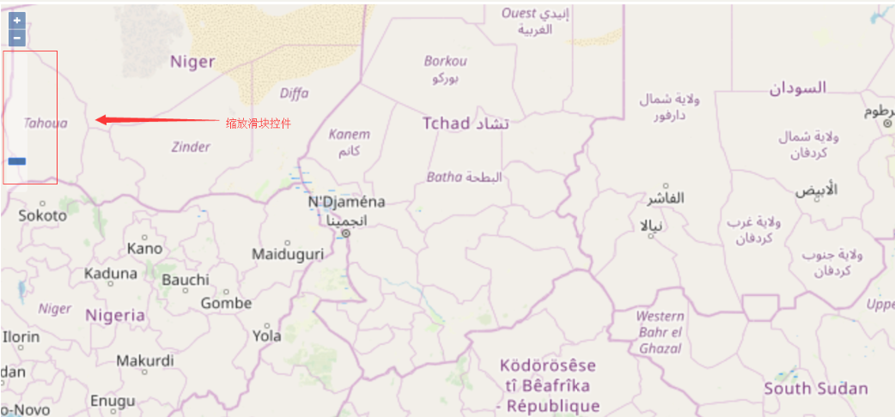

可以发现滑块缩放控件已经渲染在地图界面上了（透明度有点高），可以使用鼠标拖拉滑块来缩放地图！

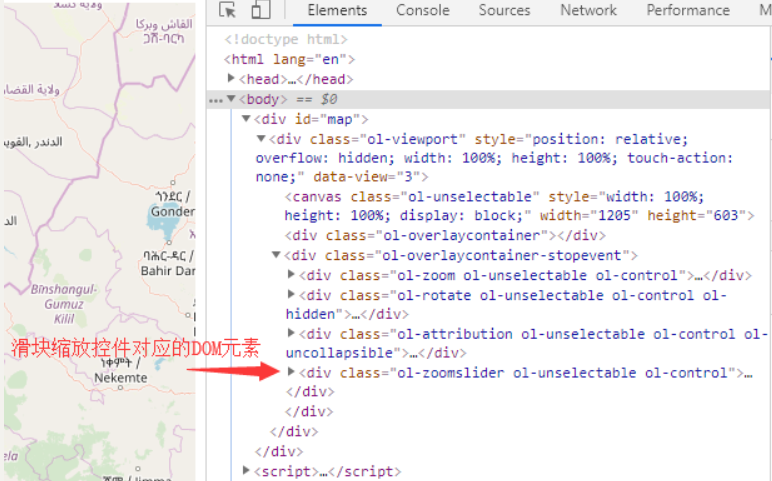

打开浏览器的开发者工具，可以发现在地图控件层中增加了一个用于承载滑块缩放控件的DOM元素。

### 3、缩放至特定位置控件

关于缩放至特定位置控件`ol.control.ZoomToExtent`，在上述代码中添加：

```typescript
 let map = new ol.Map({
            target: 'map',                          // 关联到对应的div容器
            layers: [
                new ol.layer.Tile({                 // 瓦片图层
                    source: new ol.source.OSM()     // OpenStreetMap数据源
                })
            ],
            view: new ol.View({                     // 地图视图
                projection: 'EPSG:3857',
                center: [0, 0],
                zoom: 0
            }),
            controls: ol.control.defaults().extend([    // 往地图增加控件
                new ol.control.ZoomSlider(),            // 滑块缩放控件
                // 新增代码
                new ol.control.ZoomToExtent({           // 缩放至特定位置控件      
                    extent: [
                        12667718, 2562800,
                        12718359, 2597725
                    ]
                })
            ])
        });
```

这里创建了一个ol.control.ZoomToExtent类的实例，从而创建了一个缩放至特定位置控件。其中的extent属性用于指定缩放的目标位置，它是一个数组，前两个元素表示位置矩形的左下角坐标，后两个元素表示位置矩形的右上角坐标：

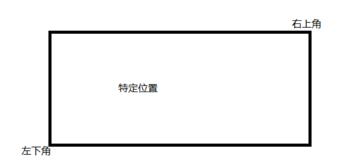

最后通过`ol.Collectionl`类的`extend()`方法将该控件增加到地图中。

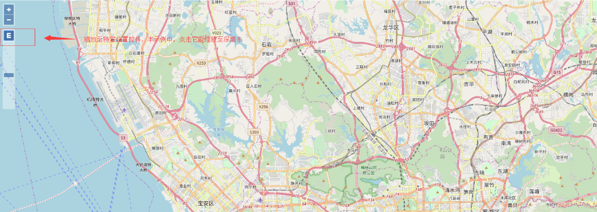

### 4、修改控件样式

OpenLayers为承载控件的各个DOM元素都自动设置了类名，所以通过CSS的类选择符就可以修改指定的控件样式。

```typescript
let map = new ol.Map({
  target: "map", // 关联到对应的div容器
  layers: [
    new ol.layer.Tile({
      // 瓦片图层
      source: new ol.source.OSM(), // OpenStreetMap数据源
    }),
  ],
  view: new ol.View({
    // 地图视图
    projection: "EPSG:3857",
    center: [0, 0],
    zoom: 0,
  }),
  controls: ol.control.defaults().extend([
    // 往地图增加控件
    new ol.control.ZoomSlider(), // 滑块缩放控件
    new ol.control.ZoomToExtent({
      // 缩放至特定位置控件
      extent: [12667718, 2562800, 12718359, 2597725],
    }),
  ]),
});
```

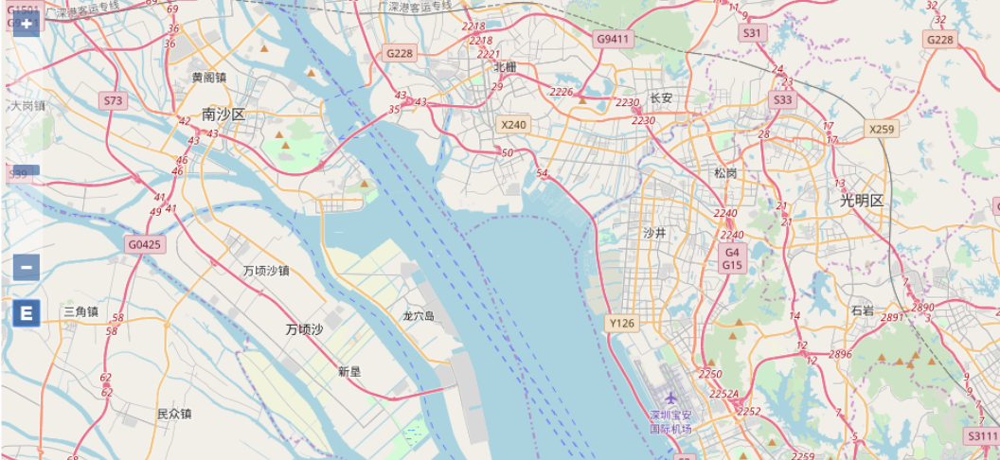

### 5、控件列表

其余控件具体用法可以查询**OpenLayers**官网API[OpenLayers v7.4.0 API - Class: Control](https://openlayers.org/en/latest/apidoc/module-ol_control_Control-Control.html)

| 控件名称        | 控件功能                                                     |
| --------------- | ------------------------------------------------------------ |
| Zoom            | 显示地图的放大和缩小按钮，用于调整地图的缩放级别。           |
| ScaleLine       | 在地图上显示比例尺线，用于测量地图中的距离和比例尺。         |
| Attribution     | 显示地图的版权信息和数据源信息，用于向用户提供地图来源和使用限制等信息。 |
| FullScreen      | 提供一个全屏切换按钮，使地图占据整个屏幕空间。               |
| MousePosition   | 在指定位置显示鼠标所在位置的经纬度坐标。                     |
| OverviewMap     | 显示地图的总体概览图，可以通过鼠标拖动来移动地图。           |
| Rotate          | 提供一个旋转按钮，使用户可以旋转地图视图。                   |
| ZoomSlider      | 在地图上显示一个缩放滑块条，用户可以通过拖动来调整地图的缩放级别。 |
| ZoomToExtent    | 提供一个快速缩放到指定范围的按钮，可通过传入一个 Extent 对象来设置缩放范围。 |
| LayerSwitcher   | 提供一个图层切换控件，用于显示和切换不同的地图图层。         |
| PanZoomBar      | 在地图上显示一个拖动条和放大/缩小按钮，用于调整地图的平移和缩放。 |
| ZoomBox         | 提供一个框选缩放控件，用于在地图上进行矩形选择缩放。         |
| DragPan         | 提供一个拖动平移控件，允许用户通过鼠标拖动来平移地图视图。   |
| DragZoom        | 提供一个框选缩放控件，用于在地图上进行矩形选择缩放。         |
| KeyboardPan     | 提供键盘平移控件，允许用户使用键盘上的方向键来平移地图视图。 |
| KeyboardZoom    | 提供键盘缩放控件，允许用户使用 "+" 和 "-" 键来调整地图的缩放级别。 |
| ModifyFeature   | 提供一个修改要素控件，用于编辑和修改地图上的矢量要素。       |
| Navigation      | 提供一个多功能导航控件，允许用户进行平移、缩放、旋转和拖动等地图操作。 |
| SelectFeature   | 提供一个选择要素控件，用于选择和高亮显示地图上的矢量要素。   |
| TouchNavigation | 提供一个多功能触摸导航控件，类似于 Navigation 控件，但适用于移动设备上的触摸操作。 |

## 三、图层

### 1、瓦片地图

#### 1.1、瓦片地图原理

​		**瓦片地图**是一种对于大地图的解决方案，针对一整块非常大的地图进行切片，将其分成很多相同的大小的小块地图，在用户访问的时候进行逐块加载，还原成一整块大地图，可以有效的提高Web地图的访问速率。

​		原理上，瓦片地图就是在**多个比例尺**下配置地图，然后提前把每个比例尺下的地图绘制成小块地图，保存在服务器的**缓存目录**中，这样客户端在访问地图时，可以直接获取需要的小块地图拼接成整块地图，而不是服务器动态的创建出一幅地图再发送给客户端，从而极大的提高了访问速度。

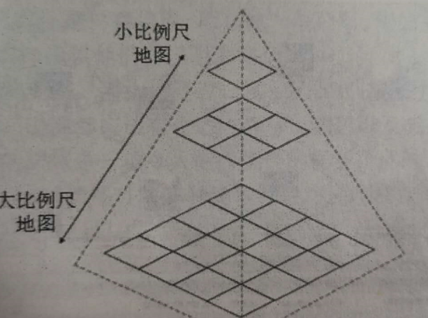

瓦片地图采用的是**金字塔模型**，是一种多分辨率层次模型，从瓦片金字塔的底层到顶层，比例尺越来越小，分辨率越来越低，但是表示的**地图范围不变**，瓦片地图通常带有一个级别、行与列编号方案，以便将来自于多个瓦片地图服务的瓦片放到正确的位置。

#### 1.2、LOD原理

 **LOD**是Levels of Detail（**细节层级**）的简写，用于根据当前的环境，渲染不同的图像，用于降低非重要内容的细节度，从而提高渲染效率，在电子游戏中经常运用，对于需要显示全球地图的GIS系统而言，更需要应用这项技术。

 在不同的**LOD**下，自然**分辨率**就可能不一样，这两者是紧密结合在一起的。对于图形显示系统而言，**分辨率**作为屏幕坐标和世界坐标之间计算的纽带，其作用是非常重要的（例如，屏幕上两个像素点间的距离对应的现实世界的距离是多少，这就需要通过**分辨率**来衡量与计算——**分辨率**将在这篇文章的后面进行介绍）。

  在详细讲解之前，假设给你两张A4纸，在其中一张纸上把你家整个绘制上去，在另一张纸上只把你睡的房间绘制上去。如果别人想看你家，你会给哪一张纸？如果想看你睡的房间，你会给哪一张纸？相信你不会给错，LOD就是这种根据不同需要，采用不同图的技术方案。在地图应用中，最直观的体验，就是地图放大缩小。当地图放大后，能看到更详细的地理信息，比如街道、商店等等。当地图缩小再缩小，原来能看到的街道、商店就看不见了，但是能看到更大的区域。我们的屏幕就相当于是A4纸，大小不变。

**LOD**非常符合我们的自然习惯，所以在很多图形系统中都使用了这项技术。在GIS系统中，不断放大，就能看到更多地图细节，了解更加详细的信息。对于GIS引擎的开发者而言，需要实现这项技术，当发现用户放大地图时，就立马使用更有细节的地图图片，替换现在显示的地图图片。现在问题来了：意思是说对于同一个地点而言，需要有更多张呈现不同细节程度的图片？是的，你没有猜错。虽然在使用**瓦片地图**的过程中，感觉放大、缩小地图是浑然一体的，但其实就在你眼皮下发生了图片替换。不同层级使用具有不同细节的**地图瓦片**，这就需要为每一个层级准备图片，如果使用离线工具下载**瓦片地图**，会看到下载的图片是按照**层级Z**进行存储的。开发者不用担心数据源的处理，只需要知道这个原理就可以了。

 为了便于理解GIS系统中不同层级，使用不同的图片，下面使用**google在线瓦片地图**进行说明。最小层级0情况下，只用了一张256*256像素的图片表示整个地球平面：

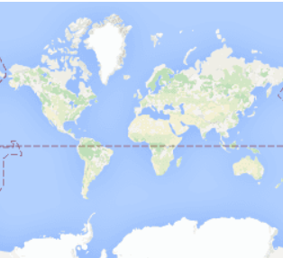

稍大一个层级1情况下，用了四张256*256像素的图片（各张图片中表示的信息更丰富了）来表示整个地球：

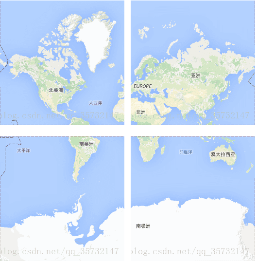

#### 1.3、瓦片计算

  不同环境条件下，加载具有不同细节的图片资源，可以提高效率，但这并不是终点。**瓦片技术**可以更进一步提高效率。其原理是将一张大图片（完整地图）切割成很多张小图片（**地图瓦片**），按照呈现需求，加载其中的几张小图片即可。

  为什么这样就能提高效率？因为屏幕显示窗口的大小是固定的，比如屏幕分辨率是`800*600`，或者`1024*768`，又或者是`1920*800`等等。如果屏幕分辨率是`800*600`，一张大图是`9000*9000`，那么同一时间，你只能看到这张图片的十分之一。但是在不切片的情况下，你却必须要加载整个地图。如果是在本地浏览还好，假如是发布到网络上，则网络传输和渲染，都将耗时。如果我们按照`500*500`大小进行切片，我们则只需要加载4张`500*500`的小图片就可以了（就可以布满**分辨率**是`800*600`的屏幕）。对于WebGIS而言，需要在网络上发布，同时需要显示整个地球，自然需要使用**瓦片技术**。

 如果对整个地球图片进行切片，需要考虑的是整个地球图片大小，以及切片规则，切片（瓦片）大小。

 对于WebGIS而言，在线地图几乎都采用**墨卡托投影坐标系（Mercator)**，对应的地图投影到平面上就是一个正方形。为了方便使用，切片时大多按照正方形的方式来进行切片，比如切片大小为`256*256`（单位**像素**）。一个`1024*1024`的地图，就可以切片4张小的**瓦片**。同时，瓦片大小几乎都是`256*256`，有一些则会增加到`512*512`（由于以前的屏幕**分辨率**通常比较低，所以`256*256`的瓦片在低分辨率的屏幕上显示效果比较好，随着屏幕**分辨率**的提高，瓦片大小自然也就增加到`512*512`）。

  **LOD**会使得不同层级下的全球地图大小不一致，结合**瓦片地图技术**一起，就出现了**金字塔瓦片结构**：

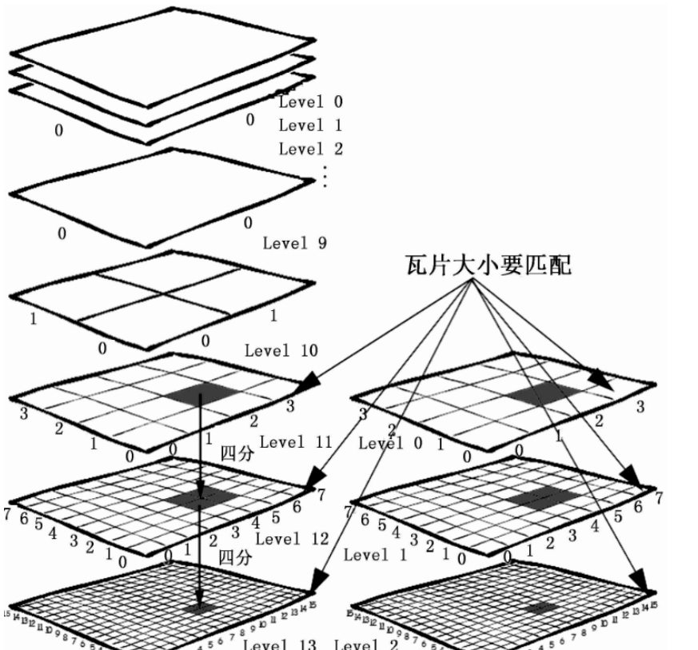

 在WebGIS中，上一层级的一张瓦片，在更大一层级中，会用4张瓦片来表示，依次类推，比如上一节中看到的**Google在线瓦片地图**的第0级和第1级的瓦片地图。这样做可以维持正方形的投影方式不变，同时按照2的幂次方放大（**瓦片**的边长），计算效率非常高。

通过上面切片的介绍，我们可以对每一层级**瓦片**的数量进行简单的计算：

- 层级0的瓦片数是1=2^0∗2^0

- 层级1的瓦片数是4=2^1*2^1

- 层级n的瓦片数是**2^n\*2^n**

  这个地方计算的是所有瓦片数，因为是一个正方形，所以是边长的平方。如果只计算x轴或y轴一边的瓦片数，就是2^n个。

任意一个层级的地图，切成多个**瓦片**后，我们需要给**瓦片**编号，才能通过编号找到**瓦片**。这个问题就涉及到**瓦片坐标系**。不同的在线地图服务商，可能定义不一样的**瓦片坐标系**，坐标系不一样，那么对应的同一个位置的**瓦片**的坐标也会不一样。需要引起重视。

  在OpenLayers提供了一个用于调试瓦片的`source : ol.source.TileDebug`类。可以清晰的看到每一个**瓦片**的坐标：

```typescript
<div id="map" style="width: 100%"></div>
<script type="text/javascript">
    var osmSource = new ol.source.OSM();
    var map = new ol.Map({
    layers: [
        // 加载Open Street Map地图
      new ol.layer.Tile({
        source: osmSource
      }),
      // 添加一个显示Open Street Map地图瓦片网格的图层
      new ol.layer.Tile({
        source: new ol.source.TileDebug({
          projection: 'EPSG:3857',
          tileGrid: osmSource.getTileGrid()
        })
      })
    ],
    target: 'map',
    view: new ol.View({
      center: ol.proj.transform([104, 30], 'EPSG:4326', 'EPSG:3857'),
      zoom: 10
    })
});
</script>
```

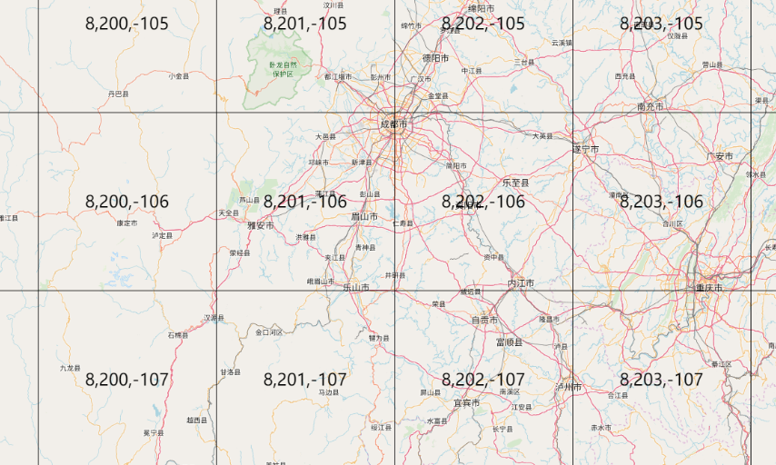

 首先从上图可以看到地图上多了网格，每一个网格对应的就是一个**瓦片**。其次网格中有三个数字，这些数字就表示当前**瓦片**的坐标：

- 第一个数字是层级z
- 第二个数字是表示经度方向上的x
- 第三个数字是表示纬度方向上的y

关于瓦片详情：[万能瓦片地图加载秘籍](https://mp.csdn.net/postedit/81317693)

#### 1.4、分辨率

前面简单提到过，**分辨率**是屏幕坐标和世界坐标的纽带，通过它，才能知道你在屏幕上用鼠标点击的位置对应于世界地图具体的**经纬度**位置。当然你不用自己来做这个计算，OpenLayers的ol.Map类已提供了对应的方法`getCoordinateFromPixel()`来帮助你实现坐标转换。

上面说到每一个层级会使用不同数量的瓦片来表示整个地球，那么无论是哪一个层级，所表示的实际地理空间范围都是一致的。但使用的瓦片个数却是不一样的。

 以**Google在线地图**为例，层级0使用了一个**瓦片**，**层级**1使用了4个**瓦片**。通过计算可以知道层级0的整个地球图像（**瓦片**）为`256*256`像素大小，层级1整个地球图像为`512*512`像素大小。层级0和层级1表示的地球范围都是一样的**经度**[-180, 180]，**纬度**[-90, 90]。在层级0的时候，一个像素就表示`360/256 = 1.40625`这么长的**经度**范围，`180/256 = 0.703125`这么长的**纬度**范围。而这两个数字就是**分辨率**了，**即一个像素所表示的现实世界的范围是多少**，这个范围可能是度，可能是米，或者其他单位，根据具体的情况而定。

  OpenLayers默认设置了加载**瓦片地图**时采用的**分辨率**，通过一个示例来看一下：

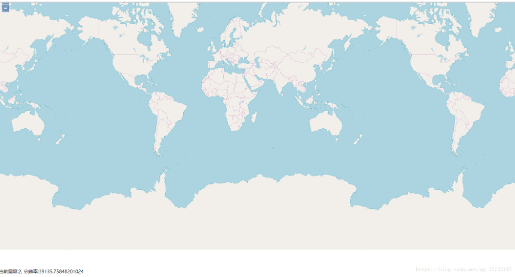

```typescript
<div id="map" style="width: 100%"></div>
<div><span>当前层级：</span><span id="zoom"></span><span>分辨率：</span><span id="resolution"></span></div>
<script type="text/javascript">
    var map = new ol.Map({
        layers: [
          new ol.layer.Tile({
            source: new ol.source.OSM()
          })
        ],
        target: 'map',
        view: new ol.View({
          center: ol.proj.transform(
              [104, 30], 'EPSG:4326', 'EPSG:3857'),
          zoom: 10
        })
    });
 
    // 监听层级变化，输出当前层级和分辨率
    map.getView().on('change:resolution', function(){
        document.getElementById('zoom').innerHTML =  this.getZoom() + '，';
        document.getElementById('resolution').innerHTML = this.getResolution();
    })
 
    document.getElementById('zoom').innerHTML = map.getView().getZoom() + '，';
    document.getElementById('resolution').innerHTML = + map.getView().getResolution();
</script>
```

 缩放上面的地图，从层级0开始，用前面介绍的公式和当前地图显示的**分辨率**进行比较，你会发现OpenLayers默认采用的**分辨率**和**Google在线瓦片地图**一样。

OpenLayers**瓦片地图**默认分辨率表：

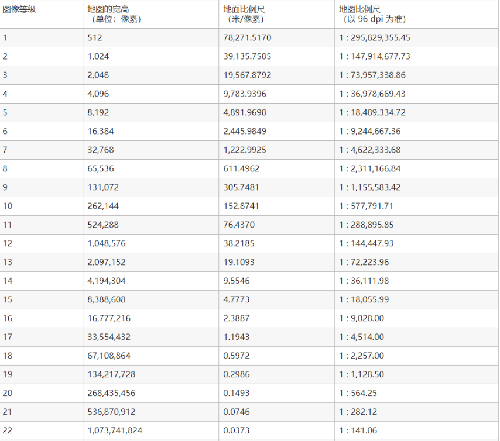

> 注意：
>
>   为什么我们上面一直以**Google在线瓦片地图**举例说明？因为不同的**在线瓦片地图**可能采用不一样的**分辨率**，比如**百度在线瓦片地图**。所以在使用**在线瓦片地图**或者自己制作的**瓦片地图**时，都需要知道使用的**分辨率**是多少。如若不然，可能也会出现位置偏移。

### 2、加载在线瓦片地图

主要包括开源的OSM、Bing、Stamen地图，Openlayers已经做好了相应的封装，可以直接使用。

#### 2.1、OSM地图

```vue
<template>
  <div id="mapContent" class="mapContent"></div>
</template>
<script setup lang='ts'>
let map:Map//定义一个Map类型的变量，接收地图实例
//Open Street Map地图层
const openStreetMapLayer = new ol.layer.Tile({
	source: new ol.source.OSM()
});
//定义初始化地图实例函数
const initMap=()=>{
    map = new Map({
        target:"mapContent",//地图容器
        view: new View({
            center: fromLonLat([108.84, 34.26], "EPSG:4548"), //将坐标从经度/纬度转换为其他投影。
      		zoom: 4.5, //缩放级别
      		projection: "EPSG:4548", //设置投影坐标为自定义坐标EPSG:4548
        }) ,
        controls: [],//地图控件
    });
    map.addLayer(openStreetMapLayer);//添加图层至地图实例
}
//在onMounted钩子函数上挂载初始化函数
onMounted(()={
	initMap()
})
</script>
<style>
/*为地图容器指定大小*/
.mapContent {
  width: 100vw;
  height: calc(100vh - 50px);
}
</style>
```

#### 2.2、Bing地图

```typescript
const bingMapLayer = new ol.layer.Tile({
    	source: new ol.source.BingMaps({
		key: 'AkjzA7OhS4MIBjutL21bkAop7dc41HSE0CNTR5c6HJy8JKc7U9U9RveWJrylD3XJ',
		imagerySet: 'Road'
	})
});
```

#### 2.3、Stamen地图

```typescript
//Stamen地图层
const stamenLayer = new ol.layer.Tile({
		source: new ol.source.Stamen({
		layer: 'watercolor'
	})
);
```

代码很简单，因为OpenLayers对这几个在线服务都做了很好的封装，只用简单的配置一下Source的构造参数就可以了。此处并没有列出每一个类的所有构造参数，但可以通过API文档查询了解。

### 3、XYZ加载瓦片地图

常用的瓦片地图是一个**三维的**概念，我们通常使用xyz这样的坐标来精确定位一张瓦片。通常z用于表示地图层级，而xy表示某个层级内的瓦片平面，x为横坐标，y为纵坐标，类似于数学上常见的笛卡尔坐标系。在这个瓦片平面上的每一个瓦片在横轴和纵轴上都有对应的坐标：x和y。

#### 3.1、简单的瓦片地图

虽然现在大多数网页地图都使用的是瓦片地图，但还是有必要先介绍一下如何识别它。在浏览器中打开任意一个在线的网页地图，然后打开浏览器的开发者工具，再随意拖动、放大、缩小地图。之后在开发者工具里查看新发起的请求，是否有一些图片请求，查看请求返回的图片，是否为正在浏览的地图的一部分。如果是，则基本为瓦片地图。下面以百度地图为例，说明一下在线瓦片地图请求信息：

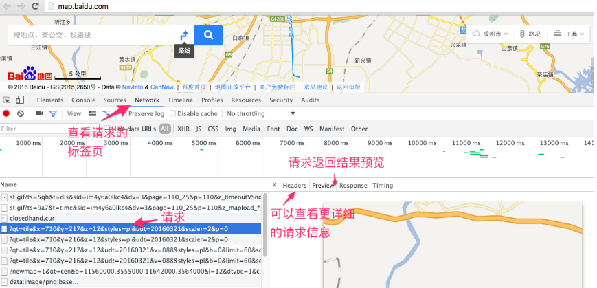

在请求的url中，我们可以很明显地看到**xyz**这三个参数，这进一步说明了百度地图就是用了瓦片地图。如果你多分析一下现有的在线网页地图，基本都是瓦片地图。正因为如此，**OpenLayers**提供了`ol.source.XYZ`这种通用的**Source**来适应广大的在线瓦片地图数据源，具备很好的适用性。通常情况下，开发者想要加载不同的在线瓦片地图源，则只需要更改`ol.source.XYZ`的构造参数中url就可以了。

比如可以不用`ol.source.OSM`，而用`ol.source.XYZ`来加载**Open Street Map**地图，结果一样：

```typescript
// Open Street Map 地图层
const openStreetMapLayer = new ol.layer.Tile({
		source: new ol.source.XYZ({
		url: 'http://{a-c}.tile.openstreetmap.org/{z}/{x}/{y}.png'
	})
});
```

 除了OSM可以这样加载外，还有很多其他的在线瓦片地图源也可以，比如**高德地图**：

```typescript
// 高德地图层
const gaodeMapLayer = new ol.layer.Tile({
    source: new ol.source.XYZ({
        url:'http://webst0{1-4}.is.autonavi.com/appmaptile?lang=zh_cn&size=1&scale=1&style=7&x={x}&y={y}&z={z}'
    })
});
```

比如**Yahoo地图**：

```typescript
// yahoo地图层
const yahooMapLayer = new ol.layer.Tile({
    source: new ol.source.XYZ({
        tileSize: 512,
        url:'https://{0-3}.base.maps.api.here.com/maptile/2.1/maptile/newest/normal.day/{z}/{x}/{y}/512/png8?lg=ENG&ppi=250&token=TrLJuXVK62IQk0vuXFzaig%3D%3D&requestid=yahoo.prod&app_id=eAdkWGYRoc4RfxVo0Z4B'
    })
});
```

大同小异，非常简单。上面的三个例子，只有**Yahoo地图**的代码有点不一样：多了**tileSize**参数的设置。

  默认情况下，**tileSize为256**，这也是现在绝大多数瓦片采用的大小。但**Yahoo地图**使用的是**512**，所以我们需要显示指定。

#### 3.2、高德地图

  高德新版的参数：

  lang可以通过zh_cn设置中文，en设置英文；

  size基本无作用；

  scl设置标注还是底图，scl=1代表注记，scl=2代表底图（矢量或者影像）；

  style设置影像和路网，style=6为影像图，style=7为矢量路网，style=8为影像路网。

  总结之：

   http://wprd0{1-4}.is.autonavi.com/appmaptile?x={x}&y={y}&z={z}&lang=zh_cn&size=1&scl=1&style=7 为矢量图（含路网、含注记）

   http://wprd0{1-4}.is.autonavi.com/appmaptile?x={x}&y={y}&z={z}&lang=zh_cn&size=1&scl=2&style=7 为矢量图（含路网，不含注记）

   http://wprd0{1-4}.is.autonavi.com/appmaptile?x={x}&y={y}&z={z}&lang=zh_cn&size=1&scl=1&style=6 为影像底图（不含路网，不含注记）

   http://wprd0{1-4}.is.autonavi.com/appmaptile?x={x}&y={y}&z={z}&lang=zh_cn&size=1&scl=2&style=6 为影像底图（不含路网、不含注记）

   http://wprd0{1-4}.is.autonavi.com/appmaptile?x={x}&y={y}&z={z}&lang=zh_cn&size=1&scl=1&style=8 为影像路图（含路网，含注记）

  http://wprd0{1-4}.is.autonavi.com/appmaptile?x={x}&y={y}&z={z}&lang=zh_cn&size=1&scl=2&style=8 为影像路网（含路网，不含注记）

  高德旧版可以通过style设置影像、矢量、路网。

  总结之：

  http://webst0{1-4}.is.autonavi.com/appmaptile?style=6&x={x}&y={y}&z={z} 为影像底图（不含路网，不含注记）

  http://webst0{1-4}.is.autonavi.com/appmaptile?style=7&x={x}&y={y}&z={z} 为矢量地图（含路网，含注记）

  http://webst0{1-4}.is.autonavi.com/appmaptile?style=8&x={x}&y={y}&z={z} 为影像路网（含路网，含注记）

#### 3.3、百度地图

上面这种简单方法并不适用于所有的在线瓦片地图，比如百度地图，上面这种方式就不生效了。

 瓦片地图加载的整个过程：

 瓦片地图加载的关键在于**找对瓦片**，但要找对瓦片，就得知道**瓦片的坐标**，而**坐标又需要明确的坐标系**。我们在坐标里说过，任何坐标都得有坐标系才有意义。在**OpenLayer**中，默认使用的瓦片地图的坐标系是如何定义的？

经分析可知，**OpenLayer的瓦片坐标系的原点在左上角，向上为y轴正方向**。具体到地图上来讲，地球经过投影，投影到一个平面上，平面最左边对应地球最西边，平面最上边对应地球最北边。**原点就处于整个平面的左上角**，即**地球的西北角**，从北向南为y轴负方向，从西向东为x轴正方向。理解这一点非常重要，因为并不是所有在线的瓦片地图都是采用这样的坐标系。用**OpenLayers**加载它们的时候，如果坐标系不同，计算出来的瓦片地址就获取不到对应的瓦片，为解决这个问题，我们必须要先对瓦片坐标进行转换。那么，具体该怎么实现转换？最详细明了的方式还是看实例，下面我们看一下加载百度地图的一种实现方式：

```js
     <script>
        //百度地图层
        var baiduMapLayer = new ol.layer.Tile({
            source: new ol.source.XYZ({
                tilePixelRatio: 2,
                tileUrlFunction: function(tileCoord){
                    var z = tileCoord[0];
                    var x = tileCoord[1];
                    var y = tileCoord[2];
 
                    //计算当前层级下瓦片总数的一半，用于定位整个地图的中心点
                    var halfTileNum = Math.pow(2, z - 1);
                    //原点移到中心点后，计算xy方向上新的坐标位置
                    var baiduX = x - halfTileNum;
                    var baiduY = y + halfTileNum;
 
                    //百度瓦片服务url将负数使用M前缀来标识
                    if(baiduX < 0){
                        baiduX = 'M' + (-baiduX);
                    }
                    if(baiduY < 0){
                        baiduY = 'M' + -(baiduY);
                    }
 
                    //返回经过转换后，对应于百度在线瓦片的url
                    return 'http://online2.map.bdimg.com/onlinelabel/?qt=tile&x=' + baiduX + '&y=' + baiduY + '&z=' + z + '&styles=pl&udt=20160321&scaler=2&p=0';
                }
            })
        });
 
        //创建地图
        var map = new ol.Map({
            layers: [
                baiduMapLayer
            ],
            view: new ol.View({
                //设置成都为地图中心
                center: [104.06, 30.67],
                projection: 'EPSG:4326',
                zoom: 4
            }),
            target: 'baiduMap'
        });
    </script>
```

和前面几个加载在线瓦片地图的例子不一样的地方在于，**没有设置url，而是设置了tileUrlFunction，这是一个获取瓦片url的函数。**如果自定义这个函数，就可以**实现不同坐标系之间的转换，从而返回在线地图服务对应瓦片的url。**通过代码可以看到，函数入参是一个瓦片坐标，然后进行一系列的转换，得到百度在线地图的瓦片地址。

**tileUrlFunction**这个自定义函数的代码实现有可能看不懂，虽然知道在进行坐标转换，但并不知道为什么要这样实现。为了彻底弄明白代码，我们必须得把之前遗漏的一个重要环节补上：弄明白待加载的在线瓦片地图的坐标系。对百度在线瓦片坐标系进行简单分析发现，**它是以某一个位置为原点，向右为x正方向，向上为y正方向的坐标系。进一步分析发现，原点应该在中心位置。**为此，我们假设百度地图是以经纬度[0,0]为原点，在此基础上编写函数**tileUrlFunction**的实现。**halfTileNum**表示的是在当前缩放层级之下，总的瓦片个数的一半，意味着它就是中心位置。对于baiduX小于0的情况，百度使用了**M**来表示负号，所以要特殊处理一下。想必这下应该更加理解代码实现了。不同的在线瓦片地图的转换代码可能不同，需要根据对应的坐标系来确定。

但上面这个地图并不完美，因为我们设定的地图中心为成都，然而实际上显示的地图中心并不在成都。虽然无缝拼接，但位置偏差有点远。由此基本可以排除坐标转换的问题，看起来应该是**OpenLayers的分辨率和百度在线瓦片地图使用的分辨率对不上**。经过分析发现，确实如此，在网上也有很多分析文章可以查询。那么我们是否可以重新定义分辨率呢？答案是肯定的，我们可以使用**ol.source.XYZ的父类**来解决问题。

#### 3.4、重新定义OpenLayers的瓦片坐标系

ol.source.TileImage作为ol.source.XYZ的父类，除了可以转换坐标之外，还具备更加强大的功能，修改分辨率（分辨率指屏幕上一个像素代表实际多少距离）。下面我们使用它来加载百度地图，这次是正确的，对应的代码：

```typescript
<div id="baiduMap2" style="width: 100%"></div>
<script>
 
    // 自定义分辨率和瓦片坐标系
  var resolutions = [];
  var maxZoom = 18;
 
  // 计算百度使用的分辨率
  for(var i=0; i<=maxZoom; i++){
      resolutions[i] = Math.pow(2, maxZoom-i);
  }
  var tilegrid  = new ol.tilegrid.TileGrid({
      origin: [0,0],    // 设置原点坐标
      resolutions: resolutions    // 设置分辨率
  });
 
  // 创建百度地图的数据源
  var baiduSource = new ol.source.TileImage({
      projection: 'EPSG:3857',    
      tileGrid: tilegrid,
      tileUrlFunction: function(tileCoord, pixelRatio, proj){
          var z = tileCoord[0];
          var x = tileCoord[1];
          var y = tileCoord[2];
 
          // 百度瓦片服务url将负数使用M前缀来标识
          if(x<0){
              x = 'M' + (-x);
          }
          if(y<0){
              y = 'M' + (-y);
          }
 
          return "http://online0.map.bdimg.com/onlinelabel/?qt=tile&x="+x+"&y="+y+"&z="+z+"&styles=pl&udt=20160426&scaler=1&p=0";
      }
  });
 
    // 百度地图层
    var baiduMapLayer2 = new ol.layer.Tile({
        source: baiduSource
    });
 
    // 创建地图
  new ol.Map({
        layers: [
            baiduMapLayer2
        ],
        view: new ol.View({
            // 设置成都为地图中心
            center: ol.proj.transform([104.06, 30.67], 'EPSG:4326', 'EPSG:3857'),
            zoom: 10
        }),
        target: 'baiduMap2'
  });
</script>
```

这个代码同上面的代码相比，引入了`**ol.tilegrid.TileGrid**`，由名字可见，这是定义**瓦片网格**，其实就是瓦片坐标系，构造时需要设定原点，紧接着设置分辨率，其作用在于设定每一图层级的分辨率。

 我们是否遗漏了坐标系的正向和负向的设定？默认情况下，从左向右为x正方向，从下向上为y轴正方向。这和我们数学上通常定义的笛卡尔坐标系是一样的，这一点需要记住。如代码所示，就可以重新定义OpenLayers的瓦片地图坐标系，这种方式的代码比上一种方式更加的可读和简洁,并且适用性更强。

### 4、静态地图

静态地图只没有被地理投影过的普通地图，例如：规划图、室内建筑图、校园地图等。会涉及到一些简单的定位、标注等。

openlayers中提供了对应的source类：`ol.source.ImageStatic`

```typescript
//地图设置中心，设置到成都，在本地离线地图offlineMapTiles刚好有一张zoom为4的成都瓦片
const center = olProj.transform([104.06667, 30.66667], 'EPSG:4326', 'EPSG:4548');
 //计算熊猫基地地图映射到地图上的范围，图片像素为1920*943，保持比例的情况下，把分辨率放大一些
const extent=[
  center[0]-1920*100/2,
  center[1]-943*100/2,
  center[0]+1920*100/2,
  center[1]+943*100/2,
];
const imageLayer = new ImageLayer({
  source:new ImageStatic({
    url:'/public/img/动物园图片.jpg',// 熊猫基地地图
    imageExtent:extent, //映射到地图的范围
  })
})
```

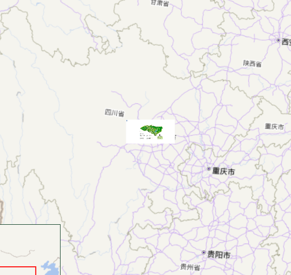

其中关于

```typescript
const extent=[
  center[0]-1920*100/2,
  center[1]-943*100/2,
  center[0]+1920*100/2,
  center[1]+943*100/2,
];
```

这是一个简单计算。目的是设置图片显示在地图中心。

### 5、矢量地图

矢量地图的图形的元素是一些点、线、矩形、多边形、圆和弧线等等，它们都是通过数学公式计算获得的。由于矢量图形可通过公式计算获得，所以矢量图形文件体积一般较小。

矢量图形最大的优点是无论放大、缩小或旋转等图形都不会失真。矢量地图在地图项目中存在着大量的应用，是地图数据中非常重要的组成部分。

为了便于存储、传递、使用，矢量地图会按照一定的格式来表达，比如常见的GeoJSON、TopoJSON、GML、KML、shapefile等等。除了最后一个shapefile，其他几个格式的矢量地图OpenLayers都支持，使用起来也非常的简单，下面这个地图就加载了GeoJson格式的矢量地图。

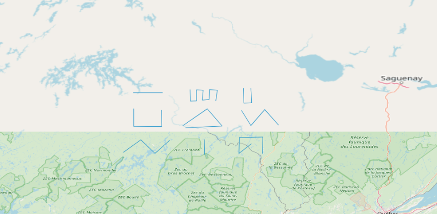

```html
<div id="map"></div>

<script>
    //创建地图
    var map = new ol.Map({
        layers: [
            //底图用Open Street Map地图
            new ol.layer.Tile({
                source: new ol.source.OSM()
            }),
            //再加载一个geojson的矢量地图
            new ol.layer.Vector({
                source: new ol.source.Vector({
                    url: 'data/geojson/line-samples.geojson',     // 矢量地图来源
                    format: new ol.format.GeoJSON()                  //解析矢量地图的格式化类
                })
            })
        ],
        view: new ol.View({
            center: [-72.980624870461128, 48.161307640513321],
            zoom: 8,
            projection: 'EPSG:4326'
        }),
        target: 'map'
    });
</script>
```

  加载矢量图使用的**source**是`ol.source.Vector`，**layer**是`ol.layer.Vector`。 加载代码之所以这么简单，是因为**OpenLayer**内置了对应矢量地图格式的解析类，比如`ol.format.GeoJSON`。它们都位于包`ol.format`下面，可以在API官方文档中查询得到。如果是**shapefile**这种不支持的，则需要自己解析。解析后，矢量地图都会转换为对应于**OpenLayers**中的**Feature**。所以，当加载完成后，可以通过`source.getFeatures()`方法来**获取所有的矢量图形**。

需要注意坐标系，因为**.geojson文档**里用的是和当前地图用的不一样的坐标系。

对于不同格式的矢量地图，会有相应的一些不同用法，下面就针对一些大家经常会遇到的问题，给出相应的实例，用以说明。

#### 5.1、获取加载后的所有feature

因为在加载矢量地图后，需要对矢量地图做一些简单的查询，分析等。但是经常会遇到获取不到加载后的feature的问题。原因就在于获取的时机不对，因为**矢量地图是异步加载的**。

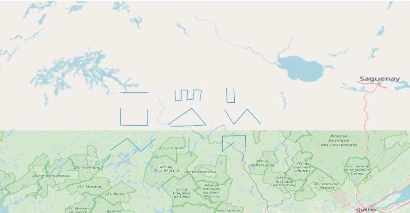

  从图上可以看到，共有9个feature，在地图下方的统计数据也是9。下面看看代码是如何实现的：

```html
<div id="map" style="width: 100%"></div>
<div>矢量地图Feature总数： <span id="count"></span></div>
<script type="text/javascript">
 
    //创建地图
    var map = new ol.Map({
        layers: [
            new ol.layer.Tile({
                source: new ol.source.OSM()
            })
        ],
        view: new ol.View({ 
            center: [-72.980624870461128, 48.161307640513321],
            zoom: 8,
            projection: 'EPSG:4326'
        }),
        target: 'map'
    });
 
    var vectorLayer = new ol.layer.Vector({
        source: new ol.source.Vector({
            url: '../data/geojson/line-samples.geojson', 
            format: new ol.format.GeoJSON()
        })
    });
 
    // 因为是异步加载，所以要采用事件监听的方式来判定是否加载完成
    var listenerKey = vectorLayer.getSource().on('change', function(){
        if (vectorLayer.getSource().getState() === 'ready') {    // 判定是否加载完成
            document.getElementById('count').innerHTML = vectorLayer.getSource().getFeatures().length;
            vectorLayer.getSource().unByKey(listenerKey); // 注销监听器
        }
    });
 
    map.addLayer(vectorLayer);
    // 如果在此处调用vectorLayer.getSource().getFeatures()是完全有可能获取不到任何Feature的，这是常犯错误
</script>
```

对于其中`vectorLayer.getSource().getState() === 'ready'`，关于source.getState()的返回值是数据源的状态，有： **'undefined'、'loading'、'ready' 、'error'**四种状态。只有在**'ready'**状态时才能正确获取加载完成的所有feature。

#### 5.2、矢量地图的坐标转换

矢量地图一般为EPSG：4326（WGS 84墨卡托投影坐标系），但是openlayers地图默认为EPSG：3857（WGS 84地理坐标系）。所以一般需要使用ol内置的地图格式解析器。

```typescript
//WKT图层
// const hnWKT = HNWKT();
const wktFormat = new WKT();
//利用readFeature方法自定义转换每一个要素坐标投影。
const wktFeature = wktFormat.readFeature(HKWKT, {
  dataProjection: "EPSG:4326",
  featureProjection: "EPSG:4548",
});
const wktVectorSource = new Vectorsource({
  features: [wktFeature],
});
const wktMap = new VectorLayer({
  source: wktVectorSource,
  style: new Style({
    fill: new Fill({
      color: "rgba(255, 255, 255, 0.2)",
    }),
    stroke: new Stroke({
      color: "#ab4bfe",
      width: 2,
    }),
  }),
  visible: false,
  properties: {
    title: "WKT",
    name: "WKT图层",
    type: "VectorLayer",
  },
});
```

#### 5.3、样式设置

  对矢量元素进行样式设置，OpenLayers支持两种方式，一种是直接给feature设置样式，一种是给layer设置样式。系统默认优先考虑feature的样式，如果没有，则使用layer的样式，还有一种情况是layer也没有设置样式，则会采用系统默认的样式。

对于自带样式的矢量地图修改样式 ，比如**KML格式**的矢量地图，如果要修改样式，则相对比较麻烦。得分情况考虑：

- ​    一种是所有矢量地图都不使用自带的样式：

- ​    一种是部分矢量地图不使用自带的样式。


对于第一种情况，则相对比较简单一点，只需要把`ol.format.KML`的构造参数`extractStyles`设置为**false**即可，然后为layer设定自定义的样式。

对于第二种情况，则相对麻烦一些，必须要读取加载的所有**feature**，并进行过滤，对符合条件的**feature**重新设置样式。

#### 5.4、数据解析类

  数据源使用**url + format**方式加载矢量数据，不同的数据类型使用不同的数据解析类，如下所述：

-   GeoJSON格式数据：使用`ol.format.GeoJSON`类进行解析。

-   KML格式数据：使用`ol.format.KML`类进行解析。

-   GPX格式数据：使用`ol.format.GPX`类进行解析。


 除了使用示例中的**url+format**设置矢量数据源的方式，还可以调用数据解析类**format**的`readFeatures`方法读取矢量要素集，**通过features参数设置数据源**。同时，也可以调用数据源对象的addFeature方法来加载单个矢量要素。

**解析器相关类的类结构图**：

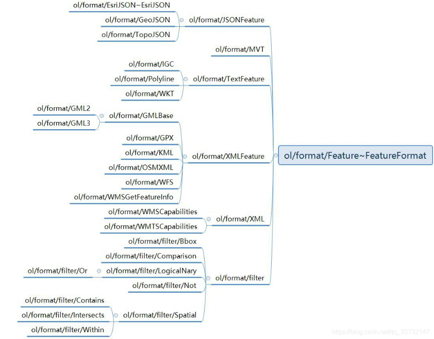

### 6、地图服务

因为每次都是根据用户请求参数，随时绘制地图，图像反映数据的最新情况，且在服务器端绘制地图，因此该方式通常称为**动态绘制地图服务**。而切片地图方式只反映了生成地图切片时的数据状况。

动态绘制地图服务的缺点是在多用户并发请求时，服务器容易超负荷运行，即用户越多，响应越慢。

#### 6.1、WMS服务

OGC（开发地理空间联盟）的**WMS（Web Map Service）**服务规范就是一种动态绘制地图服务的规范，许多WebGIS服务器实现了WMS规范，因此可以结合一些WebGIS服务器发布WMS服务，然后使用OpenLayers调用WMS服务在客户端呈现地图。目前比较流行的WebGIS服务器有GeoServer、ArcGIS Server等。

WMS服务主要支持以下操作：

- 请求服务的元数据（GetCapabilities）
- 请求地图图像（GetMap）
- 请求关于地图要素的信息（GetFeatureInfo，可选）
- 请求图例（GetLegendGraphic，可选）
- 请求用户定义的样式（GetStyles，可选）

作为基本WMS服务，必须至少支持GetCapabilities和GetMap操作，如果作为可查询WMS，则需要支持可选的GetFeatureInfo操作。

对于样式化图层描述符WMS服务，还有两种可选的操作，一个是请求图例符号操作，即GetLegendGraphic；第二个是请求用户定义的样式操作，即GetStyles。

关于WMS元数据详解请看：[OpenLayers教程十六：多源数据加载之WMS](https://zhuanlan.zhihu.com/p/73973319)

值得一提的是，WMS主要是用于**显示地图**，而非要素信息查询。**要素信息查询**应该交给WFS服务来完成。

```typescript
//WMS图层
const wmsMap = new ImageLayer({
  //params参数直接查看geoserver预览查看源码
  source: new ImageWMS({
    url: "/geoserver/Dome/wms", //访问参数采用KVP
    params: {
      FORMAT: "image/png",
      VERSION: "1.1.1",
      STYLES: "",
      LAYERS: "Dome:city_WH",
      exceptions: "application/vnd.ogc.se_inimage",
    },
    ratio: 1,
    serverType: "geoserver",
  }),
  visible: false,
  properties: {
    title: "WMS",
    name: "WMS图层",
    type: "ImageLayer",
  },
});
```

#### 6.2、WMTS服务

**WMTS**，即**Web地图瓦片服务（Web Map Tile Service）**，由OGC（开放地理信息联盟）制定。根据WMTS标准，可以使我们轻松的访问瓦片数据。

WMTS提供了一种采用预定义地图瓦片发布数字地图服务的标准化解决方案，它最重要的特征是采用**瓦片缓存技术缓解WebGIS服务器端数据处理的压力，提高前后端交互响应速度。**

**WMS（Web地图服务）**提供可定制地图的服务，是一个动态数据或用户定制地图（需结合SLD-Style Layer Descriptor）的理想解决方法。例如，可以在GeoServer中通过修改SLD样式文件来随时自定义地图样式：

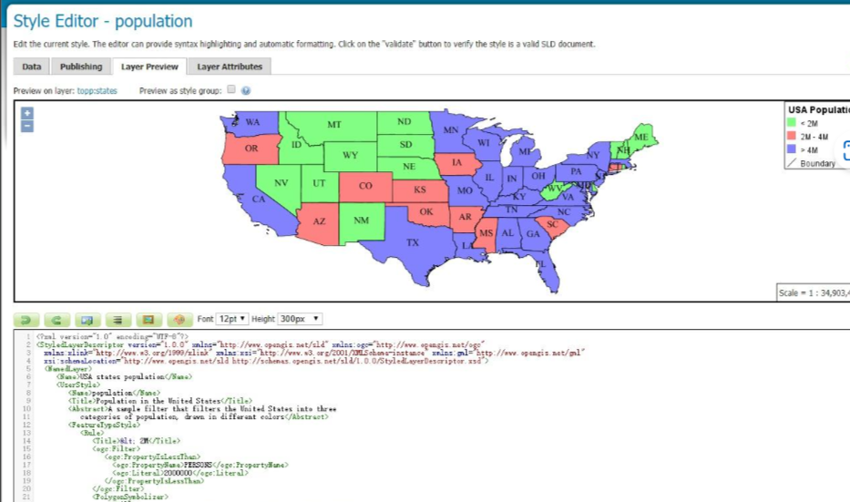

随时都可以修改，而且一修改在客户端就能实时渲染出变化。根本原因是**WMS的地图数据并没有通过切片放置到硬盘中，它的地图数据是实时处理并传输到客户端的。**

而**WMTS标准需要地图数据切片后放置在硬盘中，然后再调用数据传输到客户端。**

**WMTS**牺牲了提供定制地图的灵活性，代之以通过提供静态数据（瓦片地图）来增强伸缩性，这些静态数据的范围框和比例尺被限定在**瓦片坐标系**中。这些固定的瓦片地图数据集使得对**WMTS**服务的实现可以使用一个仅简单返回已有文件的Web服务器即可，同时使得可以利用一些标准诸如分布式缓存的网络机制实现伸缩性。

WMTS服务支持**RESTful**和**KVP**访问，其接口包括：

- GetCapabilities —— 获取服务元数据，元数据描述该服务的功能和包含的信息
- GetTile —— 获取地图瓦片
- GetFeatureInfo（鸡肋功能，不常用） —— 通过在WMTS图层上指定一定的条件，返回指定的地图瓦片内容对应的要素信息

关于WMTS详情请看：[OpenLayers教程：多源数据加载之WMTS](https://zhuanlan.zhihu.com/p/81258050)

此处从 GetCapabilities 响应访问 WMTS 的配置。更多加载WMTS方式请看：[OpenLayers Examples——加载WMTS](https://openlayers.org/en/latest/examples/?q=WMTS)

```typescript
// 计算EPSG:3857矩阵集
const projectionExtent = get("EPSG:3857")?.getExtent();
const size = getWidth(projectionExtent as Extent) / 256;
const resolutions: number[] = [];
const matrixIds: string[] = [];
for (let z = 0; z < 9; ++z) {
  resolutions[z] = size / Math.pow(2, z);
  matrixIds[z] = "EPSG:3857:" + z;
}
//WMTS图层
fetch("/geoserver/gwc/service/wmts?Request=GetCapabilities")
  .then((res) => res.text())
  .then((txt) => new WMTSCapabilities().read(txt))
  .then((capabilities) =>
    optionsFromCapabilities(capabilities, {
      layer: "Dome:tiff_GX",
    })
  )
  .then((options) => {
    const wmtsMap = new TileLayer({
      source: new WMTS(options as Options),
      properties: {
        title: "WMTS",
        name: "WMTS图层",
        type: "VectorLayer",
      },
      visible: false,
    });

    map.addLayer(wmtsMap);
  });
```

加载WMTS服务数据首先要**基于WMTS服务的基地址查询对应的元数据**，然后根据元数据文档里写的参数去请求瓦片数据就好了。

#### 6.3、WFS服务

OGC的WMS和WMTS规范都是**有关空间数据显示的标准**，而WFS（Web Feature Service）则**允许用户在分布式的环境下通过HTTP对空间数据进行增、删、改、查**。

具体来说，WebGIS服务器除了能够返回一张张地图图像之外，还可以返回绘制该地图图像所使用的真实地理数据。用户利用这些传输到客户端的地理数据可以进行数据渲染可视化、空间分析等操作。而前后端的这种数据交互就是基于WFS规范的。

那么也就能很清楚的说明WMS与WFS之间的区别了。**WMS是由服务器将地图图像发送给客户端，而WFS是服务器将矢量数据发送给客户端。**也就是在使用WMS时地图由服务器绘制，在使用WFS时地图由客户端绘制。另外最最重要的，使用WFS可以对WebGIS服务器中的地理数据（存储在空间数据库中）直接进行增、删、改、查。

WFS服务一般支持如下功能：

- GetCapabilities —— 获取WFS服务的元数据（介绍服务中的要素类和支持的操作）
- DescribeFeatureType —— 获取WFS服务支持的要素类的定义（要素类的元数据，比如要素包含哪些字段）
- GetFeature —— 获取要素数据
- GetGmlObject —— 通过XLink获取GML对象
- Transaction —— 创建、更新、删除要素数据的事务操作
- LockFeature —— 在事务过程中锁定要素

实际中，WebGIS服务器针对这些功能并不是必须全部实现，而是实现全部或部分。

因此，根据依据这些功能的支持与否，可以将WFS分为3类：

- Basic WFS —— 必须支持GetCapabilities、DescribeFeature Type、GetFeature功能
- XLink WFS —— 必须在Basic WFS基础上加上GetGmlObject操作
- Transaction WFS —— 也称为WFS-T，必须在Basic WFS基础上加上Transaction功能以及支持编辑数据，另外也可以加上GetGmlObject或LockFeature功能

WFS详情请看：[OGC的网络要素服务（WFS）(持续更新。。。）](https://zhuanlan.zhihu.com/p/83473651)

```typescript
//WFS的GML2格式数据加载
const wfsVectoreSource = new Vectorsource({
  url: "/geoserver/Dome/ows?service=WFS&version=1.0.0&request=GetFeature&typeName=Dome%3Acity_GZ&outputFormat=text%2Fxml%3B%20subtype%3Dgml%2F2.1.2",
  format: new GML2(), //指定格式
  strategy: bbox,
});
const wfsMap = new VectorLayer({
  //将GML2数据源传入矢量图层
  source: wfsVectoreSource,

  style: new Style({
    image: new Circle({
      radius: 5,
      fill: new Fill({
        color: "#3885ff",
      }),
    }),
    stroke: new Stroke({
      color: "blue",
      width: 2,
    }),
  }),
  visible: false,
  properties: {
    title: "WFS",
    name: "WFS图层",
    type: "VectorLayer",
  },
});
```

此处碰到问题：

> 在openlayers中对GML数据进行投影转换失效，最后是在GeoServer中发布时设置坐标系才正确投影。？？？？

## 四、交互

### 4.1、绘制图形

```vue
<template>
  <div class="selectDiv">
    <el-select id="type" v-model="selectValue" @change="selectTypeChange">
      <el-option
        v-for="item in options"
        :key="item.value"
        :value="item.value"
        :label="item.label"
      />
    </el-select>
    <el-button @click="stopInteraction">完成绘制</el-button>
    <el-button @click="backoutInteraction">撤销绘制</el-button>
    <el-dialog
      v-model="savePopupState"
      title=""
      width="20%"
      destroy-on-close
      draggable
    >
      <span>存到：</span>
      <el-select id="layerName" v-model="selectLayerName">
        <el-option
          v-for="(item, index) in vectorLayerArr"
          :key="index"
          :value="item.layerTitle"
          :label="item.layerName"
        />
      </el-select>
      <br />
      <span>或</span><br />
      <span>新建：</span>
      <el-input style="width: 159px" v-model="newLayerName"></el-input>
      <el-button @click="saveFeature(selectLayerName)">保存</el-button>
    </el-dialog>
  </div>
</template>
<script setup lang="ts">
import { ref } from "vue";
import { Map } from "ol";
import bus from "@/utils/bus.ts";
import VectorSource from "ol/source/Vector";
import VectorLayer from "ol/layer/Vector";
import { Draw, Snap } from "ol/interaction";

let mapCopy: Map;
//监听map数据
bus.on("mapToChecked", (res: Map) => {
  // 传参由回调函数中的形参接受
  mapCopy = res;
  mapCopy.addLayer(drawVectorLayer);
});

//定义一个类，接收图层属性
class VectorLayerAtt {
  layerName: String = "name";
  layerTitle: String = "title";

  //构造函数
  constructor(name: String, title: String) {
    this.layerName = name;
    this.layerTitle = title;
  }
}
let draw: Draw;
let snap: Snap;
const newLayerName = ref<string>(""); //新建的图层名称
const vectorLayerArr: VectorLayerAtt[] = []; //矢量图层数组
const savePopupState = ref<boolean>(false); //保存弹窗的状态
const selectValue = ref<string>(""); //选中的值
const selectLayerName = ref<string>(""); //选中的图层的名称
type SelectOption = {
  value: string;
  label: string;
};
const options: SelectOption[] = [
  //绘制要素的类型
  {
    value: "Point",
    label: "点",
  },
  {
    value: "LineString",
    label: "线",
  },
  {
    value: "Polygon",
    label: "面",
  },
  {
    value: "MultiPoint",
    label: "多点",
  },
];
const drawVectorSource = new VectorSource(); //绘制要素的目标数据源
const drawVectorLayer = new VectorLayer({
  //绘制要素的目标图层
  source: drawVectorSource,
  style: {
    "fill-color": "rgba(255, 255, 255, 0.2)",
    "stroke-color": "#ffcc33",
    "stroke-width": 2,
    "circle-radius": 7,
    "circle-fill-color": "#ffcc33",
  },
  properties: {
    title: "drawLayer",
    name: "临时绘画图层",
    type: "VectorLayer",
  },
});
// 添加绘制几何要素交互
const drawInteraction = () => {
  let selectedtype = selectValue.value; //接收选中的类型
  //创建Draw对象
  draw = new Draw({
    source: drawVectorSource,
    type: selectedtype as import("ol/geom/Geometry.js").Type, //类型断言
  });
  draw.setProperties({ name: "Draw" });
  snap = new Snap({ source: drawVectorSource }); //创建Snap控件对象
  mapCopy.addInteraction(draw); //添加draw、snap交互对象
  mapCopy.addInteraction(snap);
};
//监听选择框发生改变
const selectTypeChange = () => {
  mapCopy.removeInteraction(draw);
  mapCopy.removeInteraction(snap);
  drawInteraction(); //添加交互
};
//完成绘制
const stopInteraction = () => {
  savePopupState.value = true; //将弹窗状态设置为开启
  //获取所有矢量图层
  if (vectorLayerArr.length != 0) {
    vectorLayerArr.length = 0;
  }
  //如果是矢量图层且不是临时图层，创建矢量图层属性对象
  mapCopy.getAllLayers().forEach((item) => {
    if (
      item.get("type") === "VectorLayer" &&
      item.get("title") != "drawLayer"
    ) {
      vectorLayerArr.push(
        new VectorLayerAtt(item.get("name"), item.get("title"))
      );
    }
  });
  mapCopy.removeInteraction(draw); //移除绘制交互
  selectValue.value = ""; //置空选择框
};
//保存要素至图层
const saveFeature = (layerName: string) => {
  //如果输入框内容为空
  if (newLayerName.value == "") {
    mapCopy.getAllLayers().forEach((item) => {
      //循环查找选中的图层
      if (item.get("title") == layerName) {
        //获取图层的source断言类VectorSource类型
        const source = item.getSource() as VectorSource;
        //将临时绘制图层上的要素添加至选中的矢量图层
        source.addFeatures(drawVectorSource.getFeatures());
        item.setSource(source); //重新指定加载的数据源
      }
    });
  } else {
    nameToLayer(newLayerName.value); //根据输入框的内容创建图层
  }
  alert("保存成功");
  savePopupState.value = false; //关闭保存弹窗
  drawVectorSource.clear(); //清空临时绘制图层
};
//根据名称创建新图层
const nameToLayer = (layername: string) => {
  //根据名称创建新的VectorLayer
  const newVectorSource = new VectorSource({
    features: drawVectorSource.getFeatures(), //数据源绑定为临时绘制图层的getfeatures
  });
  const newVectorLayer = new VectorLayer({
    source: newVectorSource,
    properties: {
      name: layername,
      title: layername,
      type: "VectorLayer",
    },
  });
  mapCopy.addLayer(newVectorLayer);
};
//撤销绘制
const backoutInteraction = () => {
  //removeLastPoint对Point和MultiPoint无效
  if (selectValue.value != "Point" && selectValue.value != "MultiPoint") {
    draw?.removeLastPoint(); //通过移除正在绘制的对象的最后一个点实现撤销
  } else {
    //获取绘画源上的所有要素，getFeatures()只是以随机顺序获取源上当前要素的快照。返回的数组是一个副本，要素是对源中要素的引用。
    const drawFeatures = drawVectorSource.getFeatures();
    const length = drawFeatures.length;
    drawVectorSource.removeFeature(drawFeatures[length - 1]); //删除最后一个要素
  }
};
</script>
<style scoped>
.selectDiv {
  /* width: px; */
  display: flex;
  margin-right: 10px;
}
:deep(.el-button) {
  margin-left: 0px;
}
</style>
```

### 4.2、编辑图形

除了能够交互式地绘制几何图形，OpenLayers还支持我们编辑已经绘制的几何图形。

**ol.interaction.Modify**类封装了编辑图形的功能，只要将它初始化作为交互控件加入Map对象，就可以对几何图形进行动态编辑。

```html
<!DOCTYPE html>
<html lang="en">
<head>
    <meta charset="UTF-8">
    <meta name="viewport" content="width=device-width, initial-scale=1.0">
    <meta http-equiv="X-UA-Compatible" content="ie=edge">
    <title>编辑图形</title>
    <link rel="stylesheet" href="../v5.3.0/css/ol.css" />
    <script src="../v5.3.0/build/ol.js"></script>
</head>
<body>
    <div id="map"></div>
    <form>
        <label>Geometry type &nbsp;</label>
        <select id="type">
          <option value="Point">Point</option>
          <option value="LineString">LineString</option>
          <option value="Polygon">Polygon</option>
          <option value="Circle">Circle</option>
        </select>
    </form>
 
    <script>
        // 矢量地图源
        let vectorSource = new ol.source.Vector();
        // 矢量地图
        let vectorLayer = new ol.layer.Vector({
            source: vectorSource
        });
 
        // 初始化地图
        let map = new ol.Map({
            target: 'map',
            layers: [
                new ol.layer.Tile({
                    source: new ol.source.OSM()
                }),
                vectorLayer
            ],
            view: new ol.View({
                center: [0, 0],
                zoom: 5
            })
        });
 
        // 创建一个Modify控件，指定source可以对哪些地图源进行图形编辑。
        let modify = new ol.interaction.Modify({
            source: vectorSource
        });
        // 将Modify控件加入到Map对象中
        map.addInteraction(modify);
 
        let draw, snap;
        let typeSelect = document.getElementById('type');
 
        function addInteractions(){
            // 创建一个Draw控件，并加入到Map对象中
            draw = new ol.interaction.Draw({
                source: vectorSource,
                type: typeSelect.value
            });
            map.addInteraction(draw);
 
            // 创建一个Snap控件，并加入到Map对象中，开启捕捉
            snap = new ol.interaction.Snap({
                source: vectorSource
            });
            map.addInteraction(snap);
        }
 
        typeSelect.addEventListener('click', () => {
            // 移除Draw控件和Snap控件
            map.removeInteraction(draw);
            map.removeInteraction(snap);
            addInteractions();
        });
 
        addInteractions();
    </script>
</body>
</html>
```

### 4.3、查询图形

```typescript
<template>
  <div class="searchDiv">
    <el-input
      class="searchInput"
      v-model="searchTerm"
      placeholder="请输入关键字"
    />
    <el-button class="dataButtonSearch" @click="searchFeatures">查询</el-button>
    <el-button class="dataButtonClear" @click="clearFeatures">清除</el-button>
  </div>
</template>
<script setup lang="ts">
import { Ref, ref } from "vue";
import { Map } from "ol";
import bus from "@/utils/bus.ts";
import VectorSource from "ol/source/Vector";
import VectorLayer from "ol/layer/Vector";
import { Style, Stroke, Fill } from "ol/style";
import { Geometry } from "ol/geom";
import { Feature } from "ol";

let mapCopy: Map;
//监听map数据
bus.on("mapToChecked", (res: Map) => {
  // 传参由回调函数中的形参接受
  mapCopy = res;
});

const searchTerm: Ref<string> = ref<string>(""); //搜索框的关键字
let featuresList: Feature<Geometry>[] = [];
let selectedFeaturesList: Feature<Geometry>[] = []; //定义一个数组用于接收查询搜索到的要素

//属性模糊查询
const searchFeatures = () => {
  if (searchTerm.value) {
    //输入关键字不为空
    selectedFeaturesList.length = 0; //初始化匹配选中的要素的数组
    const geojsonSource: VectorSource<Geometry> = mapCopy
      .getAllLayers()[2]
      .getSource() as VectorSource;
    featuresList = geojsonSource.getFeatures(); //获取矢量图层中GeoJSON的要素
    const regex: RegExp = new RegExp(searchTerm.value, "i"); //创建正则表达式
    featuresList.forEach((element) => {
      //对要素进行遍历
      const name: string = element.getProperties().district; //接收要素名称
      if (regex.test(name)) {
        selectedFeaturesList.push(element); //将要素添加进要素数组
      }
    });
    drawFeatures(selectedFeaturesList); //调用绘制要素函数
    searchTerm.value = ""; //置空关键字
  }
};
// 绘制选择
let selectedVectorLayer: VectorLayer<VectorSource<Geometry>>; //创建一个VectorLayer变量
const drawFeatures = (list: Feature<Geometry>[]) => {
  if (list.length != 0) {
    //传入的要素数组不能为空
    selectedVectorLayer = new VectorLayer({
      source: new VectorSource({
        features: list, //使用传入的要素数组
      }),
      style: new Style({
        //创建选中样式
        fill: new Fill({
          color: "rgba(170, 198, 238)",
        }),
        stroke: new Stroke({
          color: "#ff0000",
          width: 2,
        }),
      }),
      properties: {
        title: "selectedLayer",
        name: "选择图层",
        type: "VectorLayer",
      },
    });

    mapCopy.addLayer(selectedVectorLayer); //将选中要素创建的图层添加进map
  }
};
//清除选择
const clearFeatures = () => {
  mapCopy.removeLayer(selectedVectorLayer); //利用removeLayer移除选中的图层
};
</script>
<style>
.searchDiv {
  display: flex;
  margin-right: 10px;
}
.dataButton,
.dataButtonSearch,
.dataButtonClear,
.searchInput {
  margin: 0px;
}
.el-button+.el-button{
  margin: 0px;
}
</style>

```

### 4.4、框选图形

```typescript
import Select from 'ol/interaction/Select.js';
```

用于选择矢量特征的交互。默认情况下，所选要素为 样式不同，因此此交互可用于视觉突出显示， 以及为其他操作选择功能，例如修改或 输出。

```typescript
import DragBox from 'ol/interaction/DragBox.js';
```

允许用户通过在地图上单击和拖动来绘制矢量框， 通常与[`ol/events/condition`](https://openlayers.org/en/latest/apidoc/module-ol_events_condition.html)限制 它到按住 shift 或其他键时。

```vue
<template>
  <div id="map">
    <el-button @click="addLayer()">添加图层</el-button>
    <el-button @click="removeLayer()">移除图层</el-button>
    <el-button @click="addInteraction()">添加交互</el-button>
    <el-button @click="removeInteraction()">移除交互</el-button>
  </div>
</template>
<script>
import "ol/ol.css";
import Map from "ol/Map";
import View from "ol/View";
import TileLayer from "ol/layer/Tile";
import VectorLayer from "ol/layer/Vector.js";
import { OSM, Vector as VectorSource } from "ol/source";
import { defaults as defaultControls } from "ol/control";
import ZoomSlider from "ol/control/ZoomSlider";
import GeoJSON from "ol/format/GeoJSON";
import Select from "ol/interaction/Select";//
import DragBox from "ol/interaction/DragBox";
import { platformModifierKeyOnly } from "ol/events/condition";
 
export default {
  name: "",
  data() {
    return {
      map: null,
      select: {},
      dragBox: {},
      vectorSource: {},
      vectorLayer: {},
      selectedFeatures: [],
    };
  },
  mounted() {
    this.initMap();
  },
  methods: {
    addLayer() {
      this.vectorLayer = new VectorLayer({
        source: this.vectorSource,
        zIndex: 2,
      });
 
      this.map.addLayer(this.vectorLayer);
    },
    removeLayer() {
      this.map.removeLayer(this.vectorLayer);
    },
    addInteraction() {
      this.select = new Select();
      this.selectedFeatures = this.select.getFeatures();
 
      this.dragBox = new DragBox({ condition: platformModifierKeyOnly });
      this.map.addInteraction(this.select);
      this.map.addInteraction(this.dragBox);
        //在拖动框结束时触发。
      this.dragBox.on("boxend", () => {
        let extent = this.dragBox.getGeometry().getExtent();
        //forEachFeatureIntersectingExtent:遍历几何与所提供范围相交的所有要素， 使用每个功能调用回调。如果回调返回“真实” 值，迭代将停止，函数将返回相同的值。
        this.vectorSource.forEachFeatureIntersectingExtent(
          extent,
          (feature) => {
            this.selectedFeatures.push(feature);
          }
        );
      });
        //拖动框启动时触发。
      this.dragBox.on("boxstart", () => {
        this.selectedFeatures.clear();
      });
    },
    removeInteraction() {
      this.selectedFeatures.clear();
      this.map.removeInteraction(this.select);
      this.map.removeInteraction(this.dragBox);
    },
 
    // 初始化地图
    initMap() {
      let view = new View({
        projection: "EPSG:4326",
        center: [115, 39],
        zoom: 4,
      });
      let layer = new TileLayer({
        source: new OSM(),
        visible: true,
        zIndex: 1,
        name: "OSM",
      });
      let vectorSource = new VectorSource({
        url: "sichuan.json",
        format: new GeoJSON(),
      });
 
      this.vectorSource = vectorSource;
 
      this.map = new Map({
        layers: [layer],
        target: "map",
        view: view,
        controls: defaultControls().extend([new ZoomSlider()]),
      });
    },
  },
};
</script>
<style scoped>
#map {
  height: 100vh;
  width: 100vw;
}
</style>
```

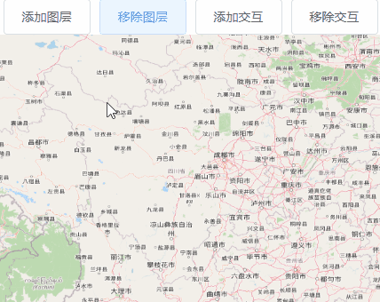

如果要设置点击多选的效果，需要设置select对象的属性：

```typescript
multi:true,
condition: click, //单击选择。点击空白处，会取消选择
toggleCondition: click,//点击空白处，不会取消选择
```

将上述代码进行更改：

```typescript
import { click } from "ol/events/condition";

addInteraction() {
    this.select = new Select({ condition: click, toggleCondition: click });
    this.selectedFeatures = this.select.getFeatures();
    this.map.addInteraction(this.select);
}
removeInteraction() {
    this.selectedFeatures.clear();
    this.map.removeInteraction(this.select);
},
```

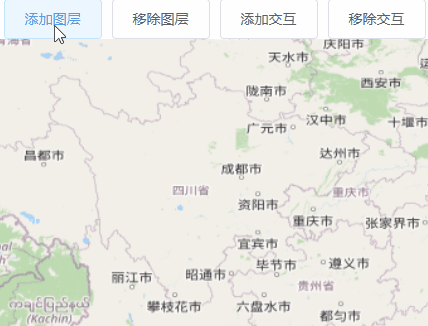

### 4.5、测量与定位

```vue
<template>
  <div class="measureDiv">
    <el-button-group style="margin-right: 10px">
      <el-button @click="beginMeasure">大地线测量</el-button>
      <el-button @click="stopMeasure">停止测量</el-button>
    </el-button-group>
  </div>
</template>
<script setup lang="ts">
import { Feature, Map, Overlay } from "ol";
import bus from "@/utils/bus.ts";
import VectorSource from "ol/source/Vector";
import VectorLayer from "ol/layer/Vector";
import { Geometry, LineString, Point } from "ol/geom";
import { Draw } from "ol/interaction";
import * as turf from "@turf/turf";
import { Coordinate } from "ol/coordinate";
import { unByKey } from "ol/Observable";
import { EventsKey } from "ol/events";
import { transform } from "ol/proj";

//监听获取map数据
let mapCopy: Map;
bus.on("mapToChecked", (res: Map) => {
  // 传参由回调函数中的形参接受
  mapCopy = res;
});
let drawLine: Draw;
let drawGeometry: LineString;
let drawFeature: Feature<Geometry> | null; //定义一个全局获取绘制的要素
let toolTipElement: HTMLElement; //提示信息dom元素
let toolTip: Overlay;
let distancePopupElement: HTMLElement; //距离弹窗dom元素
let distancePopup: Overlay;
let listener: EventsKey | EventsKey[]; //接收地图监听
//开始测量
const beginMeasure = () => {
  //创建一个矢量图层接收绘制的多线段
  const lineSource = new VectorSource();
  const lineLayer = new VectorLayer({
    source: lineSource,
    properties: {
      title: "lineLayer",
      name: "测量图层",
      type: "VectorLayer",
    },
  });

  //将矢量图层加载到地图实例
  mapCopy.addLayer(lineLayer);
  //创建一个Draw对象，绘制距离线段
  drawLine = new Draw({
    source: lineSource,
    type: "LineString",
  });
  drawLine.setProperties({ name: "Draw" });
  mapCopy.addInteraction(drawLine);

  //创建toolTipElement
  creatToolTip();
  //创建距离弹窗
  createDistancePopup();
  //监听地图的鼠标移动事件，设置提示信息弹窗
  listener = mapCopy.on("pointermove", (evt) => {
    let helpMsg = "点击开始测量";
    if (drawFeature) {
      helpMsg = "双击结束测量";
    }
    toolTipElement.innerHTML = helpMsg; //设置提示文字
    toolTip.setPosition(evt.coordinate); //设置提示位置跟着鼠标走
    toolTipElement.classList.remove("hidden"); //显示提示框
  });

  //监听开始绘制事件
  drawLine.on("drawstart", (evt) => {
    //获取绘制的要素
    drawFeature = evt.feature; //多线段
    //监听几何变化事件
    drawFeature.getGeometry()?.on("change", (evt) => {
      //获取绘制的几何对象
      drawGeometry = evt.target as LineString;
      //获取多线段的点的坐标数组长度
      const length = drawGeometry.getCoordinates().length;
      //获取多线段上最后一个点坐标
      const bottomCoord: Coordinate = drawGeometry.getLastCoordinate();
      //计算多线段的长度,点的坐标为4548坐标系，需要转换到4326地理坐标系
      const lineCoordArr: Coordinate[] = [];
      drawGeometry.getCoordinates().forEach((coord) => {
        lineCoordArr.push(transform(coord, "EPSG:4548", "EPSG:4326"));
      });
      const line = turf.lineString(lineCoordArr);
      const distance = turf.length(line, { units: "kilometers" });

      //将计算距离结果加载到提示框上
      distancePopupElement.innerHTML = `${distance.toFixed(2)} km`; //对距离保留两位小数
      distancePopup.setPosition(bottomCoord); //设置距离弹窗位置
    });
  });
  //监听双击绘制完成事件
  drawLine.on("drawend", (evt) => {
    distancePopupElement.className = "toolTip distancePopupEnd";
    distancePopup.setOffset([0, -7]);
    drawFeature = null;
    toolTipElement.classList.add("hidden");
  });
};
//创建toolTipElement
const creatToolTip = () => {
  if (toolTipElement) {
    //如果已经存在就先初始化
    toolTipElement.parentNode?.removeChild(toolTipElement);
  }
  //创建dom元素--提示信息
  toolTipElement = document.createElement("div");
  toolTipElement.className = "toolTip hidden";
  //创建Overlay弹窗
  toolTip = new Overlay({
    element: toolTipElement,
    offset: [15, 0],
    positioning: "center-left",
  });
  //添加Overlay
  mapCopy.addOverlay(toolTip);
};
//创建dom元素--距离弹窗
const createDistancePopup = () => {
  if (distancePopupElement) {
    distancePopupElement.parentNode?.removeChild(distancePopupElement);
  }
  distancePopupElement = document.createElement("div");
  distancePopupElement.className = "toolTip distancePopupStart";
  distancePopup = new Overlay({
    element: distancePopupElement,
    offset: [15, 0],
    positioning: "bottom-center",
    stopEvent: false,
    insertFirst: false,
  });
  mapCopy.addOverlay(distancePopup);
};

//停止测量
const stopMeasure = () => {
  //如果draw为空不执行删除，防止删除了默认交互
  mapCopy.removeInteraction(drawLine);
  mapCopy.removeOverlay(toolTip); //关闭信息弹窗
  unByKey(listener); //移除监听
};
</script>
<style>
.measureDiv {
  display: flex;
}
.hidden {
  display: none;
}

.toolTip {
  position: relative;
  background: rgba(0, 0, 0, 0.5);
  border-radius: 4px;
  color: white;
  padding: 4px 8px;
  opacity: 0.7;
  white-space: nowrap;
  font-size: 12px;
  cursor: default;
  user-select: none;
}

.distancePopupStart {
  opacity: 1;
  font-weight: bold;
}

.distancePopupEnd {
  background-color: #ffcc33;
  color: black;
  border: 1px solid white;
}

.distancePopupStart:before,
.distancePopupEnd:before {
  border-top: 6px solid rgba(0, 0, 0, 0.5);
  border-right: 6px solid transparent;
  border-left: 6px solid transparent;
  content: "";
  position: absolute;
  bottom: -6px;
  margin-left: -7px;
  left: 50%;
}

.distancePopupEnd:before {
  border-top-color: #ffcc33;
}
</style>
```

### 4.6、弹窗

```vue
<template>
  <div id="popup" class="olPopup" v-show="selectState">
    <a href="#" id="popupCloser" class="olPopupCloser" @click="removePopup"></a>
    <div id="popupContent" v-show="featureAmount > -1">
      <table>
        <tr>
          <th>当前坐标:</th>
          <td>{{ lonAndLat }}</td>
        </tr>
      </table>
      <div v-show="featureAmount > 0">
        <table>
          <tr>
            <th>矢量类型:</th>
            <td>{{ type[layerIndex] }}</td>
          </tr>
          <tr>
            <th>图层名称:</th>
            <td>{{ name[layerIndex] }}</td>
          </tr>
        </table>
        <el-button v-show="featureAmount > 1" @click="changePopup"
          >切换</el-button
        >
      </div>
    </div>
  </div>
</template>
<script setup lang="ts">
import { ref } from "vue";
import { Feature, Map } from "ol";
import { toLonLat } from "ol/proj";
import Overlay from "ol/Overlay.js";
import bus from "@/utils/bus.ts"; //定义声明文件再引入
import { Coordinate, toStringHDMS } from "ol/coordinate";
import { FeatureLike } from "ol/Feature";
import { Pixel } from "ol/pixel";

let mapCopy: Map;

let popupContainer: HTMLElement;
let popup: Overlay;
let lonAndLat = ref(""); //经纬度
const name = ref<string[]>([]); //图层名称
const type = ref<string[]>([]); //矢量类型
const selectState = ref<boolean>(false); //弹窗状态
let featureAmount = ref<number>(0); //选中矢量要素个数
let layerIndex = ref<number>(0); //图层显示索引

// 添加弹窗
const addPopup = (clickCrd: Coordinate, clickPixel: Pixel) => {
  //获取弹出框DOM
  popupContainer = document.getElementById("popup") as HTMLElement;
  //创建弹出层并绑定DOM
  popup = new Overlay({
    element: popupContainer as HTMLElement,
    autoPan: {
      animation: {
        duration: 250,
      },
    },
  });

  lonAndLat.value = toStringHDMS(toLonLat(clickCrd, "EPSG:4548")); //转换为经纬度坐标
  // 判断点击位置的要素
  let featuresVector: Feature[] = [];
  mapCopy.forEachFeatureAtPixel(clickPixel, (f: FeatureLike) => {
    featuresVector.push(f as Feature);
  });

  featureAmount.value = featuresVector.length; //获取到的元素的个数

  for (let i = 0; i < featureAmount.value; i++) {
    //循环获取元素名称与类型
    name.value.push(featuresVector[i].get("district"));
    type.value.push(featuresVector[i].getGeometry()?.getType() as string);
  }
  mapCopy.addOverlay(popup);
  //设置位置
  popup.setPosition(clickCrd);
};
//关闭弹窗
const removePopup = () => {
  popup.setPosition(undefined);
  selectState.value = false; //关闭弹窗状态
};
//切换要素信息弹窗
const changePopup = () => {
  if (layerIndex.value < featureAmount.value - 1) {
    layerIndex.value++;
  } else {
    alert("已经没有更多图层了");
  }
};

//监听map数据
bus.on("mapToChecked", (res: Map) => {
  // 传参由回调函数中的形参接受
  mapCopy = res;
  //监听click事件
  mapCopy.on("click", (event) => {
    //更新弹窗状态为开启
    selectState.value = true;
    //判断地图实例上是否存在绘制交互，如果存在，关闭弹窗
    mapCopy
      .getInteractions()
      .getArray()
      .some((item) => {
        if (item.getProperties().name === "Draw") {
          selectState.value = false;
        }
      });

    const clickCoordinate: Coordinate = event.coordinate; //获取点击坐标
    const clickPixel: Pixel = event.pixel; //获取点击位置
    featureAmount.value = 0; //每次点击都置空个数
    name.value = []; //置空名称数组
    type.value = []; //置空类型数组
    layerIndex.value = 0; //归零显示图层索引
    addPopup(clickCoordinate, clickPixel); //挂载添加弹窗函数
  });
});
</script>

<style>
.olPopup {
  position: absolute;
  background-color: white;
  box-shadow: 0 1px 4px rgba(0, 0, 0, 0.2);
  padding: 15px;
  border-radius: 10px;
  border: 1px solid #cccccc;
  bottom: 12px;
  left: -50px;
  min-width: 350px;
}

.olPopup:after,
.olPopup:before {
  top: 100%;
  border: solid transparent;
  content: " ";
  height: 0;
  width: 0;
  position: absolute;
  pointer-events: none;
}

.olPopup:after {
  border-top-color: white;
  border-width: 10px;
  left: 48px;
  margin-left: -10px;
}

.olPopup:before {
  border-top-color: #cccccc;
  border-width: 11px;
  left: 48px;
  margin-left: -11px;
}

.olPopupCloser {
  text-decoration: none;
  position: absolute;
  top: 2px;
  right: 8px;
}

.olPopupCloser:after {
  content: "✖";
}
</style>
```

### 4.7、图层遮罩

```typescript
import * as ol from 'ol'; // 地图实例方法、视图方法
import VectorLayer from 'ol/layer/Vector';
import VectorSource from 'ol/source/Vector';
import { fromExtent } from 'ol/geom/Polygon';
import { LinearRing } from 'ol/geom';
import { GeoJSON } from 'ol/format';
import { Tile } from 'ol/layer';
import { XYZ } from 'ol/source';
import { Style, Fill, Stroke } from 'ol/style';
import { onMounted } from 'vue';
import { getJsonData } from '@/api/getData/getData';

let map: ol.Map;
function init() {
    map = new ol.Map({
        target: 'js-map',
        layers: [
            new Tile({
                source: new XYZ({
                    url: 'https://wprd0{1-4}.is.autonavi.com/appmaptile?lang=zh_cn&size=1&style=7&x={x}&y={y}&z={z}',
                }),
            }),
        ],
        view: new ol.View({
            projection: 'EPSG:4326',
            center: [104.06, 30.67],
            zoom: 11,
        }),
    });
    showChengDuArea();

    function showChengDuArea() {
        // 创建一个适量图层
        let initLayer = new VectorLayer({
            source: new VectorSource(),
            // 设置图层样式
            style: new Style({
                // 平铺颜色
                fill: new Fill({
                    color: 'rgba( 0, 0, 0, 1)',
                }),
                // 擦除后的图形边框颜色
                stroke: new Stroke({
                    color: '#f4b49f',
                    width: 3,
                }),
            }),
        });

        //  获取地区数据:http://datav.aliyun.com/portal/school/atlas/area_selector#&lat=22.65267050733856&lng=114.18983459472656&zoom=10
        map.addLayer(initLayer);
        getJsonData(
            'https://geo.datav.aliyun.com/areas_v3/bound/510100_full.json'
        ).then((res) => {
            addConver(initLayer, res);
        });
    }

    //添加遮罩
    function addConver(converLayer: any, data: any) {
        const fts = new GeoJSON().readFeatures(data);
        const converGeom = erase(fts);
        const convertFt = new ol.Feature({
            geometry: converGeom,
        });
        converLayer.getSource().addFeature(convertFt);
    }
    //擦除操作，生成遮罩范围
    function erase(geom: any) {
        const extent = [-180, -90, 180, 90];
        const polygonRing = fromExtent(extent);
        // 擦除操作
        for (let i = 0, len = geom.length; i < len; i++) {
            let g = geom[i].getGeometry();
            const coords = g.getCoordinates();
            coords.forEach((coord: any) => {
                const linearRing = new LinearRing(coord[0]);
                // 将所有多边形数据组放到一个数据组中
                polygonRing.appendLinearRing(linearRing);
            });
        }
        return polygonRing;
    }
}

onMounted(() => {
    init();
});
```

### 4.8、聚合

```vue
<template>
  <div id="map" style="width: 100vw; height: 100vh"></div>
</template>
<script>
import "ol/ol.css";
import TileLayer from "ol/layer/Tile";
import VectorLayer from "ol/layer/Vector";
 
import VectorSource from "ol/source/Vector";
import OSM from "ol/source/OSM";
 
import { Map, View } from "ol";
import { Style, Stroke, Fill, Icon, Text, Circle } from "ol/style";
import { Cluster } from "ol/source";
import GeoJSON from "ol/format/GeoJSON";
 
export default {
  data() {
    return {
      map: {},
      clusterLayer: {},
      geojsonData: {
        type: "FeatureCollection",
        features: [
          {
            type: "Feature",
            properties: {
              name: "成都市",
              value: 85,
            },
            geometry: {
              type: "Point",
              coordinates: [104.061902, 30.609503],
            },
          },
          {
            type: "Feature",
            properties: {
              name: "广安市",
              value: 50,
            },
            geometry: {
              type: "Point",
              coordinates: [106.619126, 30.474142],
            },
          },
          {
            type: "Feature",
            properties: {
              name: "绵阳市",
              value: 36,
            },
            geometry: {
              type: "Point",
              coordinates: [104.673612, 31.492565],
            },
          },
          {
            type: "Feature",
            properties: {
              name: "雅安市",
              value: 555,
            },
            geometry: {
              type: "Point",
              coordinates: [103.031653, 30.018895],
            },
          },
          {
            type: "Feature",
            properties: {
              name: "自贡市",
              value: 55,
            },
            geometry: {
              type: "Point",
              coordinates: [104.797794, 29.368322],
            },
          },
          {
            type: "Feature",
            properties: {
              name: "宜宾市",
              value: 666,
            },
            geometry: {
              type: "Point",
              coordinates: [104.610964, 28.781347],
            },
          },
          {
            type: "Feature",
            properties: {
              name: "内江市",
              value: 777,
            },
            geometry: {
              type: "Point",
              coordinates: [105.064555, 29.581632],
            },
          },
        ],
      },
    };
  },
  mounted() {
    this.initMap();
    this.pointerMove();
    this.addCluster();
  },
  methods: {
    initMap() {
      this.map = new Map({
        target: "map",
 
        layers: [
          new TileLayer({
            source: new OSM(),
          }),
        ],
        view: new View({
          center: [104.065735, 30.659462],
          projection: "EPSG:4326",
          zoom: 4.5,
        }),
      });
    },
    pointerMove() {
      this.map.on("pointermove", (e) => {
        const isHover = this.map.hasFeatureAtPixel(e.pixel);
        this.map.getTargetElement().style.cursor = isHover ? "pointer" : "";
      });
    },
    addCluster() {
      this.clusterLayer = new VectorLayer({
        source: new Cluster({
          distance: parseInt(20, 10),
          source: new VectorSource({
            features: new GeoJSON().readFeatures(this.geojsonData),
          }),
        }),
        style: (feature) => {
          let total = 0;
          feature.get("features").forEach((value) => {
            total += value.getProperties().value;
          });
          let style = new Style({
            image: new Circle({
              radius: 15,
              stroke: new Stroke({
                color: "blue",
              }),
              fill: new Fill({
                color: "rgba(124,144,255,100)",
              }),
            }),
            text: new Text({
              text: `${total} 个`,
              fill: new Fill({
                color: "white",
              }),
              font: "12px Calibri,sans-serif",
              stroke: new Stroke({
                color: "black",
                width: 2,
              }),
            }),
          });
          return style;
        },
      });
      this.map.addLayer(this.clusterLayer);
    },
  },
};
</script>
```


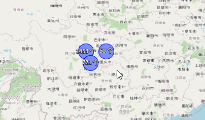

根据不同的数值，聚合标注显示不同的颜色:

```vue
<template>
  <div id="map" style="width: 1800px; height: 900px"></div>
</template>
<script>
import "ol/ol.css";
import TileLayer from "ol/layer/Tile";
import VectorLayer from "ol/layer/Vector";
 
import VectorSource from "ol/source/Vector";
import OSM from "ol/source/OSM";
 
import { Map, View } from "ol";
import { Style, Stroke, Fill, Icon, Text, Circle } from "ol/style";
import { defaults as defaultControls } from "ol/control";
import { Cluster } from "ol/source";
import GeoJSON from "ol/format/GeoJSON";
 
export default {
  data() {
    return {
      map: {},
      geojsonData: {
        type: "FeatureCollection",
        features: [
          {
            type: "Feature",
            properties: {
              name: "成都市",
              value: 85,
            },
            geometry: {
              type: "Point",
              coordinates: [104.061902, 30.609503],
            },
          },
          {
            type: "Feature",
            properties: {
              name: "广安市",
              value: 50,
            },
            geometry: {
              type: "Point",
              coordinates: [106.619126, 30.474142],
            },
          },
          {
            type: "Feature",
            properties: {
              name: "绵阳市",
              value: 236,
            },
            geometry: {
              type: "Point",
              coordinates: [104.673612, 31.492565],
            },
          },
          {
            type: "Feature",
            properties: {
              name: "雅安市",
              value: 555,
            },
            geometry: {
              type: "Point",
              coordinates: [103.031653, 30.018895],
            },
          },
          {
            type: "Feature",
            properties: {
              name: "自贡市",
              value: 155,
            },
            geometry: {
              type: "Point",
              coordinates: [104.797794, 29.368322],
            },
          },
          {
            type: "Feature",
            properties: {
              name: "宜宾市",
              value: 666,
            },
            geometry: {
              type: "Point",
              coordinates: [104.610964, 28.781347],
            },
          },
          {
            type: "Feature",
            properties: {
              name: "内江市",
              value: 777,
            },
            geometry: {
              type: "Point",
              coordinates: [105.064555, 29.581632],
            },
          },
        ],
      },
    };
  },
  mounted() {
    this.initMap();
  },
  methods: {
    getColor(value) {
      if (value < 100) return "blue";
      else if (value >= 100 && value < 700) return "yellow";
      else return "red";
    },
    initMap() {
      this.map = new Map({
        target: "map",
 
        layers: [
          new TileLayer({
            source: new OSM(),
          }),
          new VectorLayer({
            source: new Cluster({
              distance: parseInt(20, 10),
              source: new VectorSource({
                features: new GeoJSON().readFeatures(this.geojsonData),
              }),
            }),
            style: (feature) => {
              let total = 0;
              feature.get("features").forEach((value) => {
                total += value.getProperties().value;
              });
              let style = new Style({
                image: new Circle({
                  radius: 15,
                  stroke: new Stroke({
                    // color: "blue",
                    color: this.getColor(total),
                  }),
                  fill: new Fill({
                    // color: "rgba(124,144,255,100)",
                    color: this.getColor(total),
                  }),
                }),
                text: new Text({
                  text: `${total} 个`,
                  fill: new Fill({
                    color: "white",
                  }),
                  font: "12px Calibri,sans-serif",
                  stroke: new Stroke({
                    color: "black",
                    width: 2,
                  }),
                }),
              });
              return style;
            },
          }),
        ],
        view: new View({
          center: [104.065735, 30.659462],
          projection: "EPSG:4326",
          zoom: 4.5,
        }),
        controls: defaultControls({
          zoom: true,
        }).extend([]),
      });
    },
  },
};
</script>
```

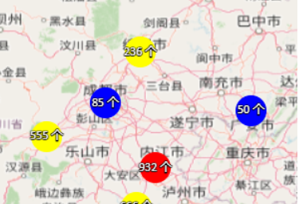

动态添加移除聚合图层:

```vue
<template>
  <div>
    <div id="map" style="width: 100vw; height: 100vh"></div>
    <div style="position: fixed; top: 200px; left: 100px">
      <el-button @click="addClusterLayer()">添加聚类图层</el-button>
      <el-button @click="removeClusterLayer()">移除聚类图层</el-button>
    </div>
  </div>
</template>
<script>
import "ol/ol.css";
import TileLayer from "ol/layer/Tile";
import VectorLayer from "ol/layer/Vector";
 
import VectorSource from "ol/source/Vector";
import OSM from "ol/source/OSM";
 
import { Map, View } from "ol";
import { Style, Stroke, Fill, Icon, Text, Circle } from "ol/style";
import { Cluster } from "ol/source";
import GeoJSON from "ol/format/GeoJSON";
 
export default {
  data() {
    return {
      map: {},
      clusterLayer: {},
      geojsonData: {
        type: "FeatureCollection",
        features: [
          {
            type: "Feature",
            properties: {
              name: "成都市",
              value: 85,
            },
            geometry: {
              type: "Point",
              coordinates: [104.061902, 30.609503],
            },
          },
          {
            type: "Feature",
            properties: {
              name: "广安市",
              value: 50,
            },
            geometry: {
              type: "Point",
              coordinates: [106.619126, 30.474142],
            },
          },
          {
            type: "Feature",
            properties: {
              name: "绵阳市",
              value: 36,
            },
            geometry: {
              type: "Point",
              coordinates: [104.673612, 31.492565],
            },
          },
          {
            type: "Feature",
            properties: {
              name: "雅安市",
              value: 555,
            },
            geometry: {
              type: "Point",
              coordinates: [103.031653, 30.018895],
            },
          },
          {
            type: "Feature",
            properties: {
              name: "自贡市",
              value: 55,
            },
            geometry: {
              type: "Point",
              coordinates: [104.797794, 29.368322],
            },
          },
          {
            type: "Feature",
            properties: {
              name: "宜宾市",
              value: 666,
            },
            geometry: {
              type: "Point",
              coordinates: [104.610964, 28.781347],
            },
          },
          {
            type: "Feature",
            properties: {
              name: "内江市",
              value: 777,
            },
            geometry: {
              type: "Point",
              coordinates: [105.064555, 29.581632],
            },
          },
        ],
      },
    };
  },
  mounted() {
    this.initMap();
    this.pointerMove();
  },
  methods: {
    initMap() {
      this.map = new Map({
        target: "map",
 
        layers: [
          new TileLayer({
            source: new OSM(),
          }),
        ],
        view: new View({
          center: [104.065735, 30.659462],
          projection: "EPSG:4326",
          zoom: 4.5,
        }),
      });
    },
    pointerMove() {
      this.map.on("pointermove", (e) => {
        const isHover = this.map.hasFeatureAtPixel(e.pixel);
        this.map.getTargetElement().style.cursor = isHover ? "pointer" : "";
      });
    },
    addClusterLayer() {
      //防止重复添加聚类图层
      if (Object.keys(this.clusterLayer).length !== 0) return;
 
      // 添加聚类图层
      this.clusterLayer = new VectorLayer({
        source: new Cluster({
          distance: parseInt(20, 10),
          source: new VectorSource({
            features: new GeoJSON().readFeatures(this.geojsonData),
          }),
        }),
        style: (feature) => {
          let total = 0;
          feature.get("features").forEach((value) => {
            total += value.getProperties().value;
          });
          let style = new Style({
            image: new Circle({
              radius: 15,
              stroke: new Stroke({
                color: "blue",
              }),
              fill: new Fill({
                color: "rgba(124,144,255,100)",
              }),
            }),
            text: new Text({
              text: `${total} 个`,
              fill: new Fill({
                color: "white",
              }),
              font: "12px Calibri,sans-serif",
              stroke: new Stroke({
                color: "black",
                width: 2,
              }),
            }),
          });
          return style;
        },
      });
      this.map.addLayer(this.clusterLayer);
    },
    removeClusterLayer() {
      // 防止移除空图层报错
      if (Object.keys(this.clusterLayer).length == 0) return;
 
      this.clusterLayer.getSource().clear();
      this.map.removeLayer(this.clusterLayer);
 
      this.clusterLayer = {}; //一定要设为{}空对象
    },
  },
};
</script>
```

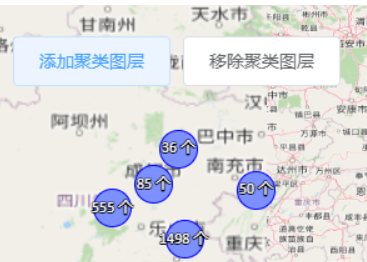

更多聚合请看：[Openlayers中使用Cluster实现缩放地图时图层聚合与取消聚合-霸道流氓气质的博客-CSDN博客](https://blog.csdn.net/BADAO_LIUMANG_QIZHI/article/details/122143275)

### 4.9、轨迹线

```vue
<template>
    <div>
        <div id="map" ref="map" style="width: 100vw; height: 100vh"></div>
    </div>
</template>

<script>
    import VectorLayer from "ol/layer/Vector";
    import VectorSource from "ol/source/Vector";
    import Feature from "ol/Feature";
    import { Draw } from "ol/interaction";
    import { Style, Fill, Stroke, Circle, Icon } from "ol/style";
    import { transform, fromLonLat, toLonLat } from "ol/proj";
    import { Point, LineString } from "ol/geom";

    import { Map, View, interaction, events } from "ol";
    import TileLayer from "ol/layer/Tile";
    import { defaults as defaultControls } from "ol/control";
    import XYZ from "ol/source/XYZ";

    export default {
        data() {
            return {
                map: {},
                featureMove: {},
                carPoints: [], //车还要走的点
                routeIndex: 0, //当前小车所在的路段
                timer: {},
                coordinates: [
                    [10836932.628965743, 4998172.218425438],
                    [10638182.82599503, 3781582.515392581],
                    [10897159.841987172, 3552719.105911153],
                    [11120000.530166456, 4986126.775821152],
                    [11360909.382252172, 4895785.956289009],
                    [11053750.595842887, 3420219.23726401],
                    [11294659.4479286, 3257605.7621061527],
                    [11565681.906525029, 4823513.300663294],
                    [11866817.971632171, 4757263.366339724],
                    [11535568.300014313, 3185333.1064804387],
                    [11812613.479912885, 3058855.959135439],
                    [12125794.987624314, 4721127.038526867],
                    [12402840.167522885, 4684990.710714009],
                    [12023408.725487886, 2926356.090488296],
                    [12300453.905386457, 2860106.1561647244],
                    [12643749.0196086, 4630786.218994724],
                    [12866589.707787886, 4510331.792951867],
                    [12547385.478774315, 2878174.3200711533],
                    [12932839.642111458, 2878174.3200711533],
                    [13113521.281175744, 3751468.908881867],
                    [13125566.723780029, 4739195.202433295],
                    [13691702.526181456, 5425785.43087758],
                    [13553179.936232172, 6112375.659321865],
                    [12920794.199507171, 5407717.266971151],
                    [12065567.774602886, 4974081.3332168665],
                    [12788294.330860028, 4895785.956289009],
                ],
                routeLayer: {},
            };
        },
        mounted() {
            this.initMap(); //初始化地图方法
            this.open(); //自动开启功能
        },
        methods: {
            //初始化地图
            initMap() {
                this.map = new Map({
                    target: "map",
                    layers: [
                        new TileLayer({
                            source: new XYZ({
                                url: "http://map.geoq.cn/ArcGIS/rest/services/ChinaOnlineStreetPurplishBlue/MapServer/tile/{z}/{y}/{x}",
                            }),
                        }),
                    ],
                    view: new View({
                        center: fromLonLat([108.522097, 37.272848]),
                        zoom: 4.7,
                    }),
                });
            },
            //添加矢量图层
            async open() {
                //画轨迹线
                await this.drawLine();
                //开始动
                this.moveStart();
            },
            //轨迹线  把每个点连起来
            drawLine() {
                this.routeLayer = new VectorLayer({
                    source: new VectorSource({
                        features: [],
                    }),
                });
                this.map.addLayer(this.routeLayer);

                let comDots = [];
                let wireFeature = {};
                this.coordinates.forEach((item) => {
                    comDots.push(item);
                    wireFeature = new Feature({
                        geometry: new LineString(comDots),
                    });
                    wireFeature.setStyle(
                        new Style({
                            stroke: new Stroke({
                                // 设置边的样式
                                color: "rgb(21, 106, 158)",
                                width: 3,
                            }),
                        })
                    );
                    this.routeLayer.getSource().addFeatures([wireFeature]);
                });
            },
            //创建小车这个要素
            moveStart() {
                //坐标转换
                this.dotsData = this.coordinates.map((item) => {
                    return transform(item, "EPSG:3857", "EPSG:4326");
                });
                //深复制车的位置，不在原数组改变，方便重新播放
                // this.carPoints = JSON.parse(JSON.stringify(this.dotsData));
                this.carPoints = [...this.dotsData];

                //小车最初位置在第一个坐标点
                this.featureMove = new Feature({
                    geometry: new Point(this.carPoints[0]),
                });
                this.featureMove.setStyle(
                    new Style({
                        image: new Icon({
                            src: "https://openlayers.org/en/v4.6.5/examples/data/icon.png",
                            scale: 0.85,
                            anchor: [0.5, 0.5],
                            rotation: this.countRotate(),
                        }),
                    })
                );
                //添加车辆元素到图层
                this.routeLayer.getSource().addFeature(this.featureMove);
                this.timeStart();
            },
            //计时器开始
            timeStart() {
                this.timer = setInterval(() => {
                    if (this.routeIndex + 1 >= this.carPoints.length) {
                        //重头开始
                        this.routeIndex = 0;
                        //移除要素
                        this.routeLayer.getSource().removeFeature(this.featureMove);
                        clearInterval(this.timer);
                        //重复运动
                        this.open(); //自动开启功能
                        return;
                    }
                    //到转折点旋转角度
                    if (this.nextPoint() === this.carPoints[this.routeIndex + 1]) {
                        this.routeIndex++;
                        this.featureMove
                            .getStyle()
                            .getImage()
                            .setRotation(this.countRotate());
                    }
                    //改变坐标点
                    this.featureMove
                        .getGeometry()
                        .setCoordinates(fromLonLat(this.carPoints[this.routeIndex]));
                }, 10);
            },
            //计算下一个点的位置
            //这里的算法是计算了两点之间的点   两点之间的连线可能存在很多个计算出来的点
            nextPoint() {
                let routeIndex = this.routeIndex;
                let p1 = this.map.getPixelFromCoordinate(
                    fromLonLat(this.carPoints[routeIndex])
                ); //获取在屏幕的像素位置
                let p2 = this.map.getPixelFromCoordinate(
                    fromLonLat(this.carPoints[routeIndex + 1])
                );
                let dx = p2[0] - p1[0];
                let dy = p2[1] - p1[1];
                //打印可见  在没有走到下一个点之前，下一个点是不变的，前一个点以这个点为终点向其靠近
                let distance = Math.sqrt(dx * dx + dy * dy);
                if (distance <= 1) {
                    return this.carPoints[routeIndex + 1];
                } else {
                    let x = p1[0] + dx / distance;
                    let y = p1[1] + dy / distance;
                    let coor = transform(
                        this.map.getCoordinateFromPixel([x, y]),
                        "EPSG:3857",
                        "EPSG:4326"
                    );
                    this.carPoints[routeIndex] = coor; //这里会将前一个点重新赋值  要素利用这个坐标变化进行移动
                    return this.carPoints[routeIndex];
                }
            },
            //计算两点之间的角度  算旋转角度
            countRotate() {
                let i = this.routeIndex,
                    j = i + 1;
                if (j === this.carPoints.length) {
                    i--;
                    j--;
                }
                let p1 = this.carPoints[i];
                let p2 = this.carPoints[j];
                return Math.atan2(p2[0] - p1[0], p2[1] - p1[1]);
            },
        },
    };
</script>

<style lang="scss" scoped>
</style>
```

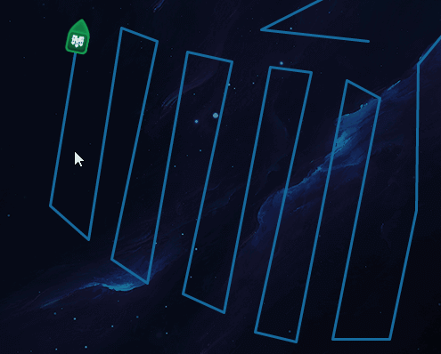

### 4.10、地图下钻

### 4.11、热力图

### 4.12、动态图标

### 4.13、图层管理
## 五、性能优化

### 5.1、加载海量数据点性能优化

Openlayers中地图通常加载方式是利用canvas加载，在Openlayers 6.0版本之后引入了WebGL绘制，在绘制海量数据的时候，使用GPU减少CPU的负载。

#### 1、canvas绘制

```vue
<!--
 * @Author: tangwenjian
 * @Date: 2023-12-05 15:39:51
 * @LastEditTime: 2023-12-05 18:28:34
 * @Description: OL加载海量数据
-->
<template>
  <div id="map"></div>
</template>
<script setup>
import { Map, View } from "ol";
import { onMounted } from "vue";
import TileLayer from "ol/layer/Tile.js";
import VectorLayer from "ol/layer/Vector.js";
import Vectorsource from "ol/source/Vector";
import { Style, Stroke, Circle, Fill } from "ol/style";
import OSM from "ol/source/OSM.js";
import GeoJSON from "ol/format/GeoJSON";
import point from "./assets/point.json";
import WebGLPointsLayer from "ol/layer/WebGLPoints"; //使用webgl渲染

let map = null; //地图实例对象
let pointLayer; //point图层

//GeoJSON数据源
const geojsonSource = new Vectorsource({
  features: new GeoJSON().readFeatures(point),
});

//GeoJSON图层
const geojsonLayer = new VectorLayer({
  source: geojsonSource,
  style: new Style({
    image: new Circle({
      // 点半径
      radius: 5,
      // 缩放比
      scale: 1,
      // 填充色
      fill: new Fill({
        color: "yellow",
      }),
    }),
  }),
});
//初始化OL地图
const initMap = () => {
  map = new Map({
    target: "map",
    view: new View({
      center: [108.84, 34.26],
      zoom: 2, //缩放级别
      projection: "EPSG:4326",
    }),
    layers: [
      new TileLayer({
        source: new OSM(),
      }),
    ],
  });
  map.addLayer(geojsonLayer)
};

//在onMounted钩子函数上挂载初始化函数
onMounted(() => {
  initMap();
});
</script>
<style scoped>
#map {
  width: 100vw;
  height: 100vh;
}
</style>
```

加载结果：

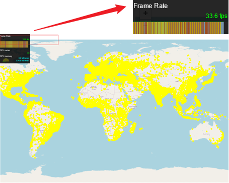

#### 2、WebGL绘制

```vue
<!--
 * @Author: tangwenjian
 * @Date: 2023-12-05 15:39:51
 * @LastEditTime: 2023-12-05 18:28:34
 * @Description: OL加载海量数据
-->
<template>
  <div id="map"></div>
</template>
<script setup>
import { Map, View } from "ol";
import { onMounted } from "vue";
import TileLayer from "ol/layer/Tile.js";
import VectorLayer from "ol/layer/Vector.js";
import Vectorsource from "ol/source/Vector";
import { Style, Stroke, Circle, Fill } from "ol/style";
import OSM from "ol/source/OSM.js";
import GeoJSON from "ol/format/GeoJSON";
import point from "./assets/point.json";
import WebGLPointsLayer from "ol/layer/WebGLPoints"; //使用webgl渲染

let map = null; //地图实例对象

//样式表达式配置样式
const predefinedStyles = {
  circles: {
    "circle-radius": [
      "interpolate",
      ["linear"],
      ["get", "population"],
      40000,
      4,
      2000000,
      14,
    ],
    "circle-fill-color": [
      "interpolate",
      ["linear"],
      ["get", "latitude"],
      -80,
      "#ff14c3",
      -20,
      "#ff621d",
      20,
      "#ffed02",
      80,
      "#00ff67",
    ],
    "circle-rotate-with-view": false,
    "circle-displacement": [0, 0],
    "circle-opacity": [
      "interpolate",
      ["linear"],
      ["get", "population"],
      40000,
      0.6,
      2000000,
      0.92,
    ],
  },
};
const newStyle = predefinedStyles["circles"];//图层样式
let pointLayer;//point图层

//GeoJSON数据源
const geojsonSource = new Vectorsource({
  features: new GeoJSON().readFeatures(point),
});

//刷新图层
const refreshLayer = () => {
  let previousLayer = pointLayer;
  pointLayer = new WebGLPointsLayer({
    source: geojsonSource,
    style: newStyle,
    // disableHitDetection: true,
  });
  map.addLayer(pointLayer);
  if (previousLayer) {
    map.removeLayer(previousLayer);
    previousLayer.dispose();
  }
};
//优化动画
const animate = () => {
  map.render();
  window.requestAnimationFrame(animate);
};

//初始化OL地图
const initMap = () => {
  map = new Map({
    target: "map",
    view: new View({
      center: [108.84, 34.26],
      zoom: 2, //缩放级别
      projection: "EPSG:4326",
    }),
    layers: [
      new TileLayer({
        source: new OSM(),
      }),
    ],
  });
  refreshLayer();
  animate();
};

//在onMounted钩子函数上挂载初始化函数
onMounted(() => {
  initMap();
});
</script>
<style scoped>
#map {
  width: 100vw;
  height: 100vh;
}
</style>
```

加载结果：

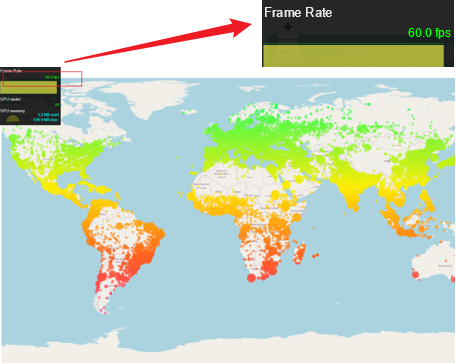

> 注意：
>
> 可以使用Chrome浏览器自带的实时帧率进行监测。
>
> 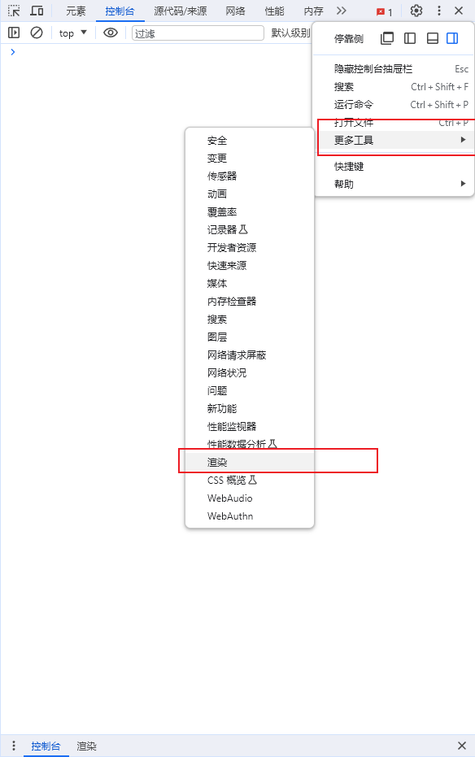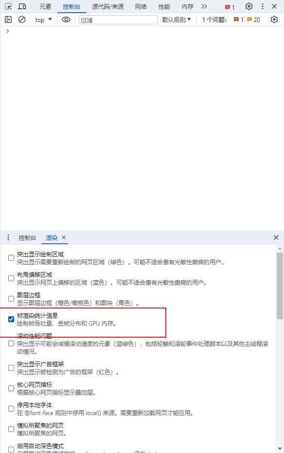

#### 3、数据聚类

通过空间上相邻活近似的数据点聚合成为单个聚类点，可以降低数据量，提高地图渲染性能，同时保留数据关键信息。可以使用openlayers自带的聚类类型，也可以让后端进行聚类筛选数据。

#### 4、数据抽稀

通过减少数据点的数量来降低数据集大小，一般通过计算当前可视范围内的数据，超过当前可视范围就选择不加载。